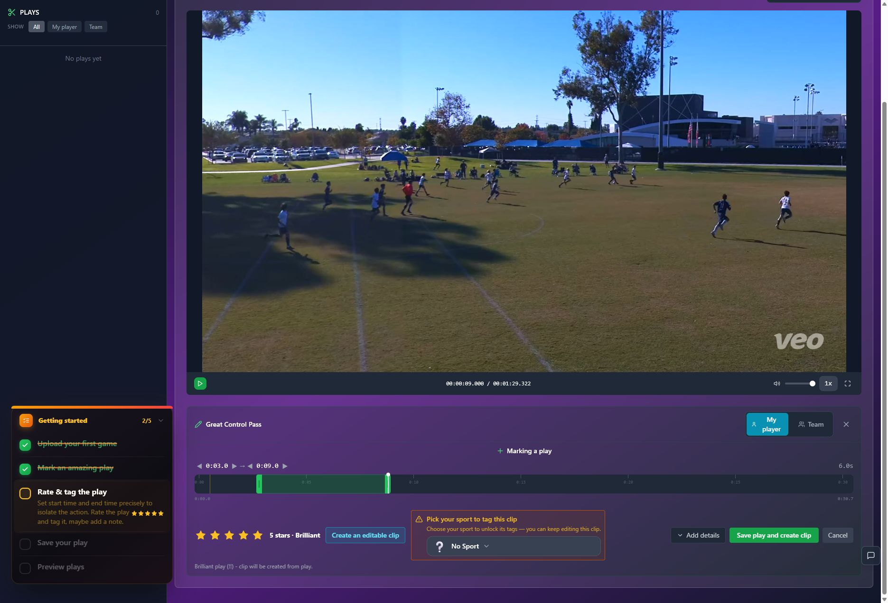
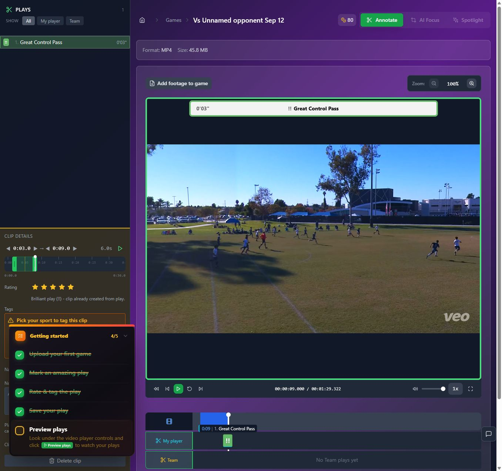
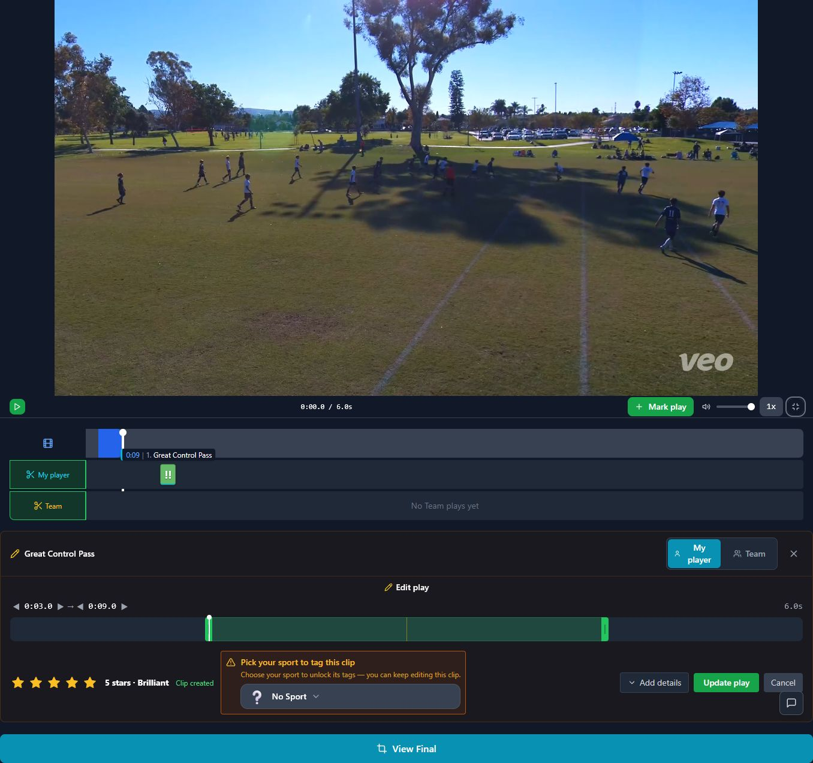
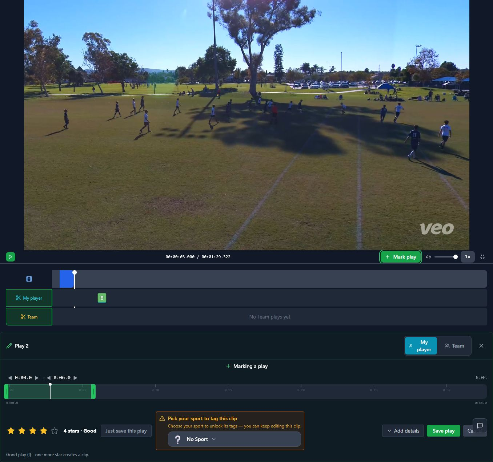

# T08 — Make capture ranges and source clocks consistent

Epic: EP02 — Create a first highlight without sacrificing continued marking

Priority: P1 · Type: Fix · Status: READY

Dependencies: None

This file contains the task’s full product brief. Its adjacent `T08.html` is an equivalent single-file visual handoff with screenshots and report mockups embedded. Choose one format; do not read both. Markdown images use the included assets folder; the schematic below is inline text.

## Context and execution boundaries

The target user is a busy youth-sports parent making one compelling playable highlight quickly, then finding and sharing it confidently; keep a deliberate continued-annotation path. The supplied baseline of approximately 5 completed clip exporters per 100 signups and target of 75 are unverified business context. No fix has a verified lift and UX cannot explain every dropout.

Evidence comes from one fresh evaluator account on September 12–13, 2026, not a representative parent study. A supplied 1:29.322 MP4 and play notes identified a six-second moment at source 0:03–0:09, “Great Control Pass.” One framing render and two free effects renders completed for the same clip. The saved portrait played; Spotlight selection was absent on both reopening checks. Sampled frames alone do not prove whole-video effects failure. Exact blue #30 identity, recipient playback, publication, download, purchases and storage expiry were not verified.

No application repository or original source video is included in this handoff. Locate actual implementation and repository instructions first; do not invent code paths, backend architecture, analytics or policies. If a fixture is absent, use an authorized equivalent and document the limit. Read only this task for product requirements; inspect repository code/tests as necessary. Dependency contracts below are repeated so upstream documents are not required. Check prerequisite implementation/tests before starting dependent work.

Preserve browser-based upload, local preview with honest save state, cost/storage disclosure, precise trim inputs, direct framing, optional continued marking, playable completion, free effects when verified, private visibility and single-highlight export without reels. Game means source recording; play means source interval; highlight means editable/exportable moment; reel is optional combination. Export creates media without changing visibility; Download saves a local file; Publish creates link access; Invite is game-scoped. Keep one parent-facing vocabulary across the release.

Implement only this task’s scope. Evidence observations are not root-cause instructions. Proposed mockups/copy are not current behavior; exact controls depend on verified capability. Do not implement rejected alternatives just because they are discussed. No deployment, real publication/invitations, purchases or new paid/external services are authorized by this handoff. Use local/mocked or explicitly authorized test environments. Never claim a task complete from a plan alone.

## Dependency contract and starting conditions

No prerequisites. Marking uses source time even during selected-play loops. Preferred default: preceding 12 seconds, clamped to source bounds. Preserve explicitly edited ranges.

## Evidence, confirmed observations and uncertainty

Original references: B04 · N01, N07 · fullscreen finding. N01–N12 were assigned to the naming report’s 12 unnumbered rows in source order; they are not original issue IDs. B01–B08 and R1–R7 are original references.

**B04 · N01, N07 · fullscreen finding (S03):**

Observed: At game time 0:03, Mark play proposed 0:00–0:06 despite promising the previous 12 seconds. Fullscreen retained editing but showed clip-relative time in the inspected playback state.

Suspected / investigation: Confirm intended pre/post-roll policy and source-versus-clip time mapping. E46 is cleaner evidence than the first layout-changing encounter. No calculation mechanism is established.

## Selected implementation decision

Implement the published previous-12-seconds policy unless existing product specification explicitly establishes post-roll. If confirmed, use exact disclosed offsets instead and record the decision; do not silently choose a different capture policy.

## Work to perform

- Trace playhead coordinate conversion normal/fullscreen/looping.
- Implement start=max(0,t−12), end=t for preceding policy; prevent zero-length saves.
- Label source and play-relative clocks; preserve trim and playback context on fullscreen transitions.
- If intentional post-roll is verified, document exact offsets/clamping and update behavior/copy together.

## Proposed replacement copy

- Mark the previous 12 seconds, ending here. Adjust the range before saving.
- Game time
- Play time
- Preview selected moment
- Play the video before marking — at zero

Use this task’s labels consistently with the release vocabulary. Bracketed values are dynamic data or explicit dependencies, never literal shipping copy. Conditional claims must remain conditional until verified.

## Proposed task schematic — not current UI

```text
Game time: 0:03
[Mark the previous 12 seconds]
        ↓ clamped default
Game time [0:00] — [0:03] · 3 seconds
[Preview selected moment] → editable start/end
Fullscreen shows same source interval, labeled clocks
```

This schematic defines behavior/hierarchy, not a new visual identity. Related report mockups are embedded in the equivalent standalone HTML; this Markdown schematic carries the task-specific behavior without requiring that document.

## Acceptance criteria

- [ ] At t=0:03 preferred policy selects 0:00–0:03; at 0:20 selects 0:08–0:20.
- [ ] Source bounds and positive duration hold; zero does not save an empty mark.
- [ ] Same source position produces same range across modes and clip-relative playback.
- [ ] Manual 0:03–0:09 stays unchanged on layout/navigation transitions.

## Practical validation

- Boundary tests at zero, 0:03, 0:20 and end.
- Nonzero source offset, variable frame-rate input and selected-play loop tests.
- Parent task marking during/after action; inspect setup/outcome retention.

## Out of scope

Do not interpret the M1 mockup’s manually adjusted 0:03–0:09 as the default capture at 0:03.

## Safe completion and rollback

Preserve old saved records and playable exports during changes. Use backward-compatible migration and existing feature gating where appropriate; do not delete user data as rollback. If a change regresses the core path, disable/revert the affected change while retaining persisted work. Run repository-required checks and this task’s meaningful validations. Screenshot comparison cannot establish playback or persistence by itself.

Update this file’s status and the plan row only after verified completion (keep the HTML counterpart consistent if maintained). Report changed paths, actual root cause/capability finding, tests executed/results, relevant before/after evidence, unresolved assumptions and rollback limits. Use `BLOCKED` with exact missing input when repository, policy, footage, permission or participants prevent verification. A discovery task is complete when its evidence/decision deliverable is complete; its proposed feature remains unimplemented. Downstream contracts must be recorded in the implementation, tests and task outcome rather than requiring another conversation.

## Original screenshot evidence

These are unchanged evaluation screenshots, not proposed outcomes. Their captions are the source descriptions. Read them alongside the bounded observations above.

### E08

Six-second selection, five-star rating, recognizable name, and Save play and create clip.



### E44

Source game and six-second annotation are restored after leaving the clip.



### E45

Fullscreen annotation retains editing and marking controls but shows clip-relative playback time.



### E46

New unsaved play at game time 0:03 receives a 0:00–0:06 range; four-star default.



## Source provenance (reading sources is optional)

Derived from `bug-report.html`, `first-export-friction-report.html`, `naming-and-action-consistency-report.html` (September 12–13, 2026) and solution report sections S03. Relevant requirements/evidence are reproduced here; source reports are not needed to execute this task.
