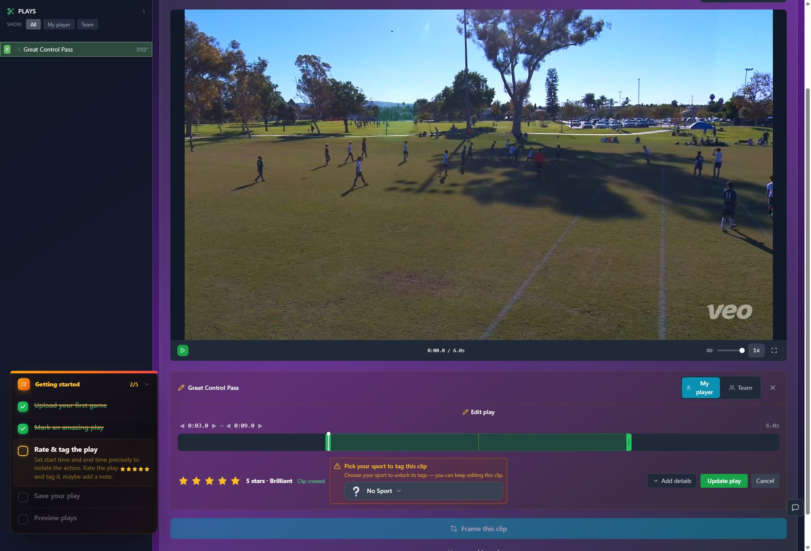
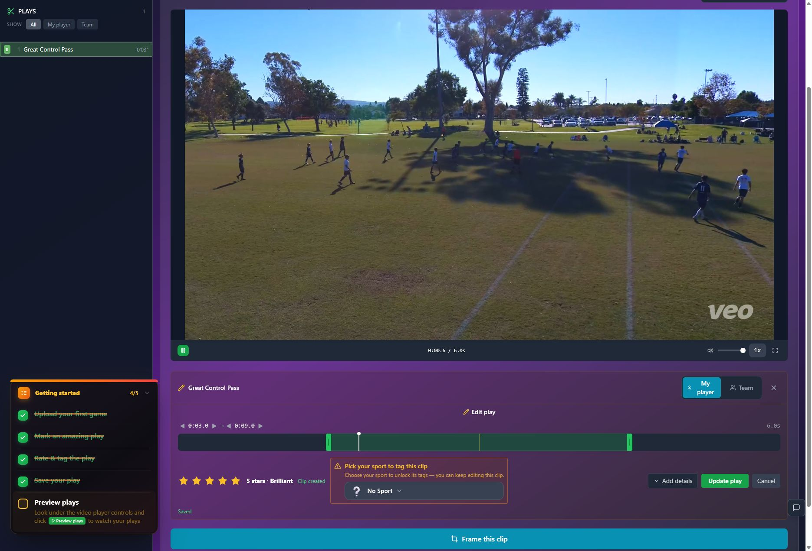
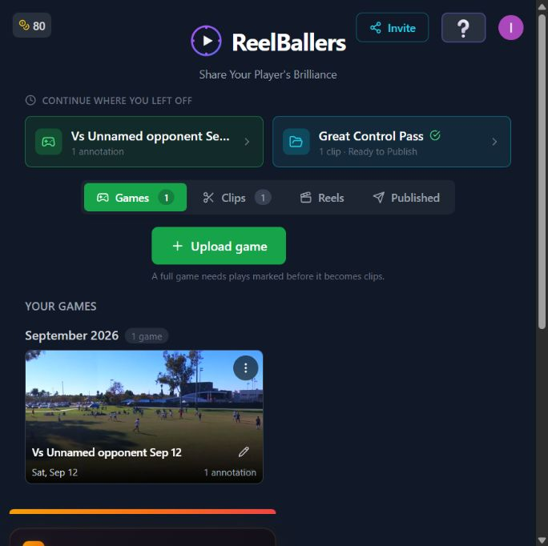

# T09 — Replace stale onboarding with route-aware next actions

Epic: EP02 — Create a first highlight without sacrificing continued marking

Priority: P1 · Type: UX implementation · Status: WAITING_FOR_DEPENDENCIES

Dependencies: T07

This file contains the task’s full product brief. Its adjacent `T09.html` is an equivalent single-file visual handoff with screenshots and report mockups embedded. Choose one format; do not read both. Markdown images use the included assets folder; the schematic below is inline text.

## Context and execution boundaries

The target user is a busy youth-sports parent making one compelling playable highlight quickly, then finding and sharing it confidently; keep a deliberate continued-annotation path. The supplied baseline of approximately 5 completed clip exporters per 100 signups and target of 75 are unverified business context. No fix has a verified lift and UX cannot explain every dropout.

Evidence comes from one fresh evaluator account on September 12–13, 2026, not a representative parent study. A supplied 1:29.322 MP4 and play notes identified a six-second moment at source 0:03–0:09, “Great Control Pass.” One framing render and two free effects renders completed for the same clip. The saved portrait played; Spotlight selection was absent on both reopening checks. Sampled frames alone do not prove whole-video effects failure. Exact blue #30 identity, recipient playback, publication, download, purchases and storage expiry were not verified.

No application repository or original source video is included in this handoff. Locate actual implementation and repository instructions first; do not invent code paths, backend architecture, analytics or policies. If a fixture is absent, use an authorized equivalent and document the limit. Read only this task for product requirements; inspect repository code/tests as necessary. Dependency contracts below are repeated so upstream documents are not required. Check prerequisite implementation/tests before starting dependent work.

Preserve browser-based upload, local preview with honest save state, cost/storage disclosure, precise trim inputs, direct framing, optional continued marking, playable completion, free effects when verified, private visibility and single-highlight export without reels. Game means source recording; play means source interval; highlight means editable/exportable moment; reel is optional combination. Export creates media without changing visibility; Download saves a local file; Publish creates link access; Invite is game-scoped. Keep one parent-facing vocabulary across the release.

Implement only this task’s scope. Evidence observations are not root-cause instructions. Proposed mockups/copy are not current behavior; exact controls depend on verified capability. Do not implement rejected alternatives just because they are discussed. No deployment, real publication/invitations, purchases or new paid/external services are authorized by this handoff. Use local/mocked or explicitly authorized test environments. Never claim a task complete from a plan alone.

## Dependency contract and starting conditions

T07 supplies explicit play-only and draft outcomes. Keep marking plays restores source position/marks; Frame your athlete opens that draft. Guide completion is based on saved playable value, not mandatory source-preview clicks.

## Evidence, confirmed observations and uncertainty

Original references: B05 · R4. N01–N12 were assigned to the naming report’s 12 unnumbered rows in source order; they are not original issue IDs. B01–B08 and R1–R7 are original references.

**B05 · R4 (S06):**

Observed: Guidance stayed at 4/5 in framing, Spotlight and the library, pointing to unavailable Preview plays. It completed after the old preview route. Direct framing and Keep marking plays already existed.

Suspected / investigation: Inspect guide route prerequisites and completion rules, not just text. No evidence establishes a need for a longer tutorial.

## Selected implementation decision

Prefer a persistent inline next action and optional checklist in Help. Keep existing direct onward capability; avoid a new compulsory wizard.

## Work to perform

- Map guide instructions to actual route capabilities and saved progress.
- Remove required rating/tagging/source-preview steps from first-result guidance.
- Show persistent branch after draft creation and success after export; preserve dismissal and Help reopening.
- Returning to marking retains source position, list, draft links and prior marks; guide advancement never auto-navigates.

## Proposed replacement copy

- Highlight draft saved.
- Frame your athlete
- Keep marking plays
- Play saved. Keep watching to mark another moment.
- Your highlight is ready to watch.
- Watch finished highlight
- Back to game plays

Use this task’s labels consistently with the release vocabulary. Bracketed values are dynamic data or explicit dependencies, never literal shipping copy. Conditional claims must remain conditional until verified.

## Proposed task schematic — not current UI

```text
Highlight draft saved
[Frame your athlete]  [Keep marking plays]
       ↓                         ↓
Current framing guidance     Restore game position + marks
       ↓ export ready
[Watch finished highlight] — no Preview plays detour
```

This schematic defines behavior/hierarchy, not a new visual identity. Related report mockups are embedded in the equivalent standalone HTML; this Markdown schematic carries the task-specific behavior without requiring that document.

## Acceptance criteria

- [ ] No route references an unavailable control.
- [ ] Direct export completes first-result guidance without Preview plays detour.
- [ ] Dismissal persists; Help can reopen accurate current guidance.
- [ ] Both continued-marking and first-highlight routes preserve work and context.

## Practical validation

- Fresh account: highlight first then three marks; marks first then highlight.
- Reload, dismissal, back navigation and return from Spotlight.
- Test preparing draft state with disabled onward action and in-place explanation.

## Out of scope

No required tutorial click sequence, new entitlement policy, or automatic publication.

## Safe completion and rollback

Preserve old saved records and playable exports during changes. Use backward-compatible migration and existing feature gating where appropriate; do not delete user data as rollback. If a change regresses the core path, disable/revert the affected change while retaining persisted work. Run repository-required checks and this task’s meaningful validations. Screenshot comparison cannot establish playback or persistence by itself.

Update this file’s status and the plan row only after verified completion (keep the HTML counterpart consistent if maintained). Report changed paths, actual root cause/capability finding, tests executed/results, relevant before/after evidence, unresolved assumptions and rollback limits. Use `BLOCKED` with exact missing input when repository, policy, footage, permission or participants prevent verification. A discovery task is complete when its evidence/decision deliverable is complete; its proposed feature remains unimplemented. Downstream contracts must be recorded in the implementation, tests and task outcome rather than requiring another conversation.

## Original screenshot evidence

These are unchanged evaluation screenshots, not proposed outcomes. Their captions are the source descriptions. Read them alongside the bounded observations above.

### E09

Immediate save response: Clip created; Frame this clip is briefly disabled.



### E10

Saved clip: framing becomes available while the tutorial still points to Preview plays.



### E12

AI Focus requires manual box positions. One focus point is required before export.


### E31

Save draft returns to Clips with Ready to Publish and a Preview action.


### E54

Tutorial reaches 5/5 only after the explicit Preview plays path, despite earlier exports.



## Source provenance (reading sources is optional)

Derived from `bug-report.html`, `first-export-friction-report.html`, `naming-and-action-consistency-report.html` (September 12–13, 2026) and solution report sections S06. Relevant requirements/evidence are reproduced here; source reports are not needed to execute this task.
