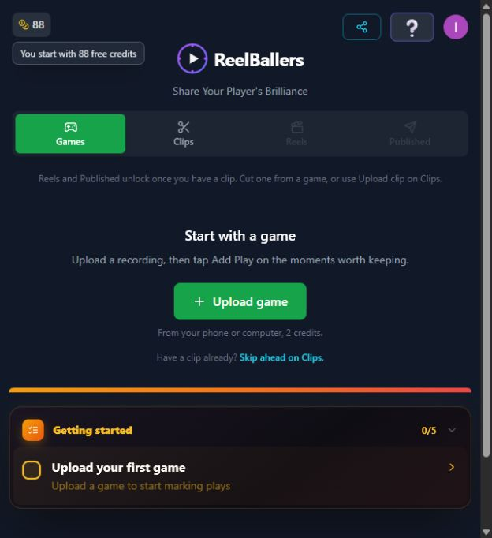
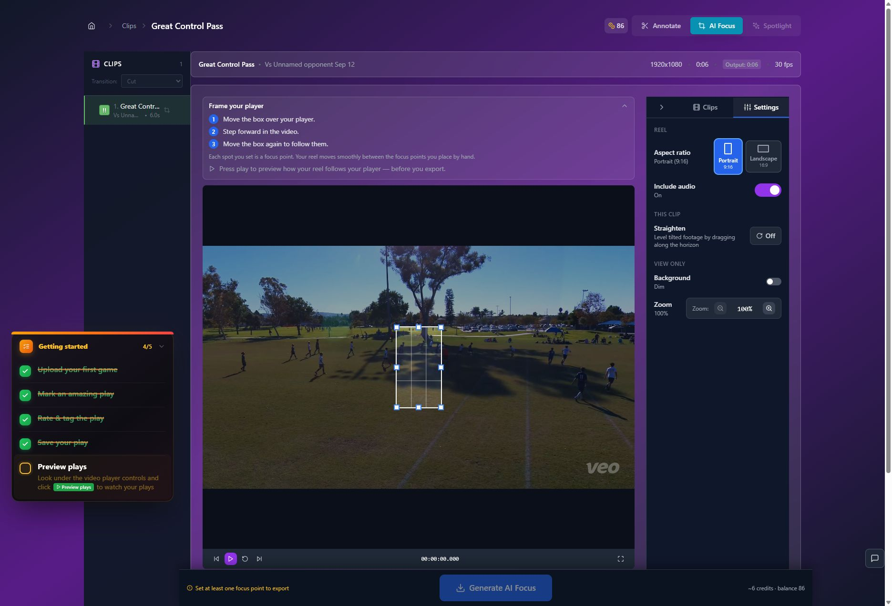
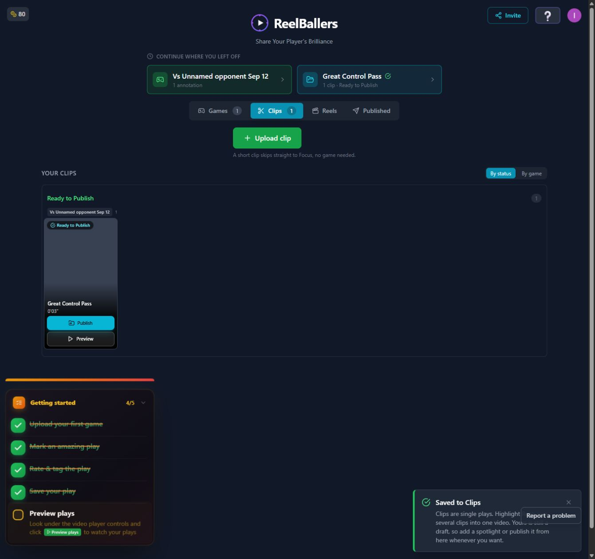
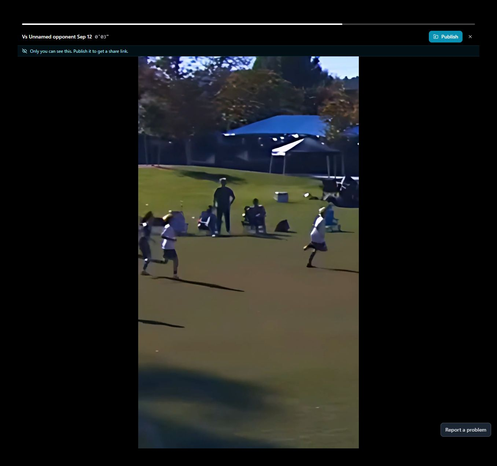
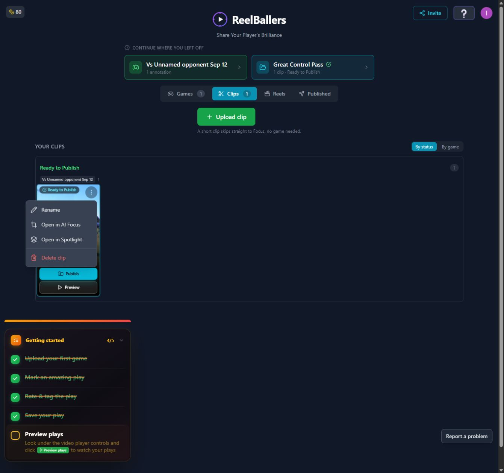
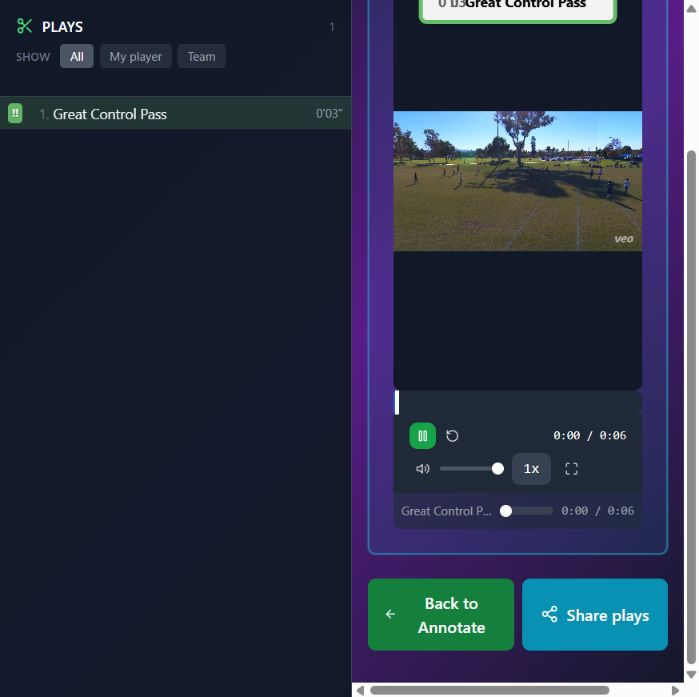

# T10 — Apply one vocabulary and stable highlight identity

Epic: EP03 — Find, replay and deliberately share the finished highlight

Priority: P2 · Type: UX implementation · Status: READY

Dependencies: None

This file contains the task’s full product brief. Its adjacent `T10.html` is an equivalent single-file visual handoff with screenshots and report mockups embedded. Choose one format; do not read both. Markdown images use the included assets folder; the schematic below is inline text.

## Context and execution boundaries

The target user is a busy youth-sports parent making one compelling playable highlight quickly, then finding and sharing it confidently; keep a deliberate continued-annotation path. The supplied baseline of approximately 5 completed clip exporters per 100 signups and target of 75 are unverified business context. No fix has a verified lift and UX cannot explain every dropout.

Evidence comes from one fresh evaluator account on September 12–13, 2026, not a representative parent study. A supplied 1:29.322 MP4 and play notes identified a six-second moment at source 0:03–0:09, “Great Control Pass.” One framing render and two free effects renders completed for the same clip. The saved portrait played; Spotlight selection was absent on both reopening checks. Sampled frames alone do not prove whole-video effects failure. Exact blue #30 identity, recipient playback, publication, download, purchases and storage expiry were not verified.

No application repository or original source video is included in this handoff. Locate actual implementation and repository instructions first; do not invent code paths, backend architecture, analytics or policies. If a fixture is absent, use an authorized equivalent and document the limit. Read only this task for product requirements; inspect repository code/tests as necessary. Dependency contracts below are repeated so upstream documents are not required. Check prerequisite implementation/tests before starting dependent work.

Preserve browser-based upload, local preview with honest save state, cost/storage disclosure, precise trim inputs, direct framing, optional continued marking, playable completion, free effects when verified, private visibility and single-highlight export without reels. Game means source recording; play means source interval; highlight means editable/exportable moment; reel is optional combination. Export creates media without changing visibility; Download saves a local file; Publish creates link access; Invite is game-scoped. Keep one parent-facing vocabulary across the release.

Implement only this task’s scope. Evidence observations are not root-cause instructions. Proposed mockups/copy are not current behavior; exact controls depend on verified capability. Do not implement rejected alternatives just because they are discussed. No deployment, real publication/invitations, purchases or new paid/external services are authorized by this handoff. Use local/mocked or explicitly authorized test environments. Never claim a task complete from a plan alone.

## Dependency contract and starting conditions

No prerequisites for inventory/build. Coordinate cutover with T07/T09/T11/T12/T19/T20: Game=source; Play=marked interval; Highlight=single editable/exportable moment; Reel=optional combination. Preserve old routes/data; do not create a second library.

## Evidence, confirmed observations and uncertainty

Original references: R5 · N01–N02, N04, N06–N07, N09, N11. N01–N12 were assigned to the naming report’s 12 unnumbered rows in source order; they are not original issue IDs. B01–B08 and R1–R7 are original references.

**R5 · N01–N02, N04, N06–N07, N09, N11 (S08):**

Observed: One clip passed through REEL, AI Focus, Clips and Highlight Reels labels; no reel was required. Saved preview promoted the game title/source timestamp instead of the clip name. Source and finished previews had similar labels.

Suspected / investigation: Labels may reflect different object models or reused components; inspect route/data contracts before renaming. Confusion is plausible, not a measured population rate.

Complete naming inventory for this task (all 12 rows; no source lookup required):

N01 — Add Play / Mark play / Mark plays / Annotate → action “Mark play”, workspace “Game plays”.

N02 — Play / clip / annotation; “Clip name” in mark dialog → Play is source interval; Highlight is editable/exportable output; “Name (optional)” and explicit save outcome.

N03 — Just save this play / Create an editable clip / one more star creates a clip → “Create highlight” and “Save play only”; rating is independent. T06/T07 own behavior.

N04 — Frame this clip / AI Focus / Focus / Generate AI Focus → “Frame your athlete”; “Export [duration]-second highlight · [verified quote] credits”. No automatic-following implication in manual-only route.

N05 — Focus point / keyframe / crop / segment → “Framing point” and “Delete framing point”; technical numeric crop/segment controls stay in Advanced editing. T19 owns layout.

N06 — REEL / Clips / Reels / Highlight Reels / Select a reel first → single-item “Highlight”, library “Highlights”, optional multi-item “Reel”; missing item “Choose a highlight to edit”. Publication does not require a reel.

N07 — Preview plays / Preview clip / Preview video / View Final → “Watch marked plays” for source footage; “Watch finished highlight” for exported media. T13 owns entry-point integration.

N08 — Sharing / Sharing settings / Share plays / Publish / Publish without spotlight → “Invite people to game plays” versus “Publish and get link”; review confirms audience; “Copy link” only after success. T05/T12 own those behaviors.

N09 — Great Control Pass becomes game title plus 0′03″ → keep “Great Control Pass · 6 seconds” primary; “Game time 0:03–0:09” plus truthful game/date metadata secondary.

N10 — Framing saved / Export required / Loading working video → “Loading your exported highlight…” until resolved; distinguish saved edit from playable media. T04/T14 own state logic.

N11 — Saved to Clips / add a spotlight or publish / Ready to Publish → “Saved in Highlights · Only you can watch”; “Private · Ready to watch” only with saved playable export; “Draft · Not exported yet” otherwise; “Spotlight included” only after output verification. T02/T11 own persistence.

N12 — 1 of 4 selected, click remaining players → “Your player is selected. Preview the spotlight, or choose another player if you want to highlight more than one.” T20 owns selection UX.

The inventory governs terminology integration and parity; do not duplicate the implementation owned by another task.

## Selected implementation decision

Prefer coordinated Clips→Highlights rename over adding a new destination. If cutover cannot ship consistently, keep Clip throughout the current flow until ready; record pending labels rather than mixing terms.

## Work to perform

- Inventory navigation, headers, cards, tooltips, errors, toast/status and fullscreen text.
- Keep named highlight primary with duration; show source game/time secondarily.
- Rename single-item REEL settings and precise missing prerequisites; distinguish source playback from finished export.
- Preserve old links and saved items; add optional combine-into-reel only in existing relevant context, not a prerequisite.

## Proposed replacement copy

- Highlights
- Great Control Pass · 6 seconds
- Game time 0:03–0:09
- Draft · Not exported yet
- Private · Ready to watch
- Watch marked plays
- Watch finished highlight
- Choose a highlight to edit
- Mark play
- Game plays

Use this task’s labels consistently with the release vocabulary. Bracketed values are dynamic data or explicit dependencies, never literal shipping copy. Conditional claims must remain conditional until verified.

## Proposed task schematic — not current UI

```text
Highlights
┌ Great Control Pass · 6 seconds
│ Private · Ready to watch
│ Game time 0:03–0:09 · [game]
└ [Watch finished highlight]
Game workspace: [Watch marked plays] means source footage
```

This schematic defines behavior/hierarchy, not a new visual identity. Related report mockups are embedded in the equivalent standalone HTML; this Markdown schematic carries the task-specific behavior without requiring that document.

## Acceptance criteria

- [ ] All naming rows N01–N12 have consistent terminology, with specialized actions owned by their task contracts.
- [ ] No single highlight requires a reel; no extra parallel Highlights library.
- [ ] Card/player/progress/publication preserve name and distinguish duration from source timestamp.
- [ ] Existing deep links and saved items remain accessible.

## Practical validation

- Render-text inventory across normal, narrow and fullscreen, including disabled/error states.
- Open existing draft and published links in test environment.
- Parent delayed retrieval of a named highlight then source versus finished playback.

## Out of scope

No media pipeline changes or forced migration that deletes/renames user titles. T11 implements lifecycle persistence; this task aligns its presentation.

## Safe completion and rollback

Preserve old saved records and playable exports during changes. Use backward-compatible migration and existing feature gating where appropriate; do not delete user data as rollback. If a change regresses the core path, disable/revert the affected change while retaining persisted work. Run repository-required checks and this task’s meaningful validations. Screenshot comparison cannot establish playback or persistence by itself.

Update this file’s status and the plan row only after verified completion (keep the HTML counterpart consistent if maintained). Report changed paths, actual root cause/capability finding, tests executed/results, relevant before/after evidence, unresolved assumptions and rollback limits. Use `BLOCKED` with exact missing input when repository, policy, footage, permission or participants prevent verification. A discovery task is complete when its evidence/decision deliverable is complete; its proposed feature remains unimplemented. Downstream contracts must be recorded in the implementation, tests and task outcome rather than requiring another conversation.

## Original screenshot evidence

These are unchanged evaluation screenshots, not proposed outcomes. Their captions are the source descriptions. Read them alongside the bounded observations above.

### E03

Fresh signed-in home: 88 credits, Start with a game, Upload game, and a five-step tutorial.



### E12

AI Focus requires manual box positions. One focus point is required before export.



### E31

Save draft returns to Clips with Ready to Publish and a Preview action.



### E37

Saved portrait preview plays after loading; the black frame was transient.



### E39

Clip menu: Rename, Open in AI Focus, Open in Spotlight, Delete clip; no download action here.



### E51

Preview plays opens source-footage playback, not the finished framed result.



## Source provenance (reading sources is optional)

Derived from `bug-report.html`, `first-export-friction-report.html`, `naming-and-action-consistency-report.html` (September 12–13, 2026) and solution report sections S08. Relevant requirements/evidence are reproduced here; source reports are not needed to execute this task.
