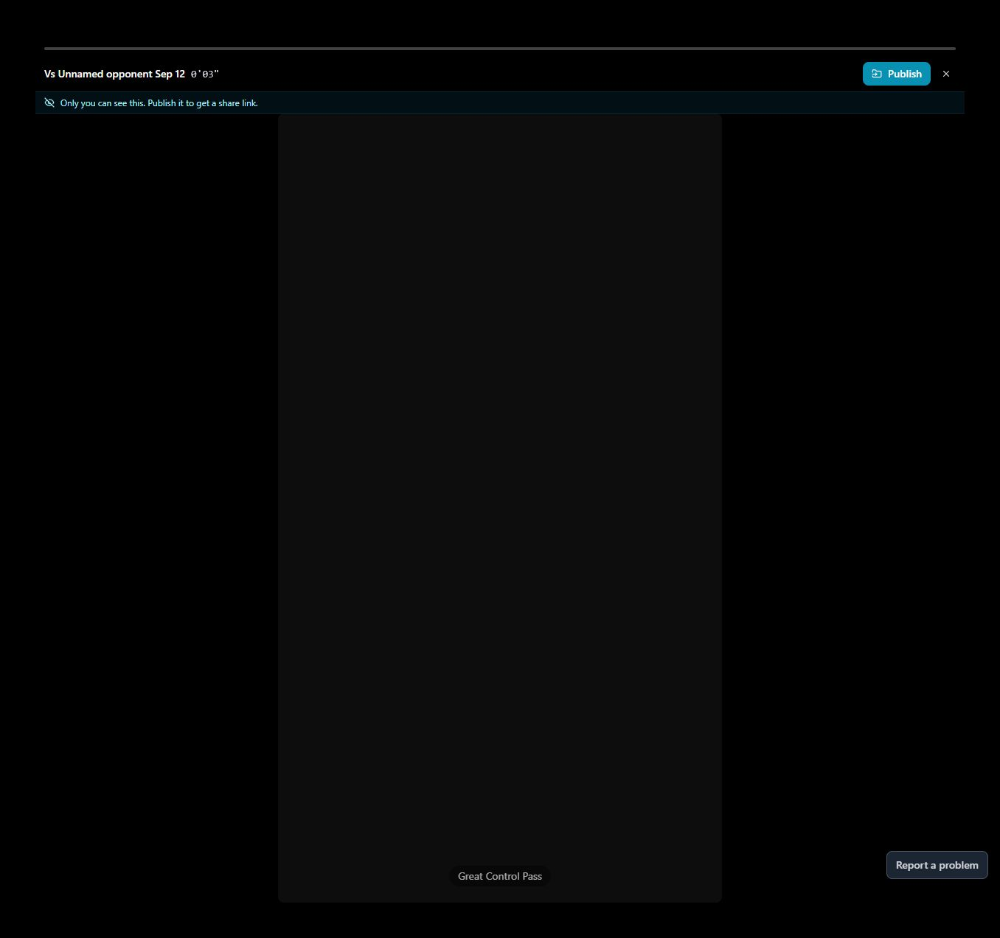

# T12 — Separate private replay, publication and link sharing

Epic: EP03 — Find, replay and deliberately share the finished highlight

Priority: P2 · Type: UX implementation · Status: WAITING_FOR_DEPENDENCIES

Dependencies: T02, T10, T11

This file contains the task’s full product brief. Its adjacent `T12.html` is an equivalent single-file visual handoff with screenshots and report mockups embedded. Choose one format; do not read both. Markdown images use the included assets folder; the schematic below is inline text.

## Context and execution boundaries

The target user is a busy youth-sports parent making one compelling playable highlight quickly, then finding and sharing it confidently; keep a deliberate continued-annotation path. The supplied baseline of approximately 5 completed clip exporters per 100 signups and target of 75 are unverified business context. No fix has a verified lift and UX cannot explain every dropout.

Evidence comes from one fresh evaluator account on September 12–13, 2026, not a representative parent study. A supplied 1:29.322 MP4 and play notes identified a six-second moment at source 0:03–0:09, “Great Control Pass.” One framing render and two free effects renders completed for the same clip. The saved portrait played; Spotlight selection was absent on both reopening checks. Sampled frames alone do not prove whole-video effects failure. Exact blue #30 identity, recipient playback, publication, download, purchases and storage expiry were not verified.

No application repository or original source video is included in this handoff. Locate actual implementation and repository instructions first; do not invent code paths, backend architecture, analytics or policies. If a fixture is absent, use an authorized equivalent and document the limit. Read only this task for product requirements; inspect repository code/tests as necessary. Dependency contracts below are repeated so upstream documents are not required. Check prerequisite implementation/tests before starting dependent work.

Preserve browser-based upload, local preview with honest save state, cost/storage disclosure, precise trim inputs, direct framing, optional continued marking, playable completion, free effects when verified, private visibility and single-highlight export without reels. Game means source recording; play means source interval; highlight means editable/exportable moment; reel is optional combination. Export creates media without changing visibility; Download saves a local file; Publish creates link access; Invite is game-scoped. Keep one parent-facing vocabulary across the release.

Implement only this task’s scope. Evidence observations are not root-cause instructions. Proposed mockups/copy are not current behavior; exact controls depend on verified capability. Do not implement rejected alternatives just because they are discussed. No deployment, real publication/invitations, purchases or new paid/external services are authorized by this handoff. Use local/mocked or explicitly authorized test environments. Never claim a task complete from a plan alone.

## Dependency contract and starting conditions

Use verified private result/artifact from T02/T11 and T10’s names. Publish binds exactly the previewed artifact; game invitations are a different scope. Existing publish capability and access policy must be inspected before any UI claims.

## Evidence, confirmed observations and uncertainty

Original references: B02 · R5 · N08 · untested download, R5 · N01–N02, N04, N06–N07, N09, N11. N01–N12 were assigned to the naming report’s 12 unnumbered rows in source order; they are not original issue IDs. B01–B08 and R1–R7 are original references.

**B02 · R5 · N08 · untested download (S07):**

Observed: Three direct Sharing settings attempts produced no visible response. Preview plays → Share plays opened a game email form. Private/link visibility copy was clear. Publication, invitations, recipient playback and downloads were untested; no download was found in inspected menus.

Suspected / investigation: Compare both entry points, selected/unselected play context and dialog state. Verify game permission scope, recipient authentication and revocation before finalizing disclosure. Do not assume every sharing route is broken.
**R5 · N01–N02, N04, N06–N07, N09, N11 (S08):**

Observed: One clip passed through REEL, AI Focus, Clips and Highlight Reels labels; no reel was required. Saved preview promoted the game title/source timestamp instead of the clip name. Source and finished previews had similar labels.

Suspected / investigation: Labels may reflect different object models or reused components; inspect route/data contracts before renaming. Confusion is plausible, not a measured population rate.

## Selected implementation decision

Prefer explicit result-page Publish and get link → visibility review → create link, rather than a generic Share hub. Sending/copying and visibility change remain separate actions.

## Work to perform

- Verify publication, recipient access and current revocation/update behavior using code and authorized local fixtures.
- Add scoped publication review and success/error states; show Copy link only after a link exists.
- Add clipboard success/fallback and supported native share-sheet fallback to copy.
- Pin published artifact and make Update shared version explicit for later exports. Never send game invitations from this flow.

## Proposed replacement copy

- Publish and get link
- Publish Great Control Pass?
- Anyone with the link can watch. Publishing creates a link; it does not send it.
- Publish and create link
- Cancel
- Link ready · Anyone with the link can watch
- Copy link
- Share link…
- Update shared version

Use this task’s labels consistently with the release vocabulary. Bracketed values are dynamic data or explicit dependencies, never literal shipping copy. Conditional claims must remain conditional until verified.

## Proposed task schematic — not current UI

```text
Private result [Publish and get link]
       ↓ visibility review
Publish Great Control Pass?
Anyone with the link can watch. Creates a link; does not send it.
[Publish and create link] [Cancel]
       ↓ success only
[Copy link] [Share link…] — same previewed artifact
```

This schematic defines behavior/hierarchy, not a new visual identity. Related report mockups are embedded in the equivalent standalone HTML; this Markdown schematic carries the task-specific behavior without requiring that document.

## Acceptance criteria

- [ ] Private replay needs no publication.
- [ ] Cancel/failure creates no misleading link or audience-state success.
- [ ] Copied link is confirmed only after clipboard success; fallback text is selectable.
- [ ] Recipient in separate session plays the intended version under verified policy.
- [ ] Private re-export does not silently update the link-visible artifact.

## Practical validation

- Mock publish failure, clipboard denial and share-sheet cancellation.
- Authorized test-environment recipient/logged-out access, update, revocation/expiry if supported.
- Ask parent who can see it before/after each step; no real public uploads for this task.

## Out of scope

No real publication, social posting or invitations. Download is T24; do not invent retention/revocation capabilities.

## Safe completion and rollback

Preserve old saved records and playable exports during changes. Use backward-compatible migration and existing feature gating where appropriate; do not delete user data as rollback. If a change regresses the core path, disable/revert the affected change while retaining persisted work. Run repository-required checks and this task’s meaningful validations. Screenshot comparison cannot establish playback or persistence by itself.

Update this file’s status and the plan row only after verified completion (keep the HTML counterpart consistent if maintained). Report changed paths, actual root cause/capability finding, tests executed/results, relevant before/after evidence, unresolved assumptions and rollback limits. Use `BLOCKED` with exact missing input when repository, policy, footage, permission or participants prevent verification. A discovery task is complete when its evidence/decision deliverable is complete; its proposed feature remains unimplemented. Downstream contracts must be recorded in the implementation, tests and task outcome rather than requiring another conversation.

## Original screenshot evidence

These are unchanged evaluation screenshots, not proposed outcomes. Their captions are the source descriptions. Read them alongside the bounded observations above.

### E23

First successful framed export: portrait playback, Add spotlight, Publish without spotlight, Save draft.


### E30

First effects export completes; Publish, Reapply spotlight, Reapply AI Focus, and Save draft.


### E36

Saved preview opens with a brief black frame and Only you can see this privacy copy.



### E39

Clip menu: Rename, Open in AI Focus, Open in Spotlight, Delete clip; no download action here.


### E52

Share plays opens a game sharing dialog that asks for email addresses. No invitation was sent.


## Source provenance (reading sources is optional)

Derived from `bug-report.html`, `first-export-friction-report.html`, `naming-and-action-consistency-report.html` (September 12–13, 2026) and solution report sections S07, S08. Relevant requirements/evidence are reproduced here; source reports are not needed to execute this task.
