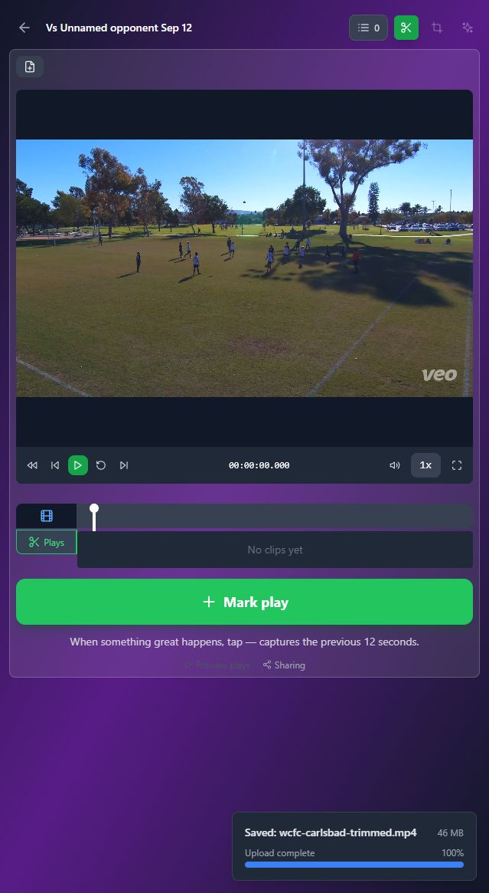
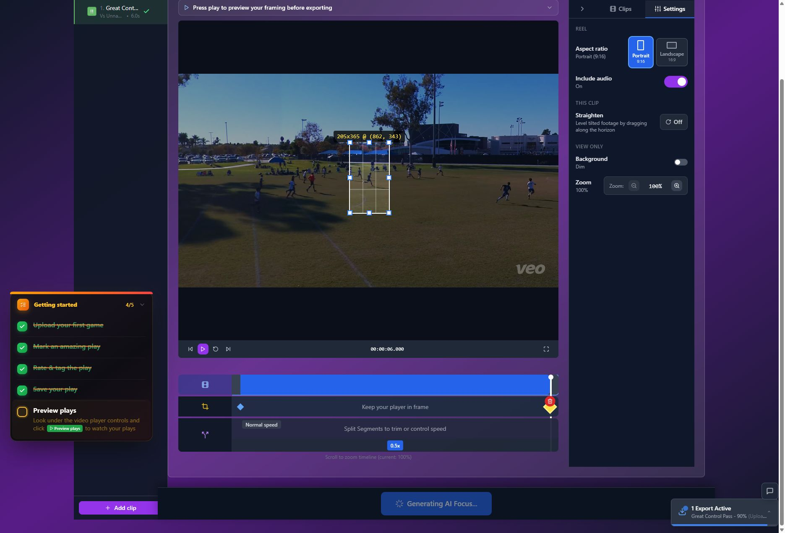
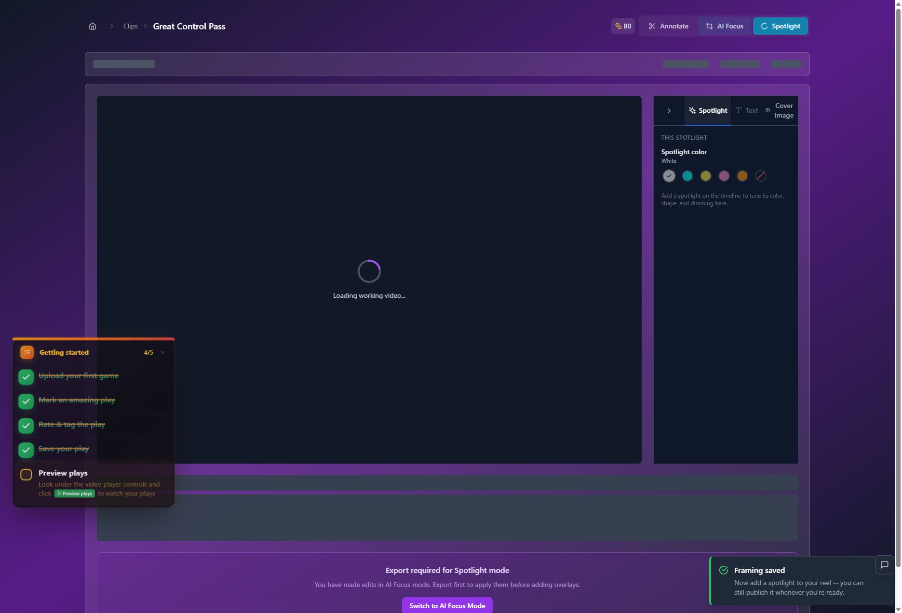

# T14 — Make progress and saving status readable and persistent

Epic: EP04 — Explain work and costs honestly on usable layouts

Priority: P2 · Type: UX implementation · Status: WAITING_FOR_DEPENDENCIES

Dependencies: T04

This file contains the task’s full product brief. Its adjacent `T14.html` is an equivalent single-file visual handoff with screenshots and report mockups embedded. Choose one format; do not read both. Markdown images use the included assets folder; the schematic below is inline text.

## Context and execution boundaries

The target user is a busy youth-sports parent making one compelling playable highlight quickly, then finding and sharing it confidently; keep a deliberate continued-annotation path. The supplied baseline of approximately 5 completed clip exporters per 100 signups and target of 75 are unverified business context. No fix has a verified lift and UX cannot explain every dropout.

Evidence comes from one fresh evaluator account on September 12–13, 2026, not a representative parent study. A supplied 1:29.322 MP4 and play notes identified a six-second moment at source 0:03–0:09, “Great Control Pass.” One framing render and two free effects renders completed for the same clip. The saved portrait played; Spotlight selection was absent on both reopening checks. Sampled frames alone do not prove whole-video effects failure. Exact blue #30 identity, recipient playback, publication, download, purchases and storage expiry were not verified.

No application repository or original source video is included in this handoff. Locate actual implementation and repository instructions first; do not invent code paths, backend architecture, analytics or policies. If a fixture is absent, use an authorized equivalent and document the limit. Read only this task for product requirements; inspect repository code/tests as necessary. Dependency contracts below are repeated so upstream documents are not required. Check prerequisite implementation/tests before starting dependent work.

Preserve browser-based upload, local preview with honest save state, cost/storage disclosure, precise trim inputs, direct framing, optional continued marking, playable completion, free effects when verified, private visibility and single-highlight export without reels. Game means source recording; play means source interval; highlight means editable/exportable moment; reel is optional combination. Export creates media without changing visibility; Download saves a local file; Publish creates link access; Invite is game-scoped. Keep one parent-facing vocabulary across the release.

Implement only this task’s scope. Evidence observations are not root-cause instructions. Proposed mockups/copy are not current behavior; exact controls depend on verified capability. Do not implement rejected alternatives just because they are discussed. No deployment, real publication/invitations, purchases or new paid/external services are authorized by this handoff. Use local/mocked or explicitly authorized test environments. Never claim a task complete from a plan alone.

## Dependency contract and starting conditions

T04 distinguishes unresolved media state from confirmed dirty/ready state. Reuse existing job identity, do not introduce a competing job store. T15 owns monetary policy; show only verified quotes and charged values.

## Evidence, confirmed observations and uncertainty

Original references: B07 · R6 · N10. N01–N12 were assigned to the naming report’s 12 unnumbered rows in source order; they are not original issue IDs. B01–B08 and R1–R7 are original references.

**B07 · R6 · N10 (S09):**

Observed: Spotlight briefly claimed export was required while loading a newly exported video, then recovered. Progress advanced and all jobs completed, but an estimate was clipped. The account began with 88 credits despite walkthrough wording; upload cost two, six-second framing six and effects zero.

Suspected / investigation: Loading/dirty-state evaluation may race. Verify entitlement, ledger, fractional rounding, retry charging and storage rules. No render stall, double charge or purchase failure is established.

## Selected implementation decision

Prefer persistent per-object status with real stages, wrapping estimates and durable acknowledgements. Add return-to-marking during rendering only if actual background execution is safe.

## Work to perform

- Move essential upload/save/render state out of toast-only UI and attach it to the named object.
- Use honest stage progress and unavailable-estimate text; avoid fabricated percent/countdown.
- Explain temporary preparation before onward action becomes available.
- Verify background job execution/recovery; otherwise omit leave-page promise. Surface actual failure/retry without duplicate jobs.

## Proposed replacement copy

- Local preview · Uploading game. Not saved online yet.
- Game saved online.
- Preparing your highlight…
- Creating Great Control Pass · Uploading result
- Time remaining varies.
- Still processing. You don’t need to start another export. — confirmed active jobs only

Use this task’s labels consistently with the release vocabulary. Bracketed values are dynamic data or explicit dependencies, never literal shipping copy. Conditional claims must remain conditional until verified.

## Proposed task schematic — not current UI

```text
Creating Great Control Pass
[Actual progress] · Uploading result
Time remaining varies.
[Verified quote / charge status]
Status persists after toast disappears
Return to marking only if background job survives departure
```

This schematic defines behavior/hierarchy, not a new visual identity. Related report mockups are embedded in the equivalent standalone HTML; this Markdown schematic carries the task-specific behavior without requiring that document.

## Acceptance criteria

- [ ] Saved/ready messages require corresponding acknowledgement/playable asset.
- [ ] At 699px and 200% zoom, stage/cost/estimate remain readable after toast dismissal.
- [ ] No fake countdown, frozen fabricated percent or automatic duplicate submit on retry.
- [ ] Unsupported background continuation is never promised.

## Practical validation

- Delayed upload/save/export stages, failed requests, reload and stale callbacks.
- Narrow, short-height and zoom layouts.
- Ask user to identify what is saved and whether another export is needed.

## Out of scope

No unverified credit/refund copy or invented background execution. T16 owns overall responsive editor layout.

## Safe completion and rollback

Preserve old saved records and playable exports during changes. Use backward-compatible migration and existing feature gating where appropriate; do not delete user data as rollback. If a change regresses the core path, disable/revert the affected change while retaining persisted work. Run repository-required checks and this task’s meaningful validations. Screenshot comparison cannot establish playback or persistence by itself.

Update this file’s status and the plan row only after verified completion (keep the HTML counterpart consistent if maintained). Report changed paths, actual root cause/capability finding, tests executed/results, relevant before/after evidence, unresolved assumptions and rollback limits. Use `BLOCKED` with exact missing input when repository, policy, footage, permission or participants prevent verification. A discovery task is complete when its evidence/decision deliverable is complete; its proposed feature remains unimplemented. Downstream contracts must be recorded in the implementation, tests and task outcome rather than requiring another conversation.

## Original screenshot evidence

These are unchanged evaluation screenshots, not proposed outcomes. Their captions are the source descriptions. Read them alongside the bounded observations above.

### E05

Annotation entry and upload state around the first playback action.



### E09

Immediate save response: Clip created; Frame this clip is briefly disabled.


### E19

Framing export at 5%; About 1 minute is available in the UI state but truncated visually.


### E20

Framing export progresses to 90%, Uploading.



### E21

A further observation still at 90%, Uploading. This filename does not denote completion.


### E22

Progress reaches 92%, Finding players for spotlight. This filename does not denote completion.


### E24

Diagnostic: contradictory Export required message while the just-exported working video loads.



## Source provenance (reading sources is optional)

Derived from `bug-report.html`, `first-export-friction-report.html`, `naming-and-action-consistency-report.html` (September 12–13, 2026) and solution report sections S09. Relevant requirements/evidence are reproduced here; source reports are not needed to execute this task.
