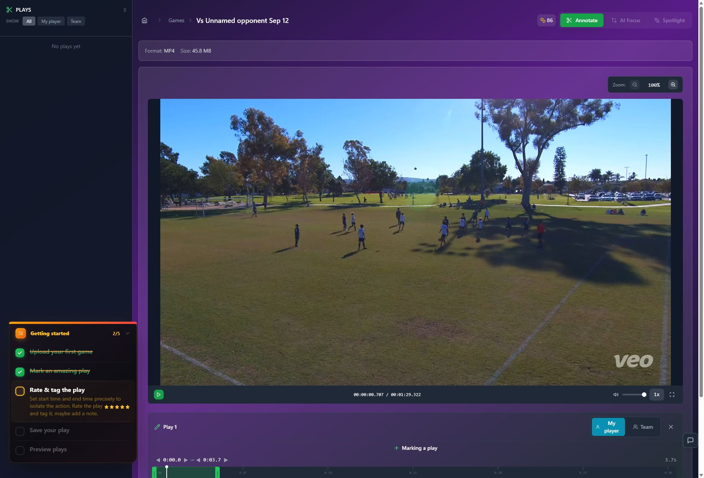

# T16 — Repair narrow and fullscreen editor layouts

Epic: EP04 — Explain work and costs honestly on usable layouts

Priority: P1 · Type: Fix / responsive UX · Status: READY

Dependencies: None

This file contains the task’s full product brief. Its adjacent `T16.html` is an equivalent single-file visual handoff with screenshots and report mockups embedded. Choose one format; do not read both. Markdown images use the included assets folder; the schematic below is inline text.

## Context and execution boundaries

The target user is a busy youth-sports parent making one compelling playable highlight quickly, then finding and sharing it confidently; keep a deliberate continued-annotation path. The supplied baseline of approximately 5 completed clip exporters per 100 signups and target of 75 are unverified business context. No fix has a verified lift and UX cannot explain every dropout.

Evidence comes from one fresh evaluator account on September 12–13, 2026, not a representative parent study. A supplied 1:29.322 MP4 and play notes identified a six-second moment at source 0:03–0:09, “Great Control Pass.” One framing render and two free effects renders completed for the same clip. The saved portrait played; Spotlight selection was absent on both reopening checks. Sampled frames alone do not prove whole-video effects failure. Exact blue #30 identity, recipient playback, publication, download, purchases and storage expiry were not verified.

No application repository or original source video is included in this handoff. Locate actual implementation and repository instructions first; do not invent code paths, backend architecture, analytics or policies. If a fixture is absent, use an authorized equivalent and document the limit. Read only this task for product requirements; inspect repository code/tests as necessary. Dependency contracts below are repeated so upstream documents are not required. Check prerequisite implementation/tests before starting dependent work.

Preserve browser-based upload, local preview with honest save state, cost/storage disclosure, precise trim inputs, direct framing, optional continued marking, playable completion, free effects when verified, private visibility and single-highlight export without reels. Game means source recording; play means source interval; highlight means editable/exportable moment; reel is optional combination. Export creates media without changing visibility; Download saves a local file; Publish creates link access; Invite is game-scoped. Keep one parent-facing vocabulary across the release.

Implement only this task’s scope. Evidence observations are not root-cause instructions. Proposed mockups/copy are not current behavior; exact controls depend on verified capability. Do not implement rejected alternatives just because they are discussed. No deployment, real publication/invitations, purchases or new paid/external services are authorized by this handoff. Use local/mocked or explicitly authorized test environments. Never claim a task complete from a plan alone.

## Dependency contract and starting conditions

No prerequisites. Preserve editing/source context and existing fullscreen capability. T08 owns timestamp semantics; consume labeled clocks. Drawers must adapt to available container width, including restored desktop state.

## Evidence, confirmed observations and uncertainty

Original references: B08 · R7 · fullscreen finding. N01–N12 were assigned to the naming report’s 12 unnumbered rows in source order; they are not original issue IDs. B01–B08 and R1–R7 are original references.

**B08 · R7 · fullscreen finding (S10):**

Observed: At the observed 699-pixel width, a broad plays panel compressed the video and Spotlight settings clipped offscreen. Early narrow layout was more usable. Fullscreen kept editing available, a positive to retain.

Suspected / investigation: A controlled sweep must isolate breakpoint/minimum-width rules and restored panel state. Resize/fullscreen transitions may contribute; exact trigger is unverified.

## Selected implementation decision

Prefer video-first compact reflow with explicit drawers. Sequential mobile-only screens add unnecessary navigation and are not selected.

## Work to perform

- Sweep widths and transitions with fresh/restored panels; isolate fixed minimum widths/overflow.
- Collapse plays/settings behind explicit triggers where space is insufficient.
- Keep timeline/action reachable with safe-area/keyboard-aware layout and bounded video height; use vertical scrolling on short screens.
- Implement drawer focus entry, Escape/close and trigger focus return; never discard edits on resize.

## Proposed replacement copy

- Plays (1)
- Settings
- Back to video
- Mark play
- Export highlight · [verified quote] credits

Use this task’s labels consistently with the release vocabulary. Bracketed values are dynamic data or explicit dependencies, never literal shipping copy. Conditional claims must remain conditional until verified.

## Proposed task schematic — not current UI

```text
Great Control Pass
[Plays (1)]                         [Settings]
┌─────────────────────────────────────────────┐
│                  VIDEO                      │
└─────────────────────────────────────────────┘
[Labeled time] [Timeline]
[Export highlight · verified quote]
Settings opens a drawer; close returns focus; no document overflow
```

This schematic defines behavior/hierarchy, not a new visual identity. Related report mockups are embedded in the equivalent standalone HTML; this Markdown schematic carries the task-specific behavior without requiring that document.

## Acceptance criteria

- [ ] No horizontal document scroll or clipped primary controls at 360, 390, 699, 768, 1024 and 1440px.
- [ ] Wide→narrow→fullscreen→exit→reload preserves edits and adapts panels.
- [ ] 44px proposed touch targets; 200% zoom/virtual keyboard do not hide required inputs.
- [ ] Keyboard drawer flow and supported fullscreen fallback work.

## Practical validation

- Fresh/restored state, long names/errors/costs, selected/no play.
- Landscape phone height, software keyboard, browser zoom and keyboard-only.
- Verify video/timeline not obscured by footer; ordinary vertical scroll allowed.

## Out of scope

No rebrand or reduced mobile feature set; no assumption that screenshot width is the sole failing breakpoint.

## Safe completion and rollback

Preserve old saved records and playable exports during changes. Use backward-compatible migration and existing feature gating where appropriate; do not delete user data as rollback. If a change regresses the core path, disable/revert the affected change while retaining persisted work. Run repository-required checks and this task’s meaningful validations. Screenshot comparison cannot establish playback or persistence by itself.

Update this file’s status and the plan row only after verified completion (keep the HTML counterpart consistent if maintained). Report changed paths, actual root cause/capability finding, tests executed/results, relevant before/after evidence, unresolved assumptions and rollback limits. Use `BLOCKED` with exact missing input when repository, policy, footage, permission or participants prevent verification. A discovery task is complete when its evidence/decision deliverable is complete; its proposed feature remains unimplemented. Downstream contracts must be recorded in the implementation, tests and task outcome rather than requiring another conversation.

## Original screenshot evidence

These are unchanged evaluation screenshots, not proposed outcomes. Their captions are the source descriptions. Read them alongside the bounded observations above.

### E05

Annotation entry and upload state around the first playback action.


### E07

Wide annotation layout: video dominates the viewport; marking controls extend below it.



### E45

Fullscreen annotation retains editing and marking controls but shows clip-relative playback time.


### E47

At four stars, Create an editable clip is enabled but helper still says one more star creates a clip.


### E50

Second direct Sharing settings attempt: no visible response; narrower layout now visible.


### E55

Second persistence check: reopening Spotlight again asks to pick a player. Narrow layout also overflows.


## Source provenance (reading sources is optional)

Derived from `bug-report.html`, `first-export-friction-report.html`, `naming-and-action-consistency-report.html` (September 12–13, 2026) and solution report sections S10. Relevant requirements/evidence are reproduced here; source reports are not needed to execute this task.
