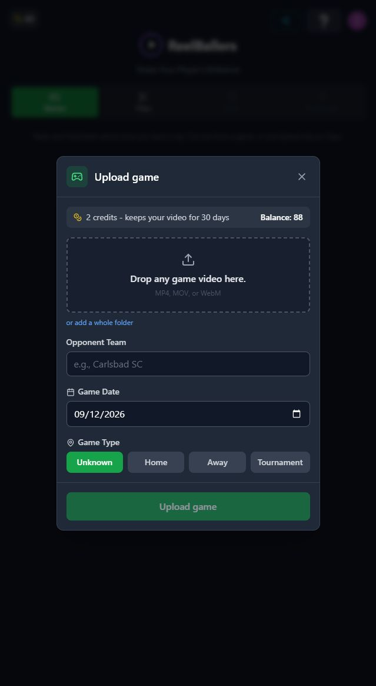

# T17 — Simplify upload and remove fresh-home distractions

Epic: EP04 — Explain work and costs honestly on usable layouts

Priority: P2 · Type: UX implementation · Status: READY

Dependencies: None

This file contains the task’s full product brief. Its adjacent `T17.html` is an equivalent single-file visual handoff with screenshots and report mockups embedded. Choose one format; do not read both. Markdown images use the included assets folder; the schematic below is inline text.

## Context and execution boundaries

The target user is a busy youth-sports parent making one compelling playable highlight quickly, then finding and sharing it confidently; keep a deliberate continued-annotation path. The supplied baseline of approximately 5 completed clip exporters per 100 signups and target of 75 are unverified business context. No fix has a verified lift and UX cannot explain every dropout.

Evidence comes from one fresh evaluator account on September 12–13, 2026, not a representative parent study. A supplied 1:29.322 MP4 and play notes identified a six-second moment at source 0:03–0:09, “Great Control Pass.” One framing render and two free effects renders completed for the same clip. The saved portrait played; Spotlight selection was absent on both reopening checks. Sampled frames alone do not prove whole-video effects failure. Exact blue #30 identity, recipient playback, publication, download, purchases and storage expiry were not verified.

No application repository or original source video is included in this handoff. Locate actual implementation and repository instructions first; do not invent code paths, backend architecture, analytics or policies. If a fixture is absent, use an authorized equivalent and document the limit. Read only this task for product requirements; inspect repository code/tests as necessary. Dependency contracts below are repeated so upstream documents are not required. Check prerequisite implementation/tests before starting dependent work.

Preserve browser-based upload, local preview with honest save state, cost/storage disclosure, precise trim inputs, direct framing, optional continued marking, playable completion, free effects when verified, private visibility and single-highlight export without reels. Game means source recording; play means source interval; highlight means editable/exportable moment; reel is optional combination. Export creates media without changing visibility; Download saves a local file; Publish creates link access; Invite is game-scoped. Keep one parent-facing vocabulary across the release.

Implement only this task’s scope. Evidence observations are not root-cause instructions. Proposed mockups/copy are not current behavior; exact controls depend on verified capability. Do not implement rejected alternatives just because they are discussed. No deployment, real publication/invitations, purchases or new paid/external services are authorized by this handoff. Use local/mocked or explicitly authorized test environments. Never claim a task complete from a plan alone.

## Dependency contract and starting conditions

No prerequisites for structure. T15 must verify any changed monetary/retention statements. Fresh-home Invite distraction is an unnumbered source finding now made explicit; do not guess whether the global Invite is referral or collaboration.

## Evidence, confirmed observations and uncertainty

Original references: Unnumbered friction journey: fresh home / upload, R5 · N01–N02, N04, N06–N07, N09, N11. N01–N12 were assigned to the naming report’s 12 unnumbered rows in source order; they are not original issue IDs. B01–B08 and R1–R7 are original references.

**Unnumbered friction journey: fresh home / upload (S11):**

Observed: Upload was clear, accepted the MP4 and disclosed two credits/30-day storage. Opponent/date/type were optional but appeared before value; defaults produced an unnamed-opponent title.

Suspected / investigation: Metadata may slow parents but no associated abandonment was measured. Source expiration and finished-result retention were untested.
**R5 · N01–N02, N04, N06–N07, N09, N11 (S08):**

Observed: One clip passed through REEL, AI Focus, Clips and Highlight Reels labels; no reel was required. Saved preview promoted the game title/source timestamp instead of the clip name. Source and finished previews had similar labels.

Suspected / investigation: Labels may reflect different object models or reused components; inspect route/data contracts before renaming. Confusion is plausible, not a measured population rate.

Additional unnumbered finding, friction report fresh-home journey, E03: Invite and multiple disabled destinations were secondary distractions. No causal abandonment was measured. The exact global Invite scope needs verification.

## Selected implementation decision

Prefer collapsed optional metadata and a secondary location for global Invite over deleting collaboration or adding a compulsory after-export form.

## Work to perform

- Preserve prominent Start with a game / Upload game and direct clip alternative.
- Keep file/cost/storage visible, collapse opponent/date/type and use truthful editable fallback title.
- Inspect global Invite purpose; move nonessential fresh-home invitation/referral control to an appropriate secondary menu after identifying its scope.
- Collapse irrelevant disabled destinations while keeping access later; do not hide contextual game invitations or rename a user’s highlight when game metadata changes.

## Proposed replacement copy

- Start with a game
- Upload game · [verified cost] credits
- Game details (optional)
- You can add an opponent and game date later.
- Game uploaded Sep 12 — when only upload date is known

Use this task’s labels consistently with the release vocabulary. Bracketed values are dynamic data or explicit dependencies, never literal shipping copy. Conditional claims must remain conditional until verified.

## Proposed task schematic — not current UI

```text
Start with a game
[Upload game · verified cost]
Already have a clip? [Direct clip entry]

Upload: [File] + visible cost/storage
▸ Game details (optional)
[Upload game]
Nonessential Invite lives in a verified-scope secondary menu
```

This schematic defines behavior/hierarchy, not a new visual identity. Related report mockups are embedded in the equivalent standalone HTML; this Markdown schematic carries the task-specific behavior without requiring that document.

## Acceptance criteria

- [ ] Upload needs no metadata; disclosed costs/storage remain visible before commitment.
- [ ] Fresh empty home emphasizes upload/direct clip entry over Invite/disabled destinations.
- [ ] Invite remains reachable in a scope-appropriate secondary location with its actual purpose stated.
- [ ] Fallback title never claims known opponent or match date; highlight name stays intact.

## Practical validation

- Fresh user and existing user with two similarly named games.
- Locate moved Invite and confirm it retains correct scope, without sending anything.
- Compare upload-start comprehension and later retrieval; source evidence does not establish measured dropout.

## Out of scope

No removal of collaboration, account rework or assumed signup problem. Do not invent entitlement/retention wording.

## Safe completion and rollback

Preserve old saved records and playable exports during changes. Use backward-compatible migration and existing feature gating where appropriate; do not delete user data as rollback. If a change regresses the core path, disable/revert the affected change while retaining persisted work. Run repository-required checks and this task’s meaningful validations. Screenshot comparison cannot establish playback or persistence by itself.

Update this file’s status and the plan row only after verified completion (keep the HTML counterpart consistent if maintained). Report changed paths, actual root cause/capability finding, tests executed/results, relevant before/after evidence, unresolved assumptions and rollback limits. Use `BLOCKED` with exact missing input when repository, policy, footage, permission or participants prevent verification. A discovery task is complete when its evidence/decision deliverable is complete; its proposed feature remains unimplemented. Downstream contracts must be recorded in the implementation, tests and task outcome rather than requiring another conversation.

## Original screenshot evidence

These are unchanged evaluation screenshots, not proposed outcomes. Their captions are the source descriptions. Read them alongside the bounded observations above.

### E03

Fresh signed-in home: 88 credits, Start with a game, Upload game, and a five-step tutorial.


### E04

Upload dialog: two credits, 30-day storage, optional opponent/date/game type.



### E31

Save draft returns to Clips with Ready to Publish and a Preview action.


### E37

Saved portrait preview plays after loading; the black frame was transient.


## Source provenance (reading sources is optional)

Derived from `bug-report.html`, `first-export-friction-report.html`, `naming-and-action-consistency-report.html` (September 12–13, 2026) and solution report sections S11, S08. Relevant requirements/evidence are reproduced here; source reports are not needed to execute this task.
