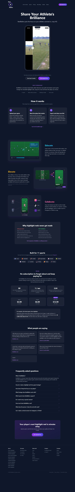

# T22 — Investigate automatic athlete tracking before committing to build

Epic: EP05 — Improve finished quality; investigate larger capabilities

Priority: P3 · Type: Gated discovery · Status: GATED_DISCOVERY

Dependencies: T21

This file contains the task’s full product brief. Its adjacent `T22.html` is an equivalent single-file visual handoff with screenshots and report mockups embedded. Choose one format; do not read both. Markdown images use the included assets folder; the schematic below is inline text.

## Context and execution boundaries

The target user is a busy youth-sports parent making one compelling playable highlight quickly, then finding and sharing it confidently; keep a deliberate continued-annotation path. The supplied baseline of approximately 5 completed clip exporters per 100 signups and target of 75 are unverified business context. No fix has a verified lift and UX cannot explain every dropout.

Evidence comes from one fresh evaluator account on September 12–13, 2026, not a representative parent study. A supplied 1:29.322 MP4 and play notes identified a six-second moment at source 0:03–0:09, “Great Control Pass.” One framing render and two free effects renders completed for the same clip. The saved portrait played; Spotlight selection was absent on both reopening checks. Sampled frames alone do not prove whole-video effects failure. Exact blue #30 identity, recipient playback, publication, download, purchases and storage expiry were not verified.

No application repository or original source video is included in this handoff. Locate actual implementation and repository instructions first; do not invent code paths, backend architecture, analytics or policies. If a fixture is absent, use an authorized equivalent and document the limit. Read only this task for product requirements; inspect repository code/tests as necessary. Dependency contracts below are repeated so upstream documents are not required. Check prerequisite implementation/tests before starting dependent work.

Preserve browser-based upload, local preview with honest save state, cost/storage disclosure, precise trim inputs, direct framing, optional continued marking, playable completion, free effects when verified, private visibility and single-highlight export without reels. Game means source recording; play means source interval; highlight means editable/exportable moment; reel is optional combination. Export creates media without changing visibility; Download saves a local file; Publish creates link access; Invite is game-scoped. Keep one parent-facing vocabulary across the release.

Implement only this task’s scope. Evidence observations are not root-cause instructions. Proposed mockups/copy are not current behavior; exact controls depend on verified capability. Do not implement rejected alternatives just because they are discussed. No deployment, real publication/invitations, purchases or new paid/external services are authorized by this handoff. Use local/mocked or explicitly authorized test environments. Never claim a task complete from a plan alone.

## Dependency contract and starting conditions

Requires T21 quality rubric and authorized representative fixtures. This task authorizes code/capability inspection and a bounded local feasibility prototype only; production rollout is a later product decision.

## Evidence, confirmed observations and uncertainty

Original references: R3 · N04–N05, R3 · homepage visual promise / result finding. N01–N12 were assigned to the naming report’s 12 unnumbered rows in source order; they are not original issue IDs. B01–B08 and R1–R7 are original references.

**R3 · N04–N05 (S04):**

Observed: The homepage promised AI tracking of a chosen player. AI Focus required manual box positions; two points were placed. Later Spotlight detected players, which does not establish automatic crop tracking.

Suspected / investigation: Investigate whether tracking exists elsewhere and whether detections identify one athlete reliably over time. Test occlusion, similar uniforms and camera movement; detection is not equivalent to tracking.
**R3 · homepage visual promise / result finding (S05):**

Observed: The portrait result played and enlarged the action but looked soft. Source crop was 205 × 365; working output was labeled 810 × 1440, 30 fps. Exact blue #30 identity was not confirmed.

Suspected / investigation: The crop is enlarged about fourfold in each dimension, a plausible contributor to softness, not proof of a faulty upscaler. Compare source detail, intermediate encoding and final asset at matched frames. Screenshots cannot establish motion/audio fidelity.

## Selected implementation decision

Compare actual temporal tracking + correction against guided manual and wider/static framing. Detection alone is insufficient. No prototype success is a shipping claim.

## Work to perform

- Inspect current detection/tracking capabilities, coordinate systems, output crop constraints and cost.
- Prototype one-athlete moving crop only within authorized local fixtures.
- Measure target switches, occlusion recovery, correction effort, crop jitter, latency and compute cost.
- Specify fallback to manual/wide framing and deliver go/no-go recommendation plus estimated implementation tasks; identify dependencies and unresolved risks.

## Proposed replacement copy

- Choose your athlete. We’ll suggest a moving frame for you to review. — prototype only
- We lost track here. Adjust the frame or use a wider view.

Use this task’s labels consistently with the release vocabulary. Bracketed values are dynamic data or explicit dependencies, never literal shipping copy. Conditional claims must remain conditional until verified.

## Proposed task schematic — not current UI

```text
PROTOTYPE ONLY
Choose athlete → suggested moving frame → whole-clip review
Confident segment ── uncertain segment ── corrected segment
                    [Adjust] [Use wider frame]
Benchmark + cost + correction effort → go / no-go decision
```

This schematic defines behavior/hierarchy, not a new visual identity. Related report mockups are embedded in the equivalent standalone HTML; this Markdown schematic carries the task-specific behavior without requiring that document.

## Acceptance criteria

- [ ] Decision memo compares manual/wide/tracking paths with measured evidence.
- [ ] Prototype never silently asserts jersey/child identity and flags uncertain sections.
- [ ] Correction/fallback preserves edits and a usable export path.
- [ ] Production implementation is not marked done or enabled by this discovery task.

## Practical validation

- Crossing similar uniforms, occlusion, distant action and camera movement across full intervals.
- Measure active corrections separately from system wait.
- Review against T21 quality tolerances and parent expectations.

## Out of scope

No production tracker rollout, external paid service adoption or claim of reaching the 75% target.

## Safe completion and rollback

Preserve old saved records and playable exports during changes. Use backward-compatible migration and existing feature gating where appropriate; do not delete user data as rollback. If a change regresses the core path, disable/revert the affected change while retaining persisted work. Run repository-required checks and this task’s meaningful validations. Screenshot comparison cannot establish playback or persistence by itself.

Update this file’s status and the plan row only after verified completion (keep the HTML counterpart consistent if maintained). Report changed paths, actual root cause/capability finding, tests executed/results, relevant before/after evidence, unresolved assumptions and rollback limits. Use `BLOCKED` with exact missing input when repository, policy, footage, permission or participants prevent verification. A discovery task is complete when its evidence/decision deliverable is complete; its proposed feature remains unimplemented. Downstream contracts must be recorded in the implementation, tests and task outcome rather than requiring another conversation.

## Original screenshot evidence

These are unchanged evaluation screenshots, not proposed outcomes. Their captions are the source descriptions. Read them alongside the bounded observations above.

### E01

Public homepage: visual demonstration, three-step promise, AI tracking, sharing and credit pricing.



### E12

AI Focus requires manual box positions. One focus point is required before export.


### E15

Framing preview at about four seconds; the crop has not automatically followed a player.


### E17

Second crop point added; timeline shows two focus points.


### E26

One detected blue player selected, visible white ellipse, and instruction to select remaining players.


## Source provenance (reading sources is optional)

Derived from `bug-report.html`, `first-export-friction-report.html`, `naming-and-action-consistency-report.html` (September 12–13, 2026) and solution report sections S04, S05. Relevant requirements/evidence are reproduced here; source reports are not needed to execute this task.
