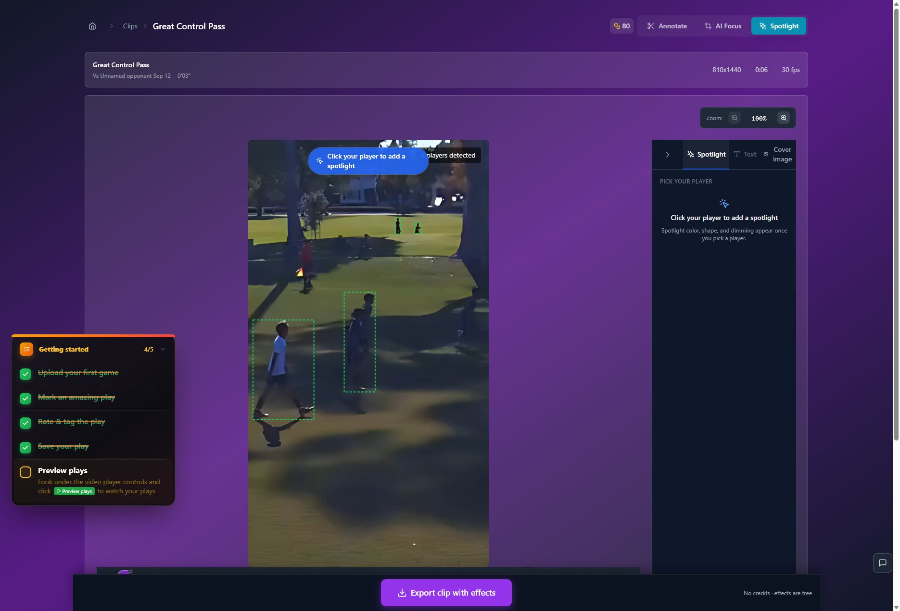
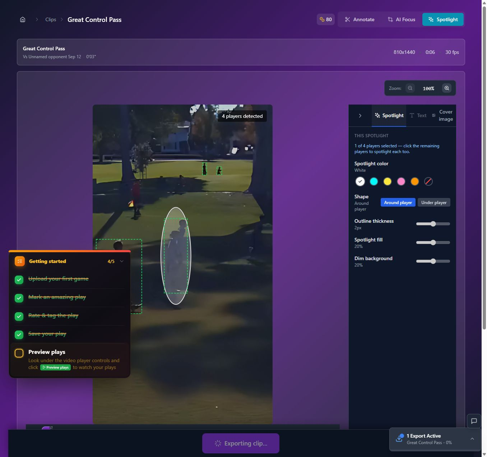

# T23 — Investigate a combined framing and Spotlight export

Epic: EP05 — Improve finished quality; investigate larger capabilities

Priority: P3 · Type: Gated discovery · Status: GATED_DISCOVERY

Dependencies: T01, T02, T21

This file contains the task’s full product brief. Its adjacent `T23.html` is an equivalent single-file visual handoff with screenshots and report mockups embedded. Choose one format; do not read both. Markdown images use the included assets folder; the schematic below is inline text.

## Context and execution boundaries

The target user is a busy youth-sports parent making one compelling playable highlight quickly, then finding and sharing it confidently; keep a deliberate continued-annotation path. The supplied baseline of approximately 5 completed clip exporters per 100 signups and target of 75 are unverified business context. No fix has a verified lift and UX cannot explain every dropout.

Evidence comes from one fresh evaluator account on September 12–13, 2026, not a representative parent study. A supplied 1:29.322 MP4 and play notes identified a six-second moment at source 0:03–0:09, “Great Control Pass.” One framing render and two free effects renders completed for the same clip. The saved portrait played; Spotlight selection was absent on both reopening checks. Sampled frames alone do not prove whole-video effects failure. Exact blue #30 identity, recipient playback, publication, download, purchases and storage expiry were not verified.

No application repository or original source video is included in this handoff. Locate actual implementation and repository instructions first; do not invent code paths, backend architecture, analytics or policies. If a fixture is absent, use an authorized equivalent and document the limit. Read only this task for product requirements; inspect repository code/tests as necessary. Dependency contracts below are repeated so upstream documents are not required. Check prerequisite implementation/tests before starting dependent work.

Preserve browser-based upload, local preview with honest save state, cost/storage disclosure, precise trim inputs, direct framing, optional continued marking, playable completion, free effects when verified, private visibility and single-highlight export without reels. Game means source recording; play means source interval; highlight means editable/exportable moment; reel is optional combination. Export creates media without changing visibility; Download saves a local file; Publish creates link access; Invite is game-scoped. Keep one parent-facing vocabulary across the release.

Implement only this task’s scope. Evidence observations are not root-cause instructions. Proposed mockups/copy are not current behavior; exact controls depend on verified capability. Do not implement rejected alternatives just because they are discussed. No deployment, real publication/invitations, purchases or new paid/external services are authorized by this handoff. Use local/mocked or explicitly authorized test environments. Never claim a task complete from a plan alone.

## Dependency contract and starting conditions

Durable effects settings and render-version parity from T01/T02, quality rubric from T21. Determine whether detection requires framed intermediate before designing a single final export. Discovery only; no automatic replacement of working pipeline.

## Evidence, confirmed observations and uncertainty

Original references: B01 dependency · N12 · friction Spotlight journey. N01–N12 were assigned to the naming report’s 12 unnumbered rows in source order; they are not original issue IDs. B01–B08 and R1–R7 are original references.

**B01 dependency · N12 · friction Spotlight journey (S12):**

Observed: Detection and a one-click white ellipse worked in the editor. After one selection the helper encouraged remaining players. Spotlight followed framing and required a second, free render; selection later failed to persist.

Suspected / investigation: Determine whether detection needs a framed intermediate or can run before export. Investigate source-coordinate mapping and costs before promising a single render. Multiple detections do not mean multiple intended subjects.

## Selected implementation decision

Compare existing optional second free render with optional effects selection before a combined render. Keep skip-effects path; reducing render count must not delay every first result.

## Work to perform

- Trace pipeline stages and detection coordinate requirements.
- Evaluate pre-export detection or mapped tracks, cache reuse and one final revision-bound render.
- Measure time to first playable versus desired effected result, compute cost and output parity.
- Produce go/no-go decision, exact cost policy questions, fallback and a separately estimable implementation plan.

## Proposed replacement copy

- Add spotlight (optional)
- Skip spotlight
- Export highlight · [verified total quote] — prototype only

Use this task’s labels consistently with the release vocabulary. Bracketed values are dynamic data or explicit dependencies, never literal shipping copy. Conditional claims must remain conditional until verified.

## Proposed task schematic — not current UI

```text
DISCOVERY ONLY
Current: frame render → optional effect choice → effect render
Candidate: frame + optional effect choice → combined render
Compare output parity, time to first value and total cost
Detection failure → skip effects without losing framing
Production build requires a separate recorded go decision
```

This schematic defines behavior/hierarchy, not a new visual identity. Related report mockups are embedded in the equivalent standalone HTML; this Markdown schematic carries the task-specific behavior without requiring that document.

## Acceptance criteria

- [ ] Document feasible/unfeasible pipeline paths and measured stage timings.
- [ ] Combined prototype, if feasible, matches framing/effects version and quality.
- [ ] Detection failure supports no-Spotlight result without losing edits.
- [ ] Do not claim one export means free or faster until total cost/wait is verified.

## Practical validation

- Compare actual output and timing on same fixtures with and without effects.
- Test detection failure, out-of-order callbacks and changed framing coordinates.
- Use T21 quality checks and confirm no duplicate chargeable submissions.

## Out of scope

No production pipeline migration or unverified quote. Separate build task requires explicit recorded product go decision.

## Safe completion and rollback

Preserve old saved records and playable exports during changes. Use backward-compatible migration and existing feature gating where appropriate; do not delete user data as rollback. If a change regresses the core path, disable/revert the affected change while retaining persisted work. Run repository-required checks and this task’s meaningful validations. Screenshot comparison cannot establish playback or persistence by itself.

Update this file’s status and the plan row only after verified completion (keep the HTML counterpart consistent if maintained). Report changed paths, actual root cause/capability finding, tests executed/results, relevant before/after evidence, unresolved assumptions and rollback limits. Use `BLOCKED` with exact missing input when repository, policy, footage, permission or participants prevent verification. A discovery task is complete when its evidence/decision deliverable is complete; its proposed feature remains unimplemented. Downstream contracts must be recorded in the implementation, tests and task outcome rather than requiring another conversation.

## Original screenshot evidence

These are unchanged evaluation screenshots, not proposed outcomes. Their captions are the source descriptions. Read them alongside the bounded observations above.

### E22

Progress reaches 92%, Finding players for spotlight. This filename does not denote completion.


### E23

First successful framed export: portrait playback, Add spotlight, Publish without spotlight, Save draft.


### E25

Loading completes and the warning clears; four players detected; effects explicitly free.



### E27

First effects export in progress. The white spotlight was visible in the editor before export.



### E30

First effects export completes; Publish, Reapply spotlight, Reapply AI Focus, and Save draft.


### E42

Second free effects export completes and offers Save draft.


## Source provenance (reading sources is optional)

Derived from `bug-report.html`, `first-export-friction-report.html`, `naming-and-action-consistency-report.html` (September 12–13, 2026) and solution report sections S12. Relevant requirements/evidence are reproduced here; source reports are not needed to execute this task.
