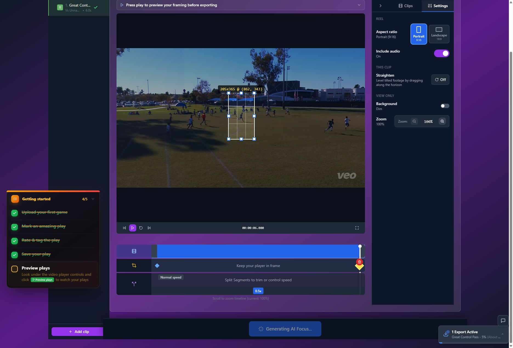
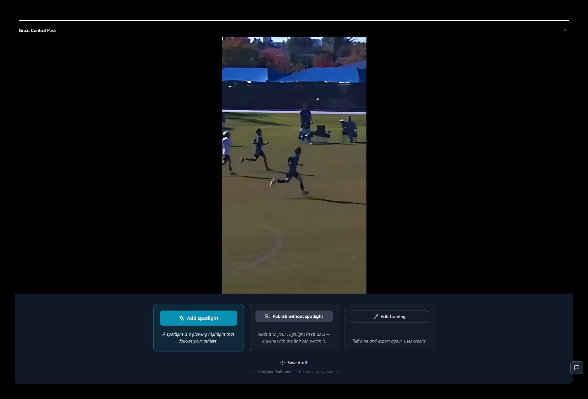
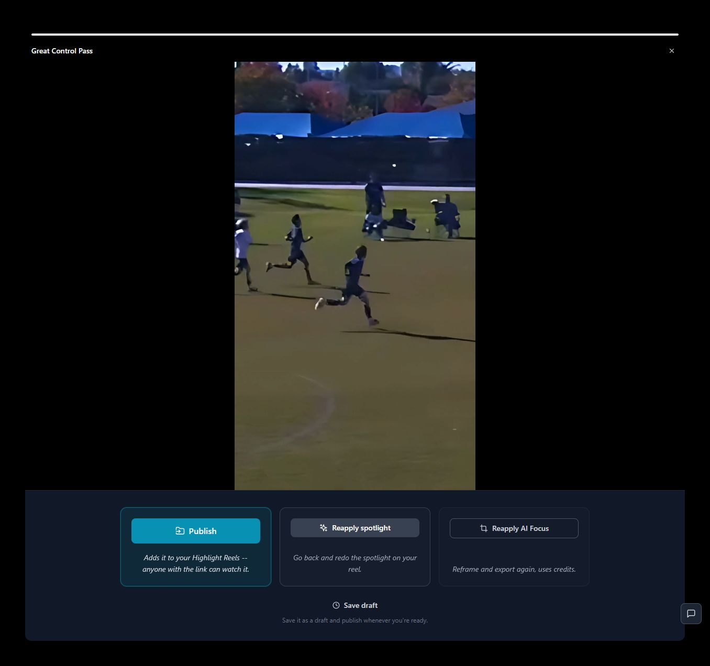

# T25 — Define activation metrics and instrument the missing funnel

Epic: EP06 — Measure actual value and validate release readiness

Priority: P2 · Type: Analytics implementation · Status: READY

Dependencies: None

This file contains the task’s full product brief. Its adjacent `T25.html` is an equivalent single-file visual handoff with screenshots and report mockups embedded. Choose one format; do not read both. Markdown images use the included assets folder; the schematic below is inline text.

## Context and execution boundaries

The target user is a busy youth-sports parent making one compelling playable highlight quickly, then finding and sharing it confidently; keep a deliberate continued-annotation path. The supplied baseline of approximately 5 completed clip exporters per 100 signups and target of 75 are unverified business context. No fix has a verified lift and UX cannot explain every dropout.

Evidence comes from one fresh evaluator account on September 12–13, 2026, not a representative parent study. A supplied 1:29.322 MP4 and play notes identified a six-second moment at source 0:03–0:09, “Great Control Pass.” One framing render and two free effects renders completed for the same clip. The saved portrait played; Spotlight selection was absent on both reopening checks. Sampled frames alone do not prove whole-video effects failure. Exact blue #30 identity, recipient playback, publication, download, purchases and storage expiry were not verified.

No application repository or original source video is included in this handoff. Locate actual implementation and repository instructions first; do not invent code paths, backend architecture, analytics or policies. If a fixture is absent, use an authorized equivalent and document the limit. Read only this task for product requirements; inspect repository code/tests as necessary. Dependency contracts below are repeated so upstream documents are not required. Check prerequisite implementation/tests before starting dependent work.

Preserve browser-based upload, local preview with honest save state, cost/storage disclosure, precise trim inputs, direct framing, optional continued marking, playable completion, free effects when verified, private visibility and single-highlight export without reels. Game means source recording; play means source interval; highlight means editable/exportable moment; reel is optional combination. Export creates media without changing visibility; Download saves a local file; Publish creates link access; Invite is game-scoped. Keep one parent-facing vocabulary across the release.

Implement only this task’s scope. Evidence observations are not root-cause instructions. Proposed mockups/copy are not current behavior; exact controls depend on verified capability. Do not implement rejected alternatives just because they are discussed. No deployment, real publication/invitations, purchases or new paid/external services are authorized by this handoff. Use local/mocked or explicitly authorized test environments. Never claim a task complete from a plan alone.

## Dependency contract and starting conditions

No prerequisite for audit. Supplied ~5 exporters per 100 signups and target 75 are unverified context. Reconcile historical denominator/window before comparing with proposed seven-day person-level playback-validated metric. Do not collect child-identifying data.

## Evidence, confirmed observations and uncertainty

Original references: B01, B06 · R1 · N11, B03 · R2 · N02–N03, R3 · N04–N05, B02 · R5 · N08 · untested download, B07 · R6 · N10. N01–N12 were assigned to the naming report’s 12 unnumbered rows in source order; they are not original issue IDs. B01–B08 and R1–R7 are original references.

**B01, B06 · R1 · N11 (S01):**

Observed: Selection was absent after both save/reopen journeys, including one without reload. Saved playback worked; sampled frames lacked an ellipse. One library reload reopened an earlier framing completion.

Suspected / investigation: Selection serialization, detection identifiers, export input, preview asset selection and job acknowledgement are separate suspects. Compare persisted editor data, effects job input/output and the exact saved-player asset. Reproduce sequential jobs and delayed completions before selecting a cause.
**B03 · R2 · N02–N03 (S02):**

Observed: At four stars, the toggle allowed clip creation while the helper still said one more star creates a clip. The evaluator raised the rating unnecessarily; five stars was not a real requirement.

Suspected / investigation: Rating-driven defaults and separately maintained helper text may have drifted. Inspect all rating/creation combinations; do not infer backend gating from misleading copy.
**R3 · N04–N05 (S04):**

Observed: The homepage promised AI tracking of a chosen player. AI Focus required manual box positions; two points were placed. Later Spotlight detected players, which does not establish automatic crop tracking.

Suspected / investigation: Investigate whether tracking exists elsewhere and whether detections identify one athlete reliably over time. Test occlusion, similar uniforms and camera movement; detection is not equivalent to tracking.
**B02 · R5 · N08 · untested download (S07):**

Observed: Three direct Sharing settings attempts produced no visible response. Preview plays → Share plays opened a game email form. Private/link visibility copy was clear. Publication, invitations, recipient playback and downloads were untested; no download was found in inspected menus.

Suspected / investigation: Compare both entry points, selected/unselected play context and dialog state. Verify game permission scope, recipient authentication and revocation before finalizing disclosure. Do not assume every sharing route is broken.
**B07 · R6 · N10 (S09):**

Observed: Spotlight briefly claimed export was required while loading a newly exported video, then recovered. Progress advanced and all jobs completed, but an estimate was clipped. The account began with 88 credits despite walkthrough wording; upload cost two, six-second framing six and effects zero.

Suspected / investigation: Loading/dirty-state evaluation may race. Verify entitlement, ledger, fractional rounding, retry charging and storage rules. No render stall, double charge or purchase failure is established.

Concrete proposed event contract (reuse equivalent existing event names rather than duplicate): signup_completed with anonymous person/cohort ID and timestamp; upload_started/succeeded/failed with game/direct source, duration/size buckets, device and failure class; play_saved and highlight_created with explicit intent and object IDs; framing_opened, framing_point_added and preview_started with manual/automatic/wide path; export_accepted/succeeded/failed with job/highlight/edit-revision IDs, framing/effects/combined stage, output duration, quoted/charged credits and system stage duration; result_opened, playback_started and result_viewed with exact artifact ID, entry route and media-load duration/error; draft_saved, result_reopened, share_intent and publish_succeeded with version and game-invite versus highlight-link scope.

Join by person, highlight, edit revision and job. Proposed primary metric: unique completed signups with at least one successfully rendered playback-validated highlight within seven days / all eligible completed signups. Report 24-hour activation separately and keep the historical definition separately until reconciled. A six-second effects retry is another job, not another person. Share intent, publication, actual sending and recipient watching are different facts. Do not infer any uninstrumented fact.

## Selected implementation decision

Prefer distinct accepted job, validated export, playback and sharing events joined by anonymous user/highlight/revision/job. Count people, not repeated effects jobs.

## Work to perform

- Audit existing event definitions/coverage and preserve historical series.
- Instrument missing upload/play/draft/framing/export/view/reopen/share-intent events using existing analytics infrastructure if authorized.
- Define accepted vs succeeded vs viewed: proposed viewed ≥2s for clips ≥4s, otherwise ≥50%, as convention not satisfaction proof.
- Record relevant failure classes, durations, device/source buckets and verified quote/charge; dedupe retries and internal tests.
- Document cohort queries, unknown inactivity and quality/annotation/privacy guardrails; do not fabricate baseline or lift.

## Proposed replacement copy

- No new parent-facing screen required. Use existing accurate states; the schematic is a measurement-state diagram, not another onboarding step.

Use this task’s labels consistently with the release vocabulary. Bracketed values are dynamic data or explicit dependencies, never literal shipping copy. Conditional claims must remain conditional until verified.

## Proposed task schematic — not current UI

```text
signup(person) → upload → play / draft → export(job, revision)
                                          ↓ validated media
                                     playable highlight
                                          ↓ actual playback
                                      viewed result
3 jobs for same person ≠ 3 activated people
Publication is a later, separate event
```

This schematic defines behavior/hierarchy, not a new visual identity. Related report mockups are embedded in the equivalent standalone HTML; this Markdown schematic carries the task-specific behavior without requiring that document.

## Acceptance criteria

- [ ] One person with three renders of one highlight contributes once to activation.
- [ ] Seven-day and 24-hour definitions are explicit and historical baseline remains separately labeled until reconciled.
- [ ] Render validation and actual playback are different events; publish does not mean sent/watched.
- [ ] Analytics excludes child names, raw videos, recipient emails and free-text report content.

## Practical validation

- Fixture event stream: signup → upload → play/draft → framing → three renders → view/reopen, including failures/retries.
- Verify deduplication/joins and missing/out-of-order events with local test sink.
- Review proposed queries and privacy fields; do not connect a new external analytics service without authorization.

## Out of scope

No claimed 75% forecast or causal attribution of all inactivity to UX. No new tracking vendor or real-data export.

## Safe completion and rollback

Preserve old saved records and playable exports during changes. Use backward-compatible migration and existing feature gating where appropriate; do not delete user data as rollback. If a change regresses the core path, disable/revert the affected change while retaining persisted work. Run repository-required checks and this task’s meaningful validations. Screenshot comparison cannot establish playback or persistence by itself.

Update this file’s status and the plan row only after verified completion (keep the HTML counterpart consistent if maintained). Report changed paths, actual root cause/capability finding, tests executed/results, relevant before/after evidence, unresolved assumptions and rollback limits. Use `BLOCKED` with exact missing input when repository, policy, footage, permission or participants prevent verification. A discovery task is complete when its evidence/decision deliverable is complete; its proposed feature remains unimplemented. Downstream contracts must be recorded in the implementation, tests and task outcome rather than requiring another conversation.

## Original screenshot evidence

These are unchanged evaluation screenshots, not proposed outcomes. Their captions are the source descriptions. Read them alongside the bounded observations above.

### E19

Framing export at 5%; About 1 minute is available in the UI state but truncated visually.



### E23

First successful framed export: portrait playback, Add spotlight, Publish without spotlight, Save draft.



### E31

Save draft returns to Clips with Ready to Publish and a Preview action.


### E37

Saved portrait preview plays after loading; the black frame was transient.


### E42

Second free effects export completes and offers Save draft.



## Source provenance (reading sources is optional)

Derived from `bug-report.html`, `first-export-friction-report.html`, `naming-and-action-consistency-report.html` (September 12–13, 2026) and solution report sections S01, S02, S04, S07, S09. Relevant requirements/evidence are reproduced here; source reports are not needed to execute this task.
