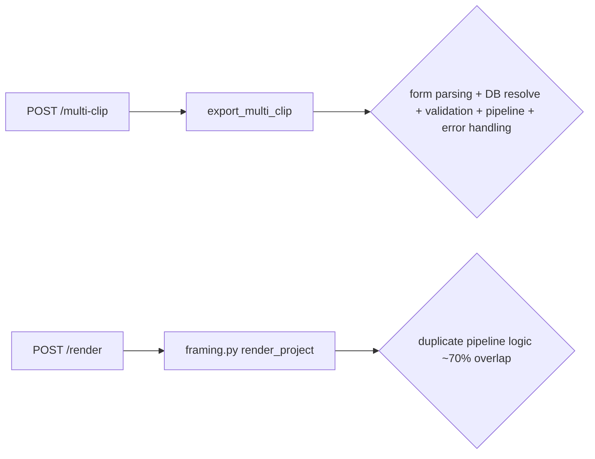
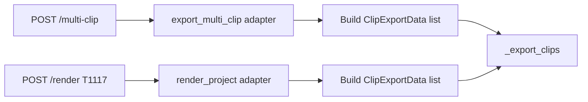

# T1116 Design: Extract Shared Export Pipeline

## Current State

`export_multi_clip()` is a ~915-line monolith (lines 1155-2069) that mixes two concerns:

```
export_multi_clip(request, form_data...)
├── REQUEST PARSING (lines 1155-1276)
│   ├── Parse form data → video_files dict
│   ├── Parse JSON → clips_data, aspect_ratio, transition
│   ├── Capture user/profile context
│   └── Reserve credits
│
├── DB-RESOLVED MODE (lines 1277-1441)
│   ├── Query working_clips + raw_clips
│   ├── Download/extract video sources
│   └── Populate video_files from DB
│
├── VALIDATION (lines 1442-1461)
│   ├── Video count matches clip count
│   └── All clips have framing data
│
└── CORE PIPELINE (lines 1463-2069)
    ├── Calculate target resolution
    ├── MODAL PATH (lines 1478-1688)
    │   ├── Upload sources to R2 temp
    │   ├── call_modal_clips_ai()
    │   ├── Player detection
    │   ├── DB save (working_videos, export_jobs)
    │   └── Return presigned URL
    ├── LOCAL PATH (lines 1690-1991)
    │   ├── Init AI upscaler
    │   ├── Process each clip
    │   ├── Concatenate with transitions
    │   ├── Upload to R2
    │   ├── Player detection (local YOLO)
    │   ├── DB save
    │   └── Return JSON
    └── ERROR HANDLING (lines 1993-2069)
        ├── Credit refund
        ├── GPU cleanup
        └── Export_jobs error update
```



## Target State

Split into a thin adapter + shared pipeline:

```
export_multi_clip(request, form_data...)        ← ~120 lines (adapter)
├── Parse form data → video_files dict
├── Parse JSON → clips_data, aspect_ratio, transition
├── Capture user/profile context
├── Reserve credits
├── DB-resolve mode (populate video_files)
├── Validate
└── Build ClipExportData list
    └── _export_clips(export_id, clips, ...)    ← ~600 lines (shared pipeline)
        ├── Calculate target resolution
        ├── MODAL PATH
        │   ├── Upload sources to R2 temp
        │   ├── call_modal_clips_ai()
        │   ├── Player detection
        │   ├── DB save
        │   └── Return presigned URL
        ├── LOCAL PATH
        │   ├── Init AI upscaler
        │   ├── Process each clip
        │   ├── Concatenate
        │   ├── Upload to R2
        │   ├── Player detection
        │   ├── DB save
        │   └── Return JSON
        └── ERROR HANDLING
            ├── Credit refund
            ├── GPU/temp cleanup
            └── Export_jobs error update
```



## ClipExportData Dataclass

```python
@dataclass
class ClipExportData:
    clip_index: int
    crop_keyframes: list[dict]      # [{frame, x, y, w, h} or {time, x, y, ...}]
    segments: list[dict] | None     # [{start, end}, ...] or None
    duration: float                 # Raw clip duration in seconds

    # Source (exactly one must be set):
    video_file: Any | None = None        # UploadFile or BytesFile (upload/DB-resolved mode)
    working_clip_id: int | None = None   # For future DB-only resolution

    # Metadata
    source_fps: float | None = None
    raw_clip_id: int | None = None
    game_id: int | None = None
    clip_name: str | None = None
```

## _export_clips Signature

```python
async def _export_clips(
    export_id: str,
    clips: list[ClipExportData],
    aspect_ratio: str,
    transition: dict,
    include_audio: bool,
    target_fps: int,
    export_mode: str,
    project_id: int | None,
    project_name: str | None,
    user_id: str,
    profile_id: int,
    credits_deducted: int,
    total_video_seconds: float,
    is_test_mode: bool = False,
) -> JSONResponse:
```

## Implementation Plan

### File: `src/backend/app/routers/export/multi_clip.py`

**Step 1: Add `ClipExportData` dataclass** (after imports, before existing classes)
- Simple dataclass, no methods needed

**Step 2: Extract `_export_clips()`** (before `export_multi_clip`)
- Cut lines 1463-2069 (from `try:` through error handling)
- Adapt to use `ClipExportData` instead of raw `clips_data` + `video_files` dicts
- Inside the function, build the local variables it needs:
  - `clips_data` reconstructed from `ClipExportData` fields (for `normalize_clip_data_for_modal`, `calculate_multi_clip_resolution`, etc.)
  - `video_files` reconstructed as `{clip.clip_index: clip.video_file for clip in clips}`
- `is_test_mode` passed as parameter (adapter extracts from `request.headers`)

**Step 3: Slim down `export_multi_clip()`** to ~120 lines:
1. Init progress + regress project (unchanged)
2. Parse form data (unchanged)
3. Credit reservation (unchanged)
4. DB-resolved mode (unchanged)
5. Validation (unchanged)
6. **NEW**: Build `ClipExportData` list from `clips_data` + `video_files`
7. **NEW**: Extract `is_test_mode` from request headers
8. Call `return await _export_clips(...)` and return result

### Compatibility bridge inside `_export_clips`

To minimize changes in the pipeline code, `_export_clips` will reconstruct the `clips_data` and `video_files` dicts that the internal functions expect:

```python
async def _export_clips(export_id, clips, ...):
    # Reconstruct legacy formats for internal functions
    clips_data = []
    video_files = {}
    for clip in clips:
        clips_data.append({
            'clipIndex': clip.clip_index,
            'cropKeyframes': clip.crop_keyframes,
            'segments': clip.segments,
            'duration': clip.duration,
            'clipName': clip.clip_name,
        })
        video_files[clip.clip_index] = clip.video_file

    # ... rest of pipeline unchanged ...
```

This ensures zero behavior change — all internal functions receive identical data.

### What moves vs. what stays

| Code | Stays in adapter | Moves to _export_clips |
|------|-----------------|----------------------|
| Form parsing | Yes | No |
| JSON parsing | Yes | No |
| Credit reservation | Yes | No |
| DB-resolved mode | Yes | No |
| Validation | Yes | No |
| Calculate resolution | No | Yes |
| Modal upload + dispatch | No | Yes |
| Local GPU processing | No | Yes |
| Concatenation | No | Yes |
| R2 upload | No | Yes |
| Player detection | No | Yes |
| DB save (working_videos) | No | Yes |
| Error handling + refund | No | Yes |
| Progress reporting | No | Yes |

## Risk Assessment

| Risk | Likelihood | Mitigation |
|------|-----------|------------|
| Breaking existing multi-clip export | Low | Pure code move; reconstruct legacy dicts inside `_export_clips` |
| Forgetting to pass a variable | Medium | Both paths (Modal + local) will be tested. Any missed var → immediate crash |
| Credit refund regression | Low | Error handling block moves intact; `credits_deducted` passed as param |
| Progress WebSocket regression | Low | `export_progress` dict is module-level; still accessible |

## Open Questions

1. **`is_test_mode` extraction**: Currently read from `request.headers` inside `export_multi_clip`. Passing as a bool param to `_export_clips` keeps the pipeline request-agnostic. Agreed?

2. **Keep `_export_clips` in `multi_clip.py`?** Task file recommends yes (framing.py already imports from it). Move to `export_core.py` later if warranted. Agreed?
