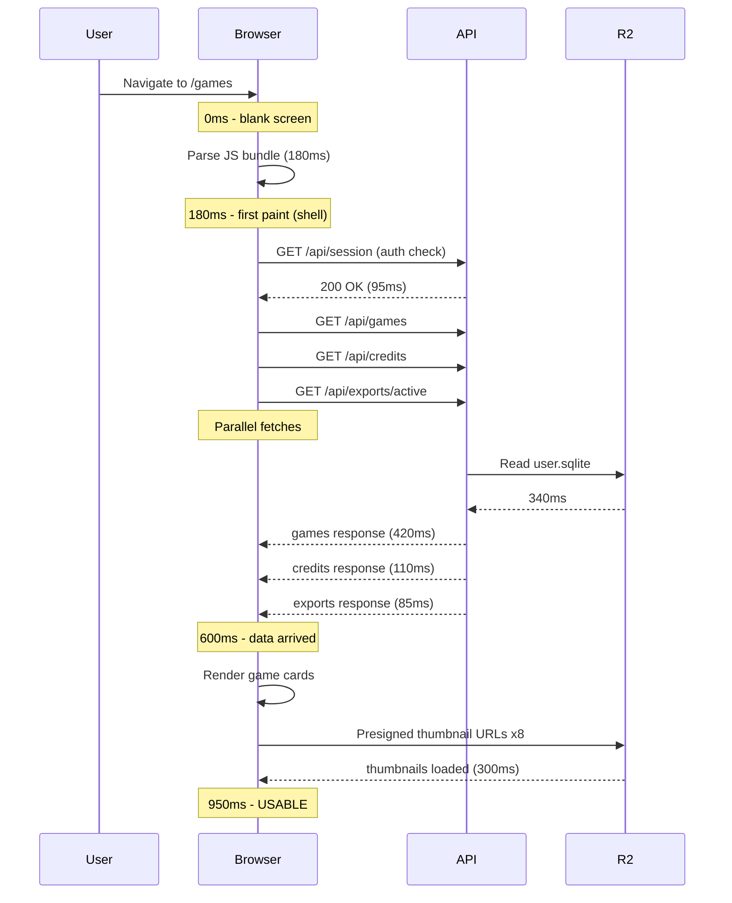

# T3060: Make It Load Fast

**Status:** TODO
**Impact:** 8
**Complexity:** 5
**Created:** 2026-05-21
**Updated:** 2026-05-21

## Problem

We don't have systematic measurements of how fast each page loads for a real user with real data. Without benchmarks, we can't identify bottlenecks or prove improvements. Alpha users with games, reels, and drafts may experience sluggish page transitions that hurt first impressions.

## Solution

Use Playwright against prod to measure what a user *perceives* as slow, then drill into the biggest contributors behind each delay. The methodology is perception-first:

1. **Measure user-perceived delays** — What does the user wait for? Time from navigation to "I can use this page." Not abstract metrics — actual stalls the user sits through.
2. **Identify bottleneck contributors** — For each perceived delay, break down what's happening: network requests, JS parsing, rendering, sequential waterfalls. Attribute time to specific causes.
3. **Expose findings as sequence diagrams** — For each slow page, produce a Mermaid sequence diagram showing the critical path from navigation to usable. The AI driver (and user) should be able to look at the diagram and immediately see where time is being spent.
4. **Fix the biggest contributors first** — Attack the longest bars in each waterfall.
5. **Re-measure** — Confirm the perceived delay actually shrank.

## Approach: Perception-First Performance

### Phase 1: Identify Perceived Delays

For each page/screen, measure the user-perceived "ready" moment — not just LCP, but when the page is actually usable (data loaded, interactive, not showing spinners/skeletons).

**Pages to measure:**
- Home (games list + reels list populated)
- Game detail / Annotate (video playing, clips visible)
- Framing (video loaded, crop controls interactive)
- Overlay (working video loaded, overlay controls ready)
- My Reels (reel list populated, thumbnails visible)
- Reel Drafts (draft list populated)
- Shared video page (video playing)

For each page, record:
- **Time to first paint** — when something appears
- **Time to usable** — when the user can actually interact (no spinners, data populated)
- **Gap between them** — this is the perceived delay the user sits through

### Phase 2: Break Down Each Delay

For each page where the gap is noticeable (>1s), capture:
- Every network request in the critical path (URL, duration, dependency chain)
- JS bundle parse/eval time
- Component hydration/render time
- Sequential vs parallel request patterns

Use Playwright's CDP session to capture Performance timeline + network events. Record the full waterfall.

### Phase 3: Sequence Diagrams

For each slow page, produce a Mermaid sequence diagram showing the critical path. Example format:

The diagram must show:
- What's sequential vs parallel
- Where the longest waits are (annotate with ms)
- The critical path from navigation to "usable"
- Which system each wait is attributed to (Browser / API / R2 / CDN)

### Phase 4: Fix & Re-measure

For each slow page:
1. Rank contributors by time spent
2. Fix the biggest contributor
3. Re-run the same Playwright test
4. Update the sequence diagram to show the improvement
5. Repeat until perceived delay is acceptable

## Context

### Relevant Files (REQUIRED)
- `src/frontend/src/` - All page components and routes
- `src/frontend/vite.config.js` - Bundle config, code splitting
- `src/backend/app/routers/` - API endpoints hit on page load
- `src/frontend/playwright.config.js` - E2E test config (extend for perf)
- New: `src/frontend/tests/perf/` - Playwright performance test scripts

### Related Tasks
- T2500-T2540 (Page Load Optimization epic) - Prior fetch dedup/parallelization work
- T1530 (Comprehensive Profiling Strategy) - Backend cProfile + frontend User Timing API
- T1730 (Performance Optimization Pass) - Broader pre-launch perf audit

### Technical Notes
- Run against prod with a real account (has games, reels, drafts)
- Use Playwright's CDP session (`page.context().newCDPSession()`) for Performance timeline + network timing
- Auth bypass headers for test account access (see feedback_auth_bypass_testing)
- Use `/visualize` skill to render sequence diagrams for the AI driver and user

## Implementation

### Steps

**Phase 1: Perceived delays**
1. [ ] Write Playwright perf harness that logs in to prod test account
2. [ ] For each page: measure time-to-first-paint and time-to-usable
3. [ ] Produce a summary table: page, first paint, usable, gap

**Phase 2: Bottleneck attribution**
4. [ ] For each page with gap >1s, capture full network waterfall + JS timeline via CDP
5. [ ] Attribute delay to specific causes (fetch chains, bundle parse, R2 latency, render)
6. [ ] Rank contributors by time within each page

**Phase 3: Sequence diagrams**
7. [ ] For each slow page, produce a Mermaid sequence diagram showing the critical path
8. [ ] Annotate with ms timings and highlight the bottleneck
9. [ ] Present diagrams to AI driver / user for review before fixing

**Phase 4: Fix & re-measure**
10. [ ] Fix the #1 contributor on each slow page
11. [ ] Re-run Playwright perf tests
12. [ ] Update sequence diagrams with before/after
13. [ ] Repeat for next-biggest contributor until acceptable

### Progress Log

## Acceptance Criteria

- [ ] Every page/screen has a measured time-to-usable baseline
- [ ] Every page with >1s perceived delay has a sequence diagram showing the critical path
- [ ] Bottlenecks ranked by time contribution within each page
- [ ] Fixes implemented for highest-impact bottlenecks
- [ ] Before/after sequence diagrams show measurable improvement
- [ ] No page has time-to-usable >2.5s on broadband
