# T1180 Design: Binary Data Format (MessagePack)

**Status:** APPROVED
**Author:** Architect Agent
**Approved:** pending

## Current State ("As Is")

### Data Flow

```mermaid
flowchart LR
    FE["Frontend"] -->|"JSON string in form data"| BE["Backend API"]
    BE -->|"json.loads()"| PY["Python dict"]
    PY -->|"json.dumps()"| DB["SQLite TEXT column"]
    DB -->|"raw string"| BE2["Backend API response"]
    BE2 -->|"JSON string inside JSON"| FE2["Frontend"]
    FE2 -->|"JSON.parse()"| JS["JS object"]
```



### Current Behavior

```
WRITE PATH (gesture → DB):
  Frontend form data (JSON string)
    → Backend receives string
    → json.dumps(parsed_data) or raw string → SQLite TEXT column
    → R2 sync uploads entire profile.sqlite

READ PATH (DB → API → frontend):
  SQLite TEXT column
    → Backend reads raw string
    → Returns as Optional[str] in WorkingClipResponse
    → FastAPI serializes: JSON string inside JSON response
    → Frontend receives string, calls JSON.parse()

INTERNAL READ (DB → backend processing):
  SQLite TEXT column
    → json.loads(row['column_name'])
    → Python dict for processing (export, rescale, etc.)
```

### Limitations

- JSON is text-based: repeated keys, quoted strings, decimal numbers inflate size
- 5 columns (crop_data, timing_data, segments_data, highlights_data, input_data) store large blobs
- profile.sqlite syncs to R2 on every write — larger DB = slower sync
- Double-encoding: backend returns JSON strings inside JSON responses, frontend must JSON.parse

## Target State ("Should Be")

### Updated Flow

```mermaid
flowchart LR
    FE["Frontend"] -->|"JSON string in form data"| BE["Backend API"]
    BE -->|"json.loads()"| PY["Python dict"]
    PY -->|"encode_data()"| DB["SQLite BLOB (msgpack)"]
    DB -->|"decode_data()"| BE2["Backend API"]
    BE2 -->|"parsed dict in response"| FE2["Frontend"]
    FE2 -->|"already parsed"| JS["JS object"]
```



### Target Behavior

```
WRITE PATH (gesture → DB):
  Frontend form data (JSON string)
    → Backend parses with json.loads() (HTTP input, unchanged)
    → encode_data(dict) → msgpack bytes → SQLite BLOB column
    → R2 sync uploads smaller profile.sqlite (~30-50% reduction on these columns)

READ PATH (DB → API → frontend):
  SQLite BLOB column
    → decode_data(bytes) → Python dict (auto-detects JSON vs msgpack)
    → Returns as Optional[Any] in response model (parsed object, not string)
    → FastAPI serializes dict to JSON naturally
    → Frontend receives parsed object directly (no JSON.parse needed)

INTERNAL READ (DB → backend processing):
  SQLite BLOB column
    → decode_data(row['column_name'])
    → Python dict for processing (identical to before)
```

### Key Benefits

1. ~30-50% size reduction on the 5 target columns
2. Faster R2 sync (smaller DB)
3. Cleaner API: frontend receives parsed objects, eliminates double-encoding
4. Backward compatible: auto-detects JSON vs msgpack by first byte

## Implementation Plan ("Will Be")

### Phase 1: Create Helpers

**New file: `src/backend/app/utils/encoding.py`**

```python
import msgpack
import json

def encode_data(data) -> bytes | None:
    if data is None:
        return None
    return msgpack.packb(data, use_bin_type=True)

def decode_data(raw: bytes | str | None):
    if raw is None:
        return None
    if isinstance(raw, str):
        return json.loads(raw)
    if raw[0:1] in (b'{', b'['):
        return json.loads(raw)
    return msgpack.unpackb(raw, raw=False)
```

### Phase 2: Backend — Replace All DB Read Sites (decode_data)

| File | Lines | Column(s) | Change |
|------|-------|-----------|--------|
| `clips.py` | 265, 272 | crop_data, segments_data | `json.loads()` → `decode_data()` |
| `projects.py` | 1216, 1247 | crop_data, segments_data | `json.loads()` → `decode_data()` |
| `export/framing.py` | 439, 450, 478 | crop_data, segments_data | `json.loads()` → `decode_data()` |
| `export/overlay.py` | 191, 1113, 1248, 1337, 1343, 1467, 1473, 1533, 1811 | highlights_data, segments_data, crop_data | `json.loads()` → `decode_data()` |
| `export/multi_clip.py` | 1963, 1973 | crop_data, segments_data | `json.loads()` → `decode_data()` |
| `services/export_worker.py` | 173 | input_data | `json.loads()` → `decode_data()` |
| `schemas.py` | 335, 349, 363, 377 | all 4 parse_* helpers | `json.loads()` → `decode_data()` |

### Phase 3: Backend — Replace All DB Write Sites (encode_data)

| File | Lines | Column(s) | Change |
|------|-------|-----------|--------|
| `clips.py` | 289, 290 | crop_data, segments_data | `json.dumps()` → `encode_data()` |
| `projects.py` | 1233, 1272 | crop_data, segments_data | `json.dumps()` → `encode_data()` |
| `exports.py` | 87, 574 | input_data | `json.dumps()` → `encode_data()` |
| `export/overlay.py` | 208, 1241 | highlights_data | `json.dumps()` → `encode_data()` for 208; parse+encode for 1241 |
| `export/multi_clip.py` | 1381, 1662 | highlights_data | `json.dumps()` → `encode_data()` |
| `services/export_helpers.py` | 68 | input_data | `json.dumps()` → `encode_data()` |

**Special case — overlay.py line 1241:** Currently writes raw form-data JSON string directly to DB. Must change to: parse form data → encode as msgpack → write to DB.

### Phase 4: Backend — Update normalize_json_data

`clips.py` lines 91-101: Update to handle bytes (msgpack) input in addition to str. After msgpack, empty-check logic changes:

```python
def normalize_data(value):
    if value is None:
        return None
    if isinstance(value, bytes):
        decoded = decode_data(value)
        if decoded in ([], {}, None):
            return None
        return encode_data(decoded)
    if isinstance(value, str):
        if value in ('', '[]', '{}', 'null'):
            return None
        return encode_data(json.loads(value))
    return encode_data(value)
```

### Phase 5: Backend — Update API Response Models

**`clips.py` WorkingClipResponse (line 156):**

Change the 3 data fields from `Optional[str]` to `Optional[Any]`:
```python
crop_data: Optional[Any] = None
timing_data: Optional[Any] = None
segments_data: Optional[Any] = None
```

**Response construction (line ~1129):** Decode before returning:
```python
crop_data=decode_data(clip['crop_data']),
timing_data=decode_data(clip['timing_data']),
segments_data=decode_data(clip['segments_data']),
```

**Overlay data endpoint (line ~1562):** Already returns parsed `highlights` — no change needed.

### Phase 6: Frontend — Remove JSON.parse Calls

Since backend now returns parsed objects, remove `JSON.parse()` on these fields:

| File | Lines | Change |
|------|-------|--------|
| `clipSelectors.js` | 29, 37, 43 | Remove `JSON.parse()` wrappers |
| `useClipManager.js` | 187, 189 | Remove `JSON.parse()` wrappers |
| `useProjectLoader.js` | 15 | Remove `JSON.parse()` wrapper |
| `ClipSelectorSidebar.jsx` | 15 | Remove `JSON.parse()` wrapper |
| `ExportButtonContainer.jsx` | 1030 | Remove `JSON.parse()` wrapper |

These fields will now be objects (or null) instead of JSON strings.

### What NOT to Touch

| File/Pattern | Reason |
|-------------|--------|
| `json.loads()` on HTTP form data (framing.py:58, overlay.py:740,767,1017, multi_clip.py:1863) | Parsing HTTP request input, not DB |
| `json.loads()` on ffprobe output | Parsing subprocess stdout |
| `json.loads()` on tags columns | Not a target column |
| `json.dumps()` for clip_cache hash keys | Not DB storage |
| `json.loads/dumps()` in auth_db.py | Separate concern |
| `json.dumps()` for X-Clip-Metadata headers (multi_clip.py:2262,2303) | HTTP response headers, not DB |
| `json.dumps()` for raw_regions → default_highlight_regions (overlay.py:1377) | Different column, not target |
| `json.loads()` on default_highlight_regions (overlay.py:1454) | Different column, not target |
| `json.loads()` on text_overlays (overlay.py:1539) | Different column, not target |
| project_archive.py json.loads/dumps | Entire archive serialization, not individual columns |

### Phase 7: Add msgpack Dependency

```bash
cd src/backend && .venv/Scripts/pip.exe install msgpack
# Add to requirements.txt
```

Frontend: No `@msgpack/msgpack` needed — backend handles all encode/decode.

## Risks

| Risk | Mitigation |
|------|------------|
| Existing JSON data in DB becomes unreadable | First-byte detection: `{`/`[` → JSON, else msgpack. Old data works without migration |
| Frontend expects strings but receives objects | Type-safe: change response model + remove JSON.parse. Both changes happen together |
| SQLite column type change | Migration in ensure_schema() changes TEXT → BLOB; eager migration script converts existing data |
| Data corruption if encode/decode has bugs | Unit tests with round-trip verification; integration test with real DB |
| R2-synced DB opened on older backend version | Old code calls json.loads on msgpack bytes → will fail with JSONDecodeError. Acceptable: we deploy atomically |

## Decisions

- **Column type**: Change `TEXT` → `BLOB` in database.py schema declarations. Add migration in `ensure_schema()`.
- **Migration**: Eager migration script. Reads all existing JSON rows, re-encodes as msgpack, writes back. Run as part of deployment.
