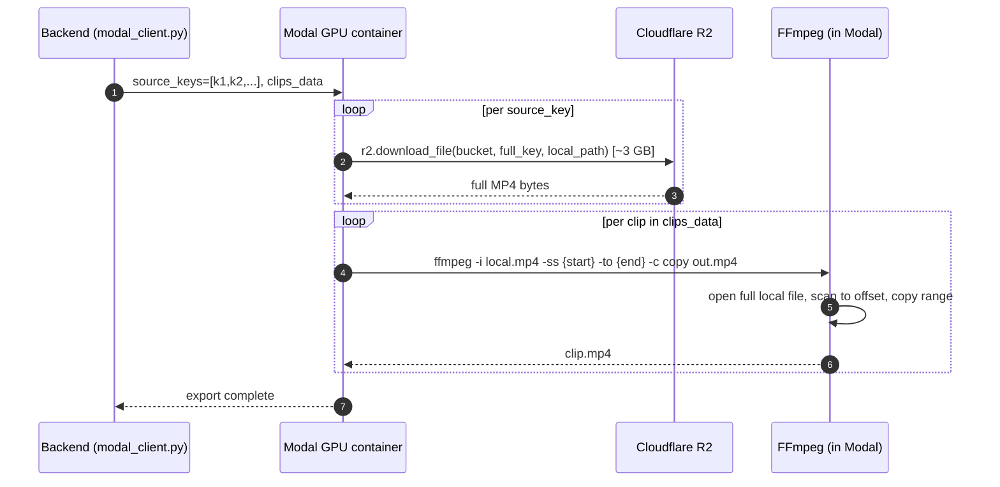
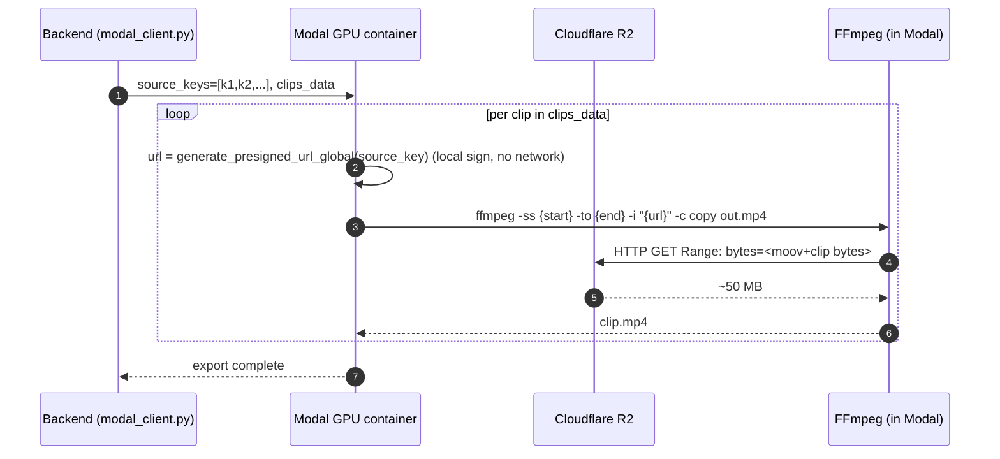

# T1220 Design — Modal + Local Range Requests via Presigned URL

**Status:** Design (awaiting approval)
**Task:** [T1220-modal-range-requests.md](T1220-modal-range-requests.md)

## 1. Summary

Port the already-proven presigned-URL + FFmpeg pre-input `-ss`/`-to` pattern (from T1130 / commits f1cb8d8, 63cc3c8) to the remaining **13 Modal call sites** in `app/modal_functions/video_processing.py` and the **1 unmigrated local site** (`call_local_overlay`). No new abstractions; a mechanical swap of `r2.download_file(...) + post-input -ss` for `generate_presigned_url[_global](...) + ffmpeg.input(url, ss=..., to=...)`. Expected effect: processing start time drops >50% on large game videos; wasted bandwidth collapses from full-video to just-the-clip range.

## 2. Current State

### 2.1 Representative Modal path — `process_multi_clip_modal` (line 2094)



Key characteristics: (a) full file on disk before ANY clip is produced; (b) Modal GPU sits idle during multi-minute R2 downloads; (c) `-ss` is **post-input**, scanning the decoded stream instead of using container indexing.

### 2.2 Current pattern — Modal (13 sites)

```python
# video_processing.py, pattern used at lines 223, 597, 723, 992, 1393, 1622,
# 1797, 1893, 2094, 2508, 2520, 2746, 2962
r2.download_file(bucket, full_input_key, input_path)          # full download
...
cmd = ["ffmpeg", "-y", "-i", input_path, "-ss", str(start), "-to", str(end),
       "-c", "copy", output_path]                              # post-input seek
```

### 2.3 Current pattern — Local overlay (1 site)

```python
# local_processors.py :: call_local_overlay (line 171)
local_path = await download_from_r2(user_id, r2_key)          # full download
ffmpeg_cmd = ["ffmpeg", "-i", str(local_path), ...]           # no range seek
```

Lines 311 (games, no `source_end_time`), 325 (framing user clips) and 531 (framing mock user clips) of `local_processors.py` are **live fallback branches** kept intentionally — they are out of scope for this task.

## 3. Target State

### 3.1 Target sequence — same function after migration



### 3.2 Target pattern

```python
# single-clip site
source_url = generate_presigned_url_global(input_key)   # or _url(user_id, key) for user-owned
(ffmpeg_lib
    .input(source_url, ss=start, to=end)                # PRE-input seek → HTTP Range
    .output(output_path, c='copy')
    .overwrite_output()
    .run(quiet=True))
```

```python
# multi-clip site (2094, 2508, 2962)
for clip in clips_data:
    clip_url = generate_presigned_url_global(clip["source_key"])   # regen per clip
    (ffmpeg_lib
        .input(clip_url, ss=clip["start"], to=clip["end"])
        .output(tmp_clip_path, c='copy')
        .overwrite_output()
        .run(quiet=True))
```

Helpers already exist — no new code in `storage.py`:

- `generate_presigned_url(user_id, key)` — `storage.py:1012`, for user-owned objects
- `generate_presigned_url_global(key)` — `storage.py:1641`, for global game assets
- Default expiry 3600 s; sufficient for every single-invocation use (see §5 Q3).

## 4. Implementation Plan

Phases are ordered lowest-risk → highest-value. Each phase is a separate commit; staging validates before next phase starts.

### Phase 1 — Single-clip Modal sites (warm-up, lowest risk)

**Files:** `src/backend/app/modal_functions/video_processing.py`
**Lines:** 223 (`render_overlay`), 597 (`detect_players_modal`), 723 (`detect_players_batch_modal`), 992 (`extract_clip_modal` first), 2746 (`extract_clip_modal` second)
**LOC:** ~40 lines total (each site ~7 lines: delete download, swap to `ffmpeg_lib.input(url, ss=, to=)`)
**Helper:** `generate_presigned_url_global` for game sources; `generate_presigned_url(user_id, key)` for user-owned clip sources — pick per call site by inspecting whether `input_key` is prefixed with `user_id/` already.
**Test approach:** Trigger each function on staging with a real job; confirm output identical to pre-migration (byte-compare a known-good clip).

### Phase 2 — AI framing Modal sites

**Files:** same file, lines 1393 (`process_framing_ai`), 1622 (`process_framing_ai_chunk`), 1797 (`process_framing_ai_parallel`), 1893 (concat audio remux inside parallel path)
**LOC:** ~60 lines
**Critical pre-work:** Verified before writing this doc — the AI framing path does **not** stream from R2 during upscaling. Both 1393 and 1797 open the source with `cv2.VideoCapture(input_path)`, decode **every frame to disk as PNG** up front, release the capture, then re-open the source briefly only for the audio remux (see 1393:1492-1511 and 1797:1918-1925). So the presigned URL only needs to live long enough for (a) the initial OpenCV decode pass and (b) the final audio `-ss/-t` remux. Both fit comfortably inside the 3600 s default expiry.
**Caveat:** `cv2.VideoCapture` accepts HTTP URLs on ffmpeg-backed OpenCV builds. Verify on Modal image before merging Phase 2; if VideoCapture balks at URLs, keep the decode pass on a small scratch extract (`ffmpeg -ss/-to -c copy` to local, then decode locally) — that still reads only the clip range.
**Helper:** `generate_presigned_url_global`.
**Test approach:** Run framing AI on a known 30 min game; compare output MD5 and audio track to pre-migration baseline.

### Phase 3 — Multi-clip Modal sites (highest value)

**Files:** same file, lines 2094 (`process_multi_clip_modal`), 2508 + 2520 (`create_annotated_compilation` multi-branch and single-branch), 2962 (`process_clips_ai`)
**LOC:** ~80 lines
**Rule:** **Generate the presigned URL inside the per-clip loop**, not once at function entry. Rationale in §5 Q1. Audio remux branches in these functions (post-processing) should also regenerate the URL at the remux step.
**Helper:** `generate_presigned_url_global` for game sources; per-clip because `source_key` varies clip-to-clip in these multi-video compilations.
**Test approach:** Staging multi-clip export with 5+ clips spanning 2+ source videos; verify each clip output, timing, and audio.

### Phase 4 — Local overlay migration

**Files:** `src/backend/app/services/local_processors.py`, `call_local_overlay` at line 171
**LOC:** ~15 lines (drop `download_from_r2`, swap ffmpeg input to presigned URL with pre-input seek)
**Helper:** `generate_presigned_url(user_id, key)` — overlay sources are user-owned working videos.
**Scope note:** Fallback branches at 311, 325, 531 are **LIVE and kept**. Not touched.
**Test approach:** Local-only run (Modal disabled env), verify overlay output identical.

### Phase 5 — Staging baseline + validation

Before merging Phase 1, capture baseline from current `master` against the designated staging game video:
- For each of: overlay, framing AI, framing mock, multi-clip export, compilation — record wall-clock from job-start to first FFmpeg output frame.
- After each phase merges to staging, re-measure. Acceptance: >50% reduction (matches task AC).
- Ask user whether the >1 GB staging game video already exists; upload one if not.

Modal redeploy after each phase touching `modal_functions/` — **ask user before running**:
```
cd src/backend && PYTHONUTF8=1 .venv/Scripts/python.exe -m modal deploy app/modal_functions/video_processing.py
```

## 5. Design Questions Resolved

### Q1. Single vs per-clip presigned URL for multi-clip sites (2094, 2508, 2962)

**Decision: Per-clip regeneration inside the loop.**

boto3 `generate_presigned_url` is a local HMAC-sign operation (no network round trip). Cost is microseconds. Regenerating per clip eliminates the entire class of mid-job URL-expiry bugs for multi-hour compilations, without any meaningful overhead. A single shared URL is a premature optimization that trades clarity for a failure mode.

### Q2. Does audio pre-roll break with pre-input `-ss`?

**Decision: No change needed — pre-input seek is safe for our uses.**

- All clip extraction paths use `c='copy'` (stream copy, no re-encode). Pre-input `-ss` aligns to the nearest keyframe; the MP4 container indexes audio tracks against those keyframes, so audio stays in sync.
- For AI framing (re-encode path), video is decoded to PNG frames up-front and audio is fetched in a **separate** `-ss`/`-t` remux pass (see 1393:1494-1511, 1797:1921-1927). That remux already uses the same style of pre-input seek the task proposes.
- **T1130 precedent:** f1cb8d8 has been in production on the multi-clip export path since merge with zero audio-desync reports.

### Q3. 30-min presigned URL expiry vs long Modal jobs (up to 12 hours)

**Decision: 3600 s default is sufficient. No expiry bump needed.**

What matters is **how long the FFmpeg HTTP session needs the URL**, not total job wall-clock. Verified by reading the AI framing code (the longest-running path):

- `process_framing_ai` (1393): one OpenCV decode pass (URL live ~1-2 min for a 30 min video) → all frames on disk → upscale loop reads PNGs from local disk → short audio remux (URL live <10 s).
- `process_framing_ai_parallel` (1797): same structure, chunked — each chunk decodes from the URL once (URL live ≈ chunk-decode duration, minutes) then works from disk.
- Multi-clip sites (2094, 2508, 2962): per-clip stream-copy FFmpeg invocation, URL live for seconds.

Every session that uses a given URL completes in well under 3600 s. Per-clip regeneration (Q1) reinforces this for multi-clip loops. If Phase 2 verification reveals OpenCV cannot accept HTTP URLs, the fallback (clip-scoped `-ss/-to -c copy` scratch extract before decode) also finishes in minutes.

### Q4. Remove R2 credentials from Modal env

**Decision: Defer. Create follow-up task T1221.**

Per audit, no non-video R2 reads remain in the Modal image after migration, so the `modal.Secret.from_name("r2-credentials")` mount can be dropped. But doing it in this task widens scope and removes the escape hatch before staging has validated the URL migration. Land T1220, bake on staging, then T1221 removes the secret mount.

### Q5. When are local_processors fallbacks hit?

**Decision (from audit):** Lines 311, 325, 531 are **live** (user clips without `source_end_time`, framing user clips, framing mock user clips) → **keep**. Line 171 (`call_local_overlay`) is **not** a fallback — it's the only code path for local overlay, and is migrated in Phase 4.

### Q6. Staging test plan

**Decision:**
1. Confirm with user whether a >1 GB staging game video already exists; if not, upload one.
2. **Baseline first, on current master**, before Phase 1 merges: run overlay, framing AI, framing mock, multi-clip export, compilation against the same video. Record time-to-first-output-frame for each.
3. After each phase merges to staging and redeploys Modal, re-run the corresponding subset. Acceptance: >50% reduction in time-to-first-output-frame for the paths changed by that phase.
4. Spot-check output parity (MD5/frame count/audio duration) for one job per path per phase.

## 6. Risks & Open Questions

| # | Risk | Mitigation |
|---|------|-----------|
| R1 | OpenCV in the Modal image may not accept HTTP URLs in `VideoCapture` (Q3 assumption) | Verify on staging at the start of Phase 2. If it fails, fall back to a small pre-decode scratch extract (`ffmpeg -ss/-to -c copy` to local disk, then `VideoCapture(local_path)`) — still range-fetched, still satisfies the AC. |
| R2 | Pre-input seek on a source with sparse keyframes could skip frames | Non-issue: every clip path uses `c='copy'` (no re-encode, frames reconstruct correctly), and AI framing decodes from frame-0 of the source anyway. T1130 in production has shown no artifacts. |
| R3 | Modal redeploy required after editing `modal_functions/` | Per `src/backend/CLAUDE.md`, **ask user before deploying** each phase. Don't auto-deploy. |
| R4 | R2 edge caching behavior with ranged GETs unknown | Orthogonal to this task (T1120 tracks edge caching). Correctness doesn't depend on it; performance gains are measured against non-cached baseline anyway. |

**Open question for user:**
- Does a >1 GB staging game video exist, or should we upload one for baseline measurement?

## 7. Acceptance Criteria

From the task file, verbatim + one refinement:

- [ ] Modal functions never download full source videos
- [ ] FFmpeg uses pre-input seek with HTTP range requests on presigned URLs
- [ ] Processing start time (**time-to-first-output-frame**, clarified) reduced by >50% for large videos with short clips
- [ ] Multi-clip processing works correctly with per-clip range fetching **and per-clip URL regeneration** (clarified)
- [ ] No regression in output quality (frame-accurate seeking)
- [ ] `call_local_overlay` migrated to presigned URL + pre-input seek
- [ ] No changes to `local_processors.py` fallback branches at 311, 325, 531

## 8. Out of Scope

- **Removing `r2-credentials` Modal secret mount** — deferred to follow-up **T1221** (§5 Q4).
- **Removing live fallback branches** in `local_processors.py:311/325/531` — those are intentional fallbacks for user-owned clip paths and stay as-is.
- **R2 edge cache tuning** — tracked by T1120.
- **Frontend/browser clip-scoped loading** — tracked by T1210.
