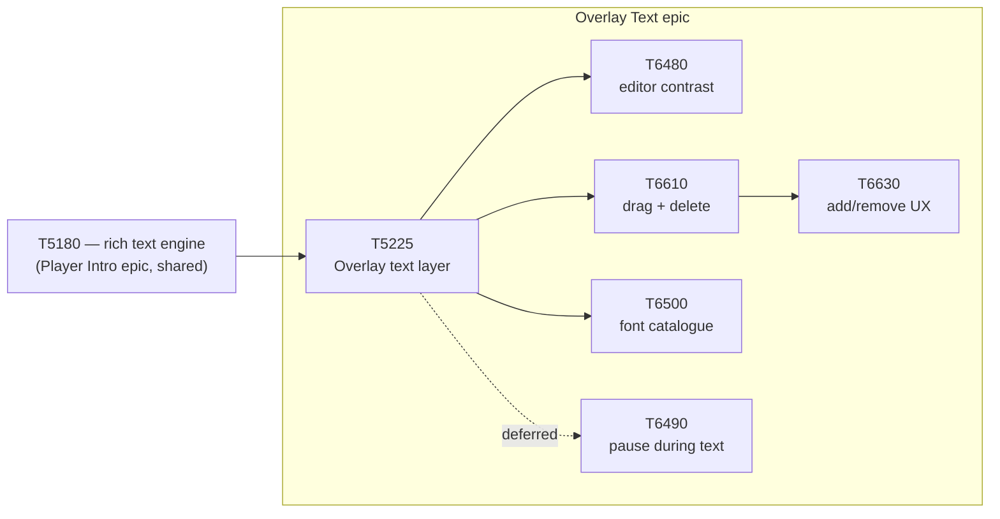

# Epic: Overlay Text

Let users add styled text directly onto the Overlay timeline — a title, a caption, a callout — over
a chosen range of the concatenated reel, burned into the render exactly as previewed.

> **Split out 2026-08-09** from the [Player Intro + Rich Text](../player-intro/EPIC.md) epic. That
> epic's rich-text engine (T5180) was always meant to be **built once and reused twice** — the
> intro card is the first consumer, the Overlay text layer is the second. The engine itself stays
> in the Player Intro epic since it is genuinely shared infrastructure, not owned by either
> consumer; this epic is specifically the Overlay-side feature and its follow-ups.

## Scope

- The Overlay timeline text layer itself: add/select/edit text blocks over a time range that snaps
  to clip boundaries, burned into both the Modal and local render loops.
- Everything that is specifically about using text **inside Overlay** (the editor rail's contrast,
  drag/reposition/delete interactions, a font catalogue suited to small burned-in captions, pausing
  playback while text is on screen).
- **Not in scope:** the rich-text engine itself (TextSpec, `text_render.py`, `RichText.jsx`, the font
  loader) — that is [T5180](../player-intro/T5180-rich-text-engine.md), shared infrastructure that
  lives in the Player Intro epic. Also not in scope: the poster/thumbnail-marker feature (T6510,
  T6550, T6560, T6590) — it is a *different* Overlay sub-feature (which frame represents the reel),
  coincidentally also called "preview"/"marker" in places, and is tracked separately.

## Dependency

The rule inherited from the parent epic still applies: there is **exactly one** text renderer on
the backend and **exactly one** preview component on the frontend, reading the **same TTF files**,
whether the caller is a card or an Overlay text block. If burning Overlay text ever needs a second
code path to draw a line of text, something has gone wrong.

## Child tasks

| Order | Task | Status | What it does |
|-------|------|--------|---------------|
| 1 | [T5225](T5225-overlay-text-layer.md) — Overlay text layer | STAGING | Timeline text layer, clip-boundary snapping, burn-in in both render loops. Needs only T5180. Merged 2e3b532e. |
| — | [T6480](T6480-overlay-text-editor-contrast.md) — Editor contrast | STAGING | Edit Text rail read bright-on-bright on Overlay's light panel — fixed host-side (dark glass), shared component untouched so the card editor can't regress. Merged 2780032d. |
| — | [T6610](T6610-overlay-text-element-manipulation.md) — Drag + delete | STAGING | Body drag to reposition a text block (levers already worked), bigger delete hit target. Merged 2780032d (same branch as T6480). |
| — | [T6630](T6630-overlay-text-add-remove-drag-ux.md) — Add/remove/drag UX | TODO | T6610 shipped believing add/remove already worked — they don't, in the real app. Root causes: a near-invisible add-click target, an affordance that vanishes after the first block, and drag verified harness-only (rejected). Follows T6610. |
| — | [T6500](T6500-overlay-font-catalogue.md) — Font catalogue | TODO | The 4 faces were chosen for full-frame card display, not small captions burned over live footage — decide split-catalogue vs. grow-one-list from rendered samples. |
| — | [T6490](T6490-pause-during-overlay-text.md) — Pause during text | TODO — DEFERRED | Hold a frame while a text block is on screen. Explicitly filed as "do it later" — its own risk profile, not competing with the higher-priority items above. |

## Completion criteria

- [ ] A user can add, select, edit and delete text blocks on the Overlay timeline via obvious,
      discoverable controls — not just ones that technically exist in code.
- [ ] Text blocks can be repositioned in time by dragging the body, not only by resizing an edge.
- [ ] The editor rail is legible on Overlay's own panel (contrast fixed, shared component intact).
- [ ] The font catalogue reads well at burned-in-caption scale, decided from rendered samples.
- [ ] What the editor previews is what the render produces — same parity guarantee as the card side.
