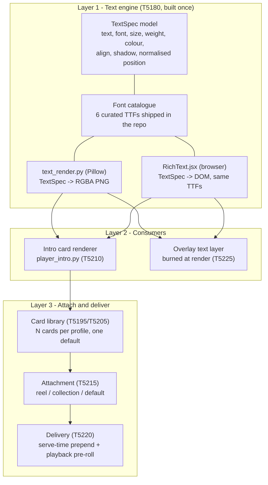
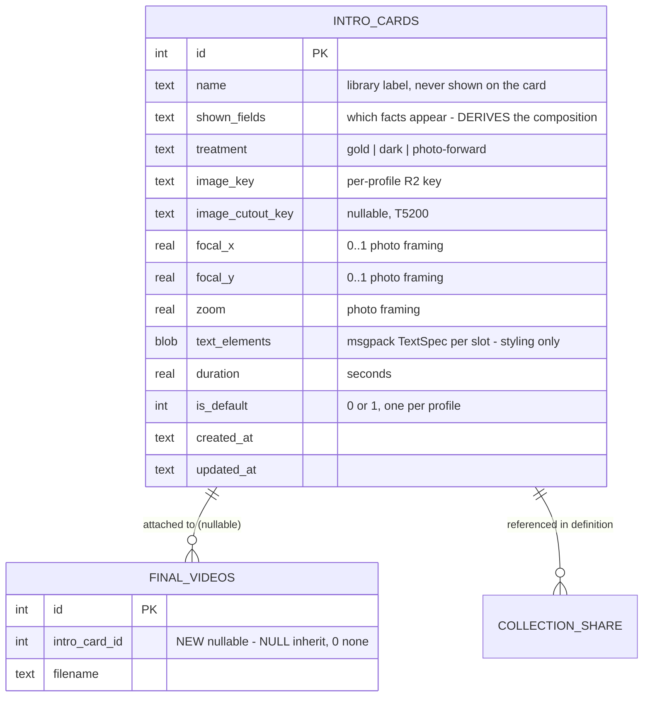
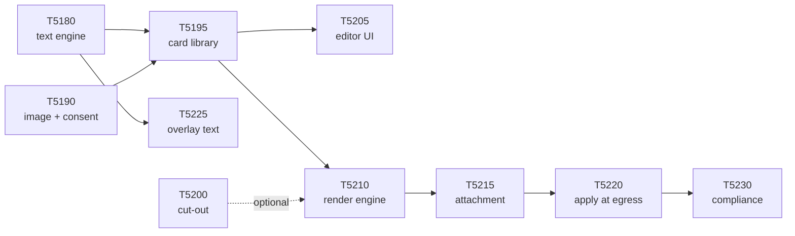

# Epic: Player Intro + Rich Text

Let users build a **library of intro cards** — photo + styled text — and attach a chosen card to
any reel or shared collection, with one card set as the profile default. The rich-text system the
cards are built on is **built once and reused** as a text layer on the Overlay timeline.

> **Redesigned 2026-08-03** after user direction. The original epic (2026-07-15) assumed ONE intro
> per athlete, auto-composed from profile fields, burned into a multiclip export. Four of the five
> new requirements break that assumption — see [Redesign delta](#redesign-delta). Visual design
> review + UI mockups: <https://claude.ai/code/artifact/93478a34-c7e5-406f-a56b-3c3724e4b6dd>

## Requirements (user, 2026-08-03)

1. **N intro cards**, stored — each has a title, an image, and user-added text.
2. The user controls the **text, the font, and the font colour**.
   *(AMENDED 2026-08-06 by decision 12 — for CARDS the template owns font and colour; this now applies to Overlay text only.)*
3. A **different intro can be attached to every reel or collection**.
4. The user can define a **default** intro.
5. The **text overlay system is reused** in Overlay, where the user selects a range of clips and
   adds that same rich text.

## Design intent (unchanged from 2026-07-15)

The point is NOT a data readout — it's **cool animation, seeing your kid up close, and a level of
professionalism** that makes the parent proud to share. Motion and polish are the product. The
pitch/position diagram from the reference is **out of scope**. Visual reference:
`C:\Users\imank\Videos\Captures\stafford intro.mp4` (~12s: animated card, white-flash into footage).
**The reference contains a real minor's photo + PII, so it is NOT committed — view the local file.**

## Architecture: three layers



**The rule that keeps this honest:** there is **exactly one** text renderer on the backend and
**exactly one** preview component on the frontend, and they read the **same TTF files**. If the
intro card and the Overlay text ever need different code paths to draw a line of text, the design
has failed.

## Decisions (settled 2026-08-03 — user approved)

| # | Decision | Why |
|---|---|---|
| 1 | **The intro is applied at DOWNLOAD and PLAYBACK, never burned at export.** Serve-time prepend mirroring `append_branded_outro`; a React pre-roll on playback surfaces mirroring `BrandedEndCard`. | Swap an intro on any reel instantly and free; every existing reel gets one with no backfill; stored R2 objects stay byte-identical so posters/ranking/share links are untouched. Burning it in would shift poster times, slow-mo section offsets and chapter markers, and cost a re-export + credits per change. |
| 2 | **REVISED 2026-08-04 — the layout is DERIVED from what the user chooses to show, not picked from a menu.** There is no template picker. The user ticks which facts appear; the composition follows: **no photo -> `title-only`; photo + 1 fact -> `hero`; photo + 2 facts -> `broadcast`; photo + 3 facts -> `recruiting`**. | User direction: parents cannot meaningfully choose between "broadcast" and "recruiting" — those words mean nothing to them — but they know exactly which facts they want to show. Deriving composition from content guarantees no empty slots and no density mismatch, and it deletes a whole control from the editor. |
| 2b | **Visual treatment is a SEPARATE axis from composition** (`gold` / `dark` / `photo-forward`), a 3-way toggle. | The four layouts differ in *look* as well as density. If field count drove both, ticking a third fact would silently restyle the card gold — a jarring, unexplainable jump — and a user who wants the gold look while showing one fact could never have it. Splitting the axes keeps decision 2's zero-choice benefit without either trap. |
| 3 | **REVERSED 2026-08-04 — position, class (grad year) and team ARE structured profile fields**, typed once on the profile and auto-filled into every card. (Was: card-first, free text, no profile fields at all.) | Decision 2 needs them as *named* fields to derive composition from — free text has no field count. Storing them on the profile means typing them once instead of on every card, and a team change edits one place. This is a deliberate partial reversal: it is far lighter than the original T5190 spec (3 fields, not 10; no DOB, no height, no high school), so the minimisation posture in T5230 still holds. Free-text title/subtitle remain available on top. |
| 3b | **Photo framing = reposition + zoom, stored as a normalised focal point + zoom.** NOT a fixed crop rectangle. **The PROFILE owns the framing** (set where the photo is uploaded); **a card may override it** (nullable columns, NULL = inherit). | Cards render at **both** 9:16 and 16:9 (reels are either), and a fixed 9:16 crop cannot produce a 16:9 card — it would force cropping the same photo twice. A normalised focal point + zoom adapts to any output aspect from one setting. Profile-owned-with-override because the photo itself is profile-level: one framing set at upload time is right for most users, while a hero card and a broadcast card can still frame the same photo differently. |
| 3c | **The profile's focal point also frames the profile's identity mark** ([T6470](../T6470-profile-photo-identity.md)) — the avatar shown instead of the sport icon. | User direction 2026-08-04. This is the reason the framing belongs on the profile rather than only on cards: "which card's focal point?" has no good answer for a per-profile avatar. It also replaces T6470's top-biased *guess* with the parent's own choice — and a user-chosen focal point is emphatically NOT face detection, so the biometric prohibition is untouched. Top-bias remains only as the fallback when no framing has been set. |
| 4 | **Overlay text range = free range that SNAPS to clip boundaries.** | "Clips 1-2" is one gesture, "the first 3 seconds" is still possible, and it matches the spotlight-region interaction directly above it on the timeline. |
| 5 | **Backend text rendering = Pillow raster to a transparent PNG**, never ffmpeg `drawtext`, never a headless browser. | Pillow/numpy/OpenCV are already dependencies. Real wrap/tracking/stroke/shadow with exact TTF metrics shared with the browser. One PNG layer feeds BOTH consumers: ffmpeg animates it for the card, OpenCV alpha-blends it per frame for Overlay text. `drawtext` has no wrap and a proven escaping landmine (T5240); a headless browser means Chromium in the Fly AND Modal images. |
| 6 | **6 curated fonts**, shipped as TTFs in the repo, served to the browser via `@font-face` from the same files. | The render container has no font server and the preview must load the identical file, so the catalogue is curated, not a system picker. Six keeps every choice deliberate and the repo light. Licences must be verified per face (OFL or equivalent). |
| 7 | **Cards are PER PROFILE** (`intro_cards` table in `profile.sqlite`), with `is_default` on the card row. | A card names one athlete, and intro media must sit under a per-profile R2 prefix or it 404s cross-profile. Putting the row beside the media removes the split. A future "copy card to another profile" action covers the shared-template case. |
| 8 | **`NULL` and `0` mean different things** on `final_videos.intro_card_id`: NULL = inherit the default, 0 = the user said no intro on this reel. | Without the distinction, opting one reel out is impossible once a default exists. |
| 9 | **Card generation is non-fatal**, exactly like the outro. | A failed card logs loudly and the user still gets their video. It never sinks a download, a share or an export. |
| 10 | **Animation is core, not optional.** The photo hero push-in, staggered text-in and white-flash out ARE v1. | The value is the motion + professionalism, not the data. A static frame is not acceptable. |
| 11 | **Player cut-out (T5200) no longer blocks the card engine.** | A card works with a plain photo; the cut-out is an enhancement whenever it comes up. |
| 12 | **REVISED 2026-08-06 — for CARDS, the TEMPLATE owns typography; the user does not pick font or colour.** The user picks which facts show, the treatment, the photo framing and their free text; font, colour, size, alignment, weight, shadow, stroke and spacing are derived from the treatment in the shared contract. **This amends requirement 2**, which said the user controls the font and the font colour. It applies to CARDS ONLY — the Overlay text rail keeps full user control. | User direction: *"the point of the templates is they all look professionally designed. The user shouldnt be able to make it ugly."* A card built with an arbitrary colour wheel produced saturated green text on a black panel beside a desaturated photo, coloured inconsistently within one line. If any reachable combination of controls yields an ugly card, the template promise is false — so the ugly combinations must be unreachable, not merely discouraged. Overlay text is exempt because it is the user annotating their own video, where no template promise is made. Tracked by T6640. |

## Data model



| Thing | Lives in | Migration |
|---|---|---|
| Card library | `intro_cards` table, `profile.sqlite` | **profile_db v034** (T5195) |
| Reel attachment | `final_videos.intro_card_id` | same migration |
| Collection attachment | `shares.collection_definition` JSONB (Postgres) | **none** — the definition already exists |
| Profile default | `intro_cards.is_default` | same migration |
| Card image | `{APP_ENV}/users/{uid}/profiles/{pid}/intro/...` R2 | n/a |
| Overlay text | `working_videos.text_overlays` | **none** — column already exists |

**Resolution order** (every playback and download surface asks the same question):

```
reel.intro_card_id = 0     -> no intro (user opted this reel out)
reel.intro_card_id = NULL  -> the profile's default card, if any
reel.intro_card_id = <id>  -> that card, default ignored
```

## Codebase facts this epic depends on (verified 2026-08-03)

| Fact | Where | Consequence |
|---|---|---|
| `working_videos.text_overlays` BLOB **already exists**, is already returned by `/overlay-data`, and already counts toward `has_overlay_edits` in `projects.py:332`. Nothing writes it, nothing renders it. | `database.py:985`, `overlay.py:1716/1734/1765/1855`, `schemas.py:268-306` | T5225 fills an open socket — **no migration**. The `TextOverlay` stub in `schemas.py` (absolute px `x`/`y`/`fontSize`) is REPLACED by TextSpec, not extended. |
| `append_branded_outro` runs at serve time on `GET /api/downloads/{id}/file`, cached per format in `/tmp`, non-fatal, `-c copy` concat. | `downloads.py:705`, `branded_outro.py` | Decision 1's precedent. T5220 mirrors it in the prepend direction and shares the concat helpers. |
| The overlay render is a **per-frame OpenCV/numpy loop**, not an ffmpeg filter graph. | `modal_functions/video_processing.py:_process_overlay`, `services/local_processors.py:_overlay_sync` | Overlay text must composite an RGBA PNG per frame in BOTH the Modal and local loops (decision 5), and a Modal redeploy is required. |
| Branded-outro card animation is authored entirely inside one cached `filter_complex`; the card is encoded ONCE, so animation is free at export. | `branded_outro._build_outro_card` | T5210 copies this shape exactly. Landmines (`overlay` cannot take a per-frame-resized input; `drawtext` cannot inline an apostrophe) are recorded in `.claude/knowledge/export-pipeline.md`. |
| `OverlayTimeline.jsx` carries two comments reserving the slot: "Future: Additional overlay layer labels (BallGlow, Text, etc.)". | `modes/overlay/OverlayTimeline.jsx:103,153` | T5225 lands where the component already expects it. |
| Collections are **playback-composited** (presigned member list, no stitched file). | `collections.py:775` create, `:652` resolve | Collection intro = pre-roll on playback; the burned-in case only arrives with T4945. |
| profile_db head is **v033**; user_db head **v007**; postgres head **v022**. No unmerged sibling branches. | `app/migrations/` | T5195 takes profile_db **v034**. Re-check for collisions at implementation time (see memory: version collision across branches). |

## Compliance posture (carried forward, retargeted)

The risk is unchanged in kind and slightly reduced in degree — decision 3 means we store **less**
structured data about a minor, but a card still holds a **minor's photo + free text that will be
publicly visible when shared**.

- **COPPA most likely does NOT legally apply** — the service is directed at adult parents and the
  child's data is provided BY the parent, not collected FROM the child (FTC: COPPA "does not cover
  information collected from adults that may pertain to children"). We adopt a children's-data
  posture anyway because state privacy/biometric laws, GDPR-K and future COPPA 2.0 reach this data.
- **Data minimisation > encryption.** Decision 3 removes the structured athlete field set entirely.
  No DOB is collected. If a future feature needs one, it is app-encrypted on top of R2 SSE.
- **Encryption at rest:** R2 AES-256 SSE + TLS in transit is the baseline. The photo can't be
  meaningfully app-encrypted (it must decrypt to render) — protect it via SSE, per-profile access
  control, and the public-exposure warning.
- **The real risk is PUBLIC EXPOSURE, not storage.** Required mitigations: **parental-consent
  attestation** (T5190), a **"this is publicly visible when shared" warning** at card creation and
  at attach time (T5205/T5215), and **retention/deletion** wired into `privacy.py` (T5230).
- **Never** run face-recognition/biometric templating on the photos. Background removal (T5200) is
  segmentation, NOT recognition — fine.

## Redesign delta

| Requirement | Epic before 2026-08-03 | Consequence |
|---|---|---|
| N intro cards | One card, composed from profile athlete facts | Needs a card *library* (table + CRUD + editor UI); the card stops being a pure function of the profile |
| Text/font/colour control | Fixed layout, hard-coded font | Needs a real rich-text model and a renderer that matches the browser preview |
| Per-reel / per-collection attach | A per-export on/off toggle | Needs an attachment column, a collection-definition field, and a resolution order |
| A default | Not modelled | `is_default` on the card row |
| Reuse text in Overlay | Not in the epic at all | New Overlay layer sharing the card's renderer |

## Child tasks (implement in order)

| Order | Task | What it does |
|-------|------|--------------|
| 1 | [T5180](T5180-rich-text-engine.md) — Rich text engine | TextSpec, font catalogue, `text_render.py`, `RichText.jsx`, parity test. Foundation, no user-visible feature. |
| 1 | [T5190](T5190-card-image-upload-consent.md) — Card image upload + consent | Image-upload endpoint under the per-profile `intro/` prefix + parental-consent attestation. Runs parallel with T5180. |
| 2 | [T5195](T5195-intro-card-library.md) — Card library: schema, CRUD, default | `intro_cards` table (profile_db v034), REST CRUD, single-default enforcement. |
| 3 | [T5205](T5205-card-editor-ui.md) — Card editor UI | Library grid + editor stage + per-slot text controls + browser motion preview. |
| 3 | [T5210](T5210-intro-card-generation.md) — Card render engine | `player_intro.py`: card row + PNG text layers -> animated MP4, probe-matched, cached, non-fatal. |
| 4 | [T5215](T5215-intro-attachment.md) — Attachment + resolution | `final_videos.intro_card_id`, collection-definition field, resolution helper, reel + collection pickers. |
| 5 | [T5220](T5220-add-intro-integration.md) — Apply the intro at every egress | Serve-time prepend, playback pre-roll, T4945 stitch seam, public-exposure notice. |
| — | [T5225](T5225-overlay-text-layer.md) — Overlay text layer | Timeline layer + clip-snapping range + burn-in in both render loops. Needs only T5180, so it can run early. |
| 6 | [T5230](T5230-childrens-data-compliance.md) — Children's-data compliance | Consent record, retention/deletion in `privacy.py`, no-face-recognition guardrail, privacy-policy update. Gates public launch. |
| — | [T5200](T5200-player-cutout.md) — Player cut-out | Optional enhancement; no longer blocks T5210. |
| — | [T6520](T6520-card-slot-size-align-overrides.md) — Per-slot size/align overrides | Follow-up from T5205's merge (2026-08-04): reintroduces size/alignment as overrides on top of the shared geometry contract, without taking layout ownership back from it. |
| — | [T6540](T6540-card-editor-information-design.md) — Card editor information design | User feedback 2026-08-05 ("hard to parse"). Three-tier rail hierarchy, composition badge reads as feedback not debug text. Merged bd17b228. |
| — | [T6570](T6570-card-title-from-profile-full-name.md) — Card title from the profile | User request 2026-08-05. Title resolves from the profile's Full Name (both preview and export), not a per-card text box. Merged d91a11c7. |
| — | [T6580](T6580-card-editor-presentation-and-order-bug.md) — Card editor presentation + order bug | Staging feedback 2026-08-05: bigger card, readable controls, treatments that visibly differ, a click-order-dependent render bug. Merged d91a11c7 (same branch as T6570). |
| — | [T6600](T6600-modal-z-order-and-stacking-scale.md) — Modal z-order + stacking scale | Split out of T6580 item 1 (2026-08-05): the card modal was losing to draft tiles via nested stacking contexts, not a scrim-strength problem. Merged b6878608. |
| — | [T6650](T6650-card-delete-destroys-profile-intro-photo.md) — Card delete destroys the profile photo | User-hit data loss 2026-08-07: deleting a card that shares its image key with the profile's own intro photo silently destroyed the profile photo too. |
| — | [T6530](T6530-intro-card-discoverability-ux.md) — Discoverability UX pass | Research + decision (DECIDED 2026-08-08), split into the 4 tasks below. |
| — | [T6660](T6660-rename-athlete-intro-card.md) — Rename to "Athlete Intro Card" | User-facing copy sweep, final naming decision. |
| — | [T6670](T6670-card-selector-inline-create-flow.md) — Card selector inline create flow | Create a card from the picker, land back on selection with it. |
| — | [T6680](T6680-default-athlete-intro-card-provisioning.md) — Default card before user creates one | Needs Architecture design gate (consent-gate + resolution-semantics interaction). |
| — | [T6690](T6690-nonactive-profile-dead-end-fix.md) — Non-active-profile dead end fix | Real "Switch & manage" action replaces dead grey text. |
| — | [T6700](T6700-owner-inapp-playback-intro.md) — Owner in-app playback intro | Owner's own Play button (reel + collection) doesn't show the intro card, unlike T5220's 4 egress paths. Needs Architecture design gate (CollectionPlayer.jsx has no pause hook). |



## Related: animation polish

The same premium-motion bar applies to intros, outros and spotlights — they should all *animate*
and look professional. Siblings: [T5240](../T5240-animated-branded-outro.md) (animated outro,
DONE — its motion vocabulary is the one T5210 should share) and
[T5250](../T5250-spotlight-animation-polish.md) (spotlight reveal). Cohesion goal: a reel that opens
with an animated intro, spotlights with a produced reveal, and closes with an animated outro should
feel like one system.

## Epic completion criteria

- [ ] A user can create, edit, name and delete **multiple** intro cards on a profile, each with an
      image, a chosen set of facts to show, a visual treatment, and text they styled (font, size,
      colour, alignment).
- [ ] The **composition is derived** from what the user chose to show — no template picker exists —
      and the visual treatment is an independent 3-way choice.
- [ ] The photo can be **repositioned and zoomed on the live card**, and one such setting renders
      correctly at both 9:16 and 16:9.
- [ ] One card can be marked **default**; exactly one default per profile is enforced.
- [ ] A **different card can be attached to each reel and each shared collection**, and a reel can be
      explicitly opted out of intros even when a default exists.
- [ ] The attached card plays before the reel on **every egress**: owner download, share-page
      playback, share-page download, collection playback (+ the T4945 stitch seam).
- [ ] Changing which card is attached to a reel takes effect **without re-exporting**.
- [ ] The **same** rich-text editing produces text on the Overlay timeline over a user-chosen range
      that snaps to clip boundaries, burned into the render.
- [ ] What the editor previews is what the render produces (parity test, not eyeballing).
- [ ] Compliance: consent attestation captured; public-exposure warning shown; card image + text
      included in privacy export & purge; no biometric/face-recognition on photos.
- [ ] Card/intro failure never sinks a download, share or export.
