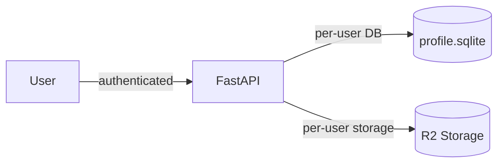

# T1750 Design: Share Backend Model & API

**Status:** APPROVED
**Author:** Architect Agent
**Created:** 2026-04-30

## Current State ("As Is")

No sharing infrastructure exists. All video content is fully isolated per-user and per-profile:

- Each user's data lives in `user_data/<user_id>/profiles/<profile_id>/profile.sqlite`
- Videos stored in R2 at `{env}/users/{user_id}/profiles/{profile_id}/final_videos/{filename}`
- All API endpoints require authentication via `rb_session` cookie
- No concept of cross-user data access



## Key Architectural Decision: Where does `shared_videos` live?

### The Problem

`shared_videos` is cross-user data. When a recipient visits `/shared/{token}`, the backend must:
1. Look up the share record by token (without knowing which user created it)
2. Verify access control (public vs private, email match)
3. Generate a presigned URL to the **sharer's** video in R2

Per-user SQLite databases can't support cross-user token lookups.

### Decision: Dedicated `sharing.sqlite` global database (temporary)

A new `user_data/sharing.sqlite` global database, following the pattern of `auth.sqlite`.

**This is a temporary solution.** T1960 (Migrate Global SQLite to Upstash Redis) will migrate both auth.sqlite and sharing.sqlite to Upstash Redis before alpha exit. The sharing.sqlite approach ships the feature now with minimal infrastructure change; the durable persistence strategy lands with T1960.

**Rationale for SQLite now:**
1. **Token lookup requires a single index.** Unauthenticated public link visitors can't iterate all user DBs.
2. **auth.sqlite stays focused on auth.** Different access patterns, different sync requirements.
3. **Mirrors auth.sqlite's operational model:** single global file, R2 backup on write, restored on startup.
4. **Low write volume.** Share creation and revocation are infrequent — R2 sync overhead is manageable for alpha.

**Scalability note:** Viral public links are not a concern. Video bytes flow through R2/Cloudflare CDN (zero egress fees). The backend only does lightweight token lookups (~0.1ms indexed read) + HMAC URL signing (~0.01ms). A single Fly machine handles thousands of these per second.

### Denormalized Fields

The shared_videos table stores enough to generate a presigned URL and display video info **without** hitting the sharer's per-user DB:

- `sharer_profile_id` — R2 key requires `{user_id}/profiles/{profile_id}/final_videos/{filename}`
- `video_filename` — denormalized from final_videos.filename
- `video_name` — display name for the shared player page
- `video_duration` — duration for player UI

These are stable: video filename never changes for a given final_video.id (re-exports create new rows).

## Target State ("Should Be")

```mermaid
flowchart LR
    Sharer[Sharer] -->|POST /gallery/{id}/share| API[FastAPI]
    API -->|write share record| SDB[(sharing.sqlite)]
    API -->|verify video exists| UDB[(sharer's profile.sqlite)]

    Recipient[Recipient] -->|GET /shared/{token}| API
    API -->|lookup token| SDB
    API -->|presigned URL| R2[(R2 Storage)]
    R2 -->|video stream| Recipient
```

### Schema

```sql
CREATE TABLE shared_videos (
    id INTEGER PRIMARY KEY AUTOINCREMENT,
    share_token TEXT UNIQUE NOT NULL,       -- UUID v4, used in share URL
    video_id INTEGER NOT NULL,              -- FK to sharer's final_videos.id (informational)
    sharer_user_id TEXT NOT NULL,           -- who shared it
    sharer_profile_id TEXT NOT NULL,        -- for R2 key construction
    video_filename TEXT NOT NULL,           -- denormalized from final_videos.filename
    video_name TEXT,                        -- denormalized display name
    video_duration REAL,                    -- denormalized duration in seconds
    recipient_email TEXT NOT NULL,          -- who it's shared with
    is_public INTEGER DEFAULT 0,           -- 1 = anyone with link can view
    shared_at TEXT NOT NULL,               -- ISO timestamp
    revoked_at TEXT                         -- NULL unless revoked
);
CREATE INDEX idx_shared_videos_token ON shared_videos(share_token);
CREATE INDEX idx_shared_videos_video ON shared_videos(video_id, sharer_user_id);
CREATE INDEX idx_shared_videos_sharer ON shared_videos(sharer_user_id);
CREATE INDEX idx_shared_videos_recipient ON shared_videos(recipient_email);
```

## Resolved Design Decisions

1. **Soft-delete on revoke.** `DELETE /shared/{token}` sets `revoked_at` timestamp. Sharer can see revoked shares in their list. GET by token returns 410 Gone.

2. **Flag known vs unknown emails on share creation.** `POST /gallery/{video_id}/share` response includes `is_existing_user: bool` per recipient (looked up from auth.sqlite). Enables green/yellow indicator in T1770 share modal UI.

3. **Shares are profile-scoped.** A share is tied to the profile that owns the final_video. Users with multiple profiles see different shares per profile. This is correct — the video lives in a specific profile's R2 namespace.

4. **No watch tracking in this task.** `watched_at` column and `POST /shared/{token}/watched` endpoint are deferred to T1790 (Watch Tracking & Share Status), which is the right place for that feature.

5. **No rate limiting.** Public links are the primary use case. Viral traffic is handled by CDN, not our backend. Revisit post-launch if abuse emerges.

## Implementation Plan ("Will Be")

### Files to Create

| File | Purpose | ~LOC |
|------|---------|------|
| `src/backend/app/services/sharing_db.py` | Connection management, CRUD ops, R2 sync | ~180 |
| `src/backend/app/routers/shares.py` | Two routers: gallery shares (auth) + shared access (optional auth) | ~250 |
| `src/backend/tests/test_shares.py` | All endpoints + access control scenarios | ~350 |

### Files to Modify

| File | Change |
|------|--------|
| `src/backend/app/main.py` | Register routers, init sharing DB on startup |
| `src/backend/app/middleware/db_sync.py` | Add `/api/shared/` to AUTH_ALLOWLIST_PREFIXES and SKIP_SYNC_PATHS |

### Router Structure

One router file with **two APIRouter instances**:

- `gallery_shares_router` (prefix `/api/gallery`) — always authenticated (sharer context)
  - `POST /{video_id}/share` — create shares
  - `GET /{video_id}/shares` — list shares for a video

- `shared_router` (prefix `/api/shared`) — optional auth (recipient/public context)
  - `GET /{share_token}` — get share + video metadata + presigned URL
  - `PATCH /{share_token}` — toggle is_public (sharer only)
  - `DELETE /{share_token}` — revoke share (sharer only)

### Auth for Shared Endpoints

Add `/api/shared/` to `AUTH_ALLOWLIST_PREFIXES` so unauthenticated requests pass through middleware. Each handler then:

- **GET by token:** checks `is_public`; if private, resolves email from session cookie
- **PATCH/DELETE:** validates session and checks sharer ownership

```pseudo
function get_email_from_request(request):
    session_id = request.cookies.get("rb_session")
    if no session_id:
        user_id = request.headers.get("X-User-ID")  // dev/test only
        if user_id: return lookup_email(user_id)
        return None
    session = validate_session(session_id)
    return session.email if session else None
```

### Key Endpoint Pseudo Code

**POST /api/gallery/{video_id}/share**
```pseudo
handler create_share(video_id, body: {recipient_emails, is_public}):
    user_id = get_current_user_id()
    profile_id = get_current_profile_id()

    // Verify video exists in sharer's DB
    video = query sharer's final_videos WHERE id = video_id
    if not video: raise 404

    // Check which emails are existing users (for green/yellow indicator)
    existing_emails = lookup_emails_in_auth_db(body.recipient_emails)

    // Create one share record per email in sharing.sqlite
    shares = []
    for email in body.recipient_emails:
        token = uuid4()
        INSERT INTO shared_videos (share_token, video_id, sharer_user_id,
            sharer_profile_id, video_filename, video_name, video_duration,
            recipient_email, is_public, shared_at)
        VALUES (token, video_id, user_id, profile_id,
            video.filename, video.name, video.duration,
            email, body.is_public, now())
        shares.append({
            share_token: token,
            recipient_email: email,
            is_existing_user: email in existing_emails
        })

    sync_sharing_db_to_r2()
    return {shares: shares}
```

**GET /api/shared/{share_token}**
```pseudo
handler get_shared_video(share_token, request):
    share = query sharing.sqlite WHERE share_token = ?
    if not share: raise 404
    if share.revoked_at: raise 410 Gone

    if not share.is_public:
        email = get_email_from_request(request)
        if not email or email != share.recipient_email: raise 403

    // Generate presigned URL using sharer's R2 path
    r2_key = "{env}/users/{share.sharer_user_id}/profiles/{share.sharer_profile_id}/final_videos/{share.video_filename}"
    video_url = generate_presigned_url_global(r2_key)

    return {share_token, video_name, video_duration, video_url, is_public, shared_at}
```

### Sharing DB Service (`sharing_db.py`)

```pseudo
SHARING_DB_PATH = user_data / "sharing.sqlite"

function init_sharing_db():
    CREATE TABLE IF NOT EXISTS shared_videos (...)
    CREATE INDEX IF NOT EXISTS (...)

function get_sharing_db() -> context_manager:
    conn = sqlite3.connect(SHARING_DB_PATH)
    conn.row_factory = sqlite3.Row
    yield conn
    conn.close()

function sync_sharing_db_from_r2() -> bool:
    // Download sharing.sqlite from R2 on startup (mirrors auth_db pattern)

function sync_sharing_db_to_r2() -> bool:
    // Upload sharing.sqlite to R2 after writes

// CRUD operations:
function create_shares(video_id, sharer_user_id, ..., recipient_emails, is_public) -> list[dict]
function get_share_by_token(token) -> Optional[dict]
function list_shares_for_video(video_id, sharer_user_id) -> list[dict]
function update_share_visibility(token, is_public, sharer_user_id) -> bool
function revoke_share(token, sharer_user_id) -> bool
```

## Risks

| Risk | Impact | Mitigation |
|------|--------|------------|
| sharing.sqlite R2 sync overhead | Moderate | Low write volume (share creation/revocation only). Migrated to Upstash Redis with T1960 before alpha exit. |
| R2 sync failure on startup | High | Follow auth.sqlite's `restore_or_fail`: retry 3x, fatal crash if all fail. |
| Denormalized filename stale after re-export | Low | Re-export creates new final_video row. Share points to original (still valid in R2). |
| Sharer deletes video after sharing | Moderate | Presigned URL will 404 from R2. Shared player page should show "video unavailable" (T1780 concern). |
| Public share link leaks presigned URL | Low | URLs expire after 1 hour. Tokens are UUID v4. Revoking returns 410. |
