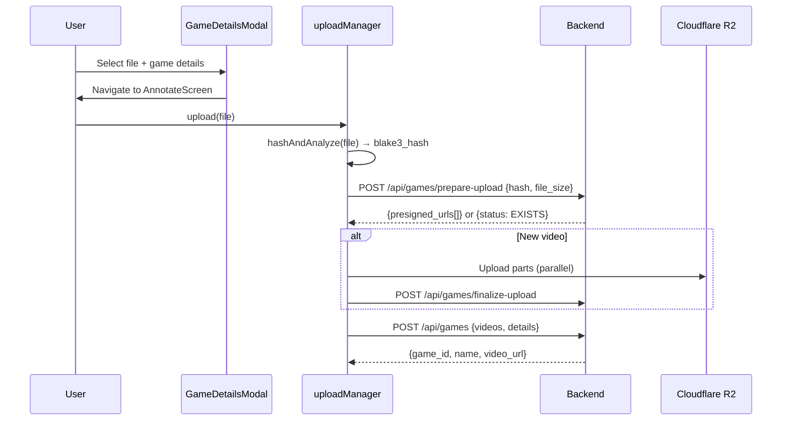
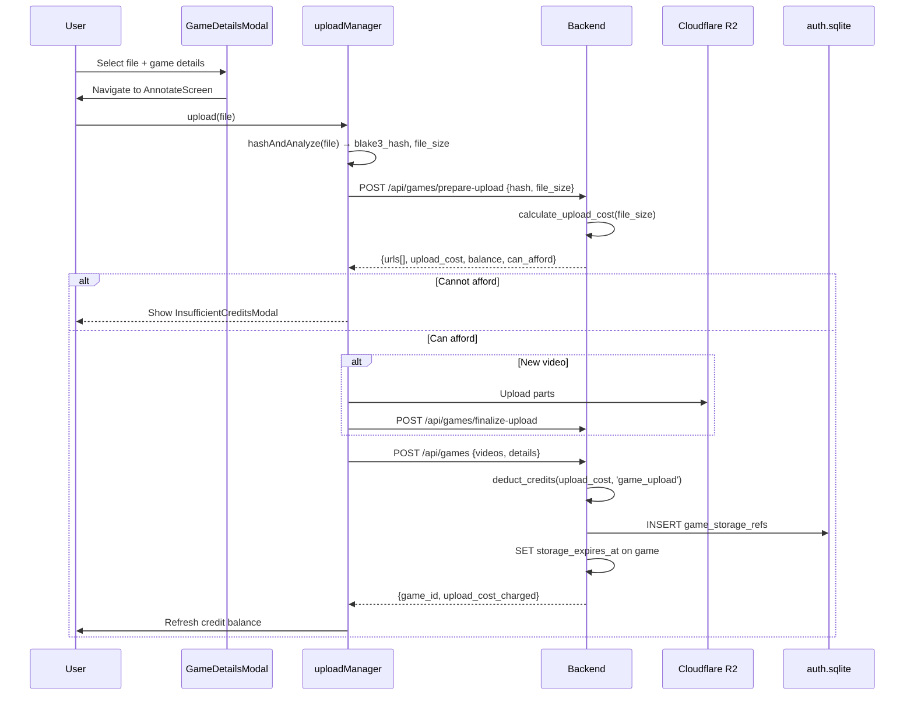
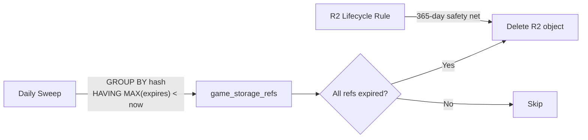
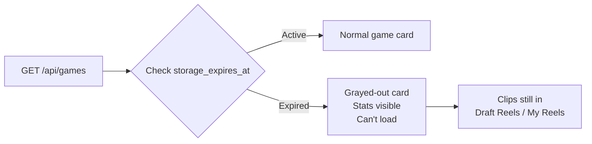

# T1580 Design: Game Upload & Storage Credits

**Status:** DRAFT
**Author:** Architect Agent
**Date:** 2026-05-01

## Current State ("As Is")

### Upload Data Flow



### Current Behavior
```
Upload is free. No credit check. No storage limits.
Game created → persists forever in R2.
No cross-user tracking of game video references.
No expiration or cleanup mechanism.
```

### Credit System (existing)
```
Export flow: reserve_credits → GPU job → confirm/release
Credits table in per-user user.sqlite
Balance checked atomically via SQLite transaction
402 response triggers InsufficientCreditsModal on frontend
```

## Target State ("Should Be")

### Upload Data Flow with Credits



### Cleanup Data Flow



### Expired Game UX



## Implementation Plan ("Will Be")

### Design Decisions

| Decision | Options | Choice | Rationale |
|----------|---------|--------|-----------|
| When to check credits | Before upload vs at game creation | Before upload (prepare-upload) | Don't waste bandwidth uploading a file the user can't afford |
| When to deduct credits | prepare-upload vs game creation | Game creation (POST /api/games) | Atomic with game record creation; avoids charge on failed uploads |
| Reserve vs direct deduct | Reserve pattern (like exports) vs simple deduct | Simple deduct | Uploads are fast enough; reserve pattern adds complexity for minimal benefit at current scale |
| Cost formula location | Backend only vs shared | Backend authoritative, frontend mirrors for display | Backend is source of truth; frontend shows cost after prepare-upload responds |
| Expiry source of truth | game_storage_refs (auth DB) | game_storage_refs for cross-user cleanup, games.storage_expires_at for per-user display | Two purposes: cleanup needs cross-user view, game list needs per-user view |
| Dedup charging | Free for dedup vs charge same | Charge same | Deduped game still holds the R2 object alive; user is consuming storage |

### Files to Modify

| # | File | Change | LOC |
|---|------|--------|-----|
| 1 | `src/backend/app/services/auth_db.py` | Add `game_storage_refs` table + CRUD functions | ~60 |
| 2 | `src/backend/app/database.py` | Add `storage_expires_at`, `storage_status` to games table | ~5 |
| 3 | `src/backend/app/services/storage_credits.py` | **NEW** — cost calculation utility, cleanup sweep | ~80 |
| 4 | `src/backend/app/routers/games_upload.py` | Return `upload_cost`, `balance`, `can_afford` from prepare-upload | ~15 |
| 5 | `src/backend/app/routers/games.py` | Deduct credits + insert game_storage_refs on game creation; add expiry to game list response | ~40 |
| 6 | `src/backend/app/session_init.py` | Seed 8 credits for new accounts | ~5 |
| 7 | `src/frontend/src/services/uploadManager.js` | Handle `can_afford=false` from prepare-upload, abort + return cost info | ~20 |
| 8 | `src/frontend/src/hooks/useGameUpload.js` | New phase `INSUFFICIENT_CREDITS`, expose cost info | ~15 |
| 9 | `src/frontend/src/components/ProjectManager.jsx` | Gray out expired games in GameCard, show InsufficientCreditsModal on upload | ~30 |
| 10 | `src/frontend/src/stores/gamesDataStore.js` | Handle expiry data from game list response | ~10 |
| 11 | `src/frontend/src/stores/creditStore.js` | Add `canAffordUpload(cost)` selector | ~5 |

**Total: ~285 LOC across 11 files (1 new)**

### Pseudo Code Changes

#### 1. Backend: Storage Credits Service (NEW)

```python
# src/backend/app/services/storage_credits.py

R2_RATE = 0.015          # $/GB/month
STORAGE_DAYS = 30
MARGIN = 0.10
CREDIT_VALUE = 0.072     # worst-case per-credit
NEW_ACCOUNT_CREDITS = 8
EXPIRY_VISIBLE_DAYS = 28

def calculate_upload_cost(file_size_bytes: int) -> int:
    size_gb = file_size_bytes / (1024 ** 3)
    return max(1, math.ceil(size_gb * R2_RATE * (STORAGE_DAYS / 30) * (1 + MARGIN) / CREDIT_VALUE))

def calculate_extension_cost(file_size_bytes: int, days: int) -> int:
    size_gb = file_size_bytes / (1024 ** 3)
    return max(1, math.ceil(size_gb * R2_RATE * (days / 30) * (1 + MARGIN) / CREDIT_VALUE))
```

#### 2. Backend: Auth DB — game_storage_refs table

```python
# In auth_db.py init_auth_db()
cursor.execute("""
    CREATE TABLE IF NOT EXISTS game_storage_refs (
        id INTEGER PRIMARY KEY AUTOINCREMENT,
        user_id TEXT NOT NULL,
        profile_id TEXT NOT NULL,
        blake3_hash TEXT NOT NULL,
        game_size_bytes INTEGER NOT NULL,
        storage_expires_at DATETIME NOT NULL,
        created_at DATETIME NOT NULL DEFAULT (datetime('now')),
        UNIQUE(user_id, profile_id, blake3_hash)
    )
""")

# Functions:
def insert_game_storage_ref(user_id, profile_id, blake3_hash, game_size_bytes, storage_expires_at)
def get_game_storage_ref(user_id, profile_id, blake3_hash) -> row | None
def get_expired_hashes() -> list[str]  # GROUP BY hash HAVING MAX(expires) < now
def delete_refs_for_hash(blake3_hash)  # cleanup after R2 delete
```

#### 3. Backend: prepare-upload response change

```python
# In games_upload.py POST /api/games/prepare-upload
# After existing validation, before returning:

+ upload_cost = calculate_upload_cost(request.file_size)
+ balance = get_credit_balance(user_id)

# Add to all response variants (NEW, EXISTS, RESUME):
+ response.upload_cost = upload_cost
+ response.balance = balance
+ response.can_afford = balance >= upload_cost
```

#### 4. Backend: Game creation with credit deduction

```python
# In games.py POST /api/games
# After game record INSERT, before response:

+ upload_cost = calculate_upload_cost(total_video_size)
+ result = deduct_credits(user_id, upload_cost, source='game_upload', reference_id=str(game_id))
+ if not result['success']:
+     raise HTTPException(402, {"balance": result["balance"], "required": upload_cost})
+
+ expires_at = datetime.utcnow() + timedelta(days=STORAGE_DAYS)
+ # Per-user: mark on games table
+ cursor.execute("UPDATE games SET storage_expires_at = ? WHERE id = ?", (expires_at, game_id))
+ # Cross-user: insert ref for cleanup tracking
+ for video in videos:
+     insert_game_storage_ref(user_id, profile_id, video.blake3_hash, video.video_size, expires_at)
```

#### 5. Backend: Game list with expiry info

```python
# In games.py GET /api/games
# Add storage_expires_at and storage_status to response:

+ for game in games:
+     if game['storage_expires_at'] and game['storage_expires_at'] < now:
+         game['storage_status'] = 'expired'
+     else:
+         game['storage_status'] = 'active'
```

#### 6. Backend: New account credit seeding

```python
# In session_init.py, after is_new_user profile creation:

+ if is_new_user:
+     grant_credits(user_id, NEW_ACCOUNT_CREDITS, source='new_account_bonus')
```

#### 7. Backend: Daily cleanup sweep

```python
# In storage_credits.py
async def run_storage_cleanup():
    expired_hashes = get_expired_hashes()  # GROUP BY hash HAVING MAX < now
    for blake3_hash in expired_hashes:
        key = r2_global_key(f"games/{blake3_hash}.mp4")
        r2_delete_object_global(key)
        delete_refs_for_hash(blake3_hash)
        log.info(f"Cleaned up expired game: {blake3_hash}")

# Triggered by: scheduled endpoint or FastAPI on_startup repeating task
```

#### 8. Frontend: Upload flow credit gate

```javascript
// In uploadManager.js uploadGame()
// After prepare-upload response:

+ if (!prepareResult.can_afford) {
+     return {
+         status: 'INSUFFICIENT_CREDITS',
+         upload_cost: prepareResult.upload_cost,
+         balance: prepareResult.balance
+     };
+ }
```

```javascript
// In useGameUpload.js
+ UPLOAD_PHASE.INSUFFICIENT_CREDITS = 'insufficient_credits'

// In upload() function, after uploadGame returns:
+ if (result.status === 'INSUFFICIENT_CREDITS') {
+     setPhase(UPLOAD_PHASE.INSUFFICIENT_CREDITS);
+     setUploadCost(result.upload_cost);
+     return result;
+ }
```

#### 9. Frontend: GameCard expired state

```jsx
// In ProjectManager.jsx GameCard component
// Add grayed-out state for expired games:

function GameCard({ game, onLoad, onDelete }) {
+   const isExpired = game.storage_status === 'expired';

    return (
-       <div className="..." onClick={() => onLoad(game)}>
+       <div className={`... ${isExpired ? 'opacity-50 pointer-events-none' : ''}`}
+            onClick={() => !isExpired && onLoad(game)}>
            {/* existing card content */}
+           {isExpired && (
+               <div className="text-xs text-red-400">Storage expired</div>
+           )}
        </div>
    );
}
```

#### 10. Frontend: InsufficientCreditsModal on upload

```jsx
// In ProjectManager.jsx or AnnotateScreen
// When upload returns INSUFFICIENT_CREDITS:

+ {uploadPhase === 'insufficient_credits' && (
+     <InsufficientCreditsModal
+         required={uploadCost}
+         available={creditBalance}
+         onClose={resetUpload}
+         onBuyCredits={openBuyCreditsModal}
+     />
+ )}
```

## Risks

| Risk | Impact | Mitigation |
|------|--------|------------|
| Credit deducted but game creation fails (partial failure) | User charged without game | Transaction: deduct + insert in same SQLite transaction. If game INSERT fails, credits are rolled back. |
| Race condition: two uploads pass affordability check | Second game creation fails with 402 | Acceptable at current scale. `deduct_credits` is atomic — returns `success: false` if balance insufficient. Frontend handles 402 gracefully. |
| Dedup game still charges | User might feel "cheated" paying for existing video | The charge is for storage time, not upload bandwidth. Their reference keeps the R2 object alive. Could add messaging: "This game already exists — 1 credit for 30 days of access." |
| Daily sweep misses a run | Expired objects linger 1-2 extra days | Acceptable. 365-day lifecycle safety net catches anything. Sweep is idempotent — catches up on next run. |
| Auth.sqlite contention | game_storage_refs writes on every upload | Uploads are infrequent (~1-5/day). Auth.sqlite already handles session writes. This adds negligible load. Migrates to Postgres in T1960. |

## Open Questions

None — all questions resolved during kickoff:
- ~~Existing games migration~~ → Not needed (admin-only uploads)
- ~~Existing account credits~~ → New signups only
- ~~Expired game UX~~ → Grayed out, not hidden
- ~~R2 cleanup strategy~~ → Hybrid: DB sweep + lifecycle safety net
- ~~T1580/T1581 boundary~~ → T1580 skips ExpirationBadge
