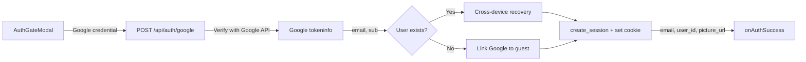
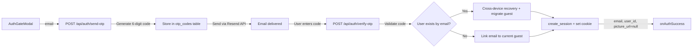
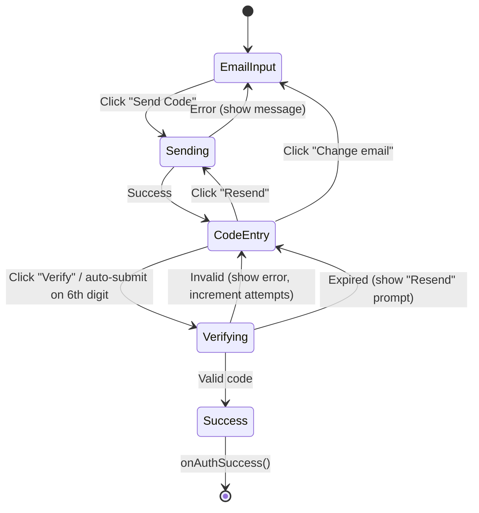

# T401 Design: Email OTP Auth

**Status:** DRAFT
**Author:** Architect Agent

## Current State ("As Is")

### Data Flow


### Current Behavior
```pseudo
AuthGateModal shows:
  1. Google Sign-In button (functional via GIS library)
  2. Email input + "Send Code" button (DISABLED, opacity-50)
  3. "Email sign-in coming soon" text

Email OTP section is placeholder only — no API wiring.
```

### Limitations
- Users without Google accounts cannot authenticate
- Email input and Send Code button are disabled/placeholder

## Target State ("Should Be")

### Updated Flow


### Frontend State Machine


### Target Behavior
```pseudo
# Frontend (AuthGateModal)
step = 'email' | 'code'

when step == 'email':
  show email input + "Send Code" button
  on submit:
    POST /api/auth/send-otp { email }
    if 200: step = 'code', store email
    if 429: show "Too many codes. Try again in X minutes."
    if error: show error message

when step == 'code':
  show 6 individual digit inputs with auto-advance
  show "Verify" button (enabled when 6 digits entered)
  show "Resend code" link, "Use different email" link
  on verify:
    POST /api/auth/verify-otp { email, code }
    if 200: onAuthSuccess(email, user_id, picture_url)
    if 400 "Invalid code": show inline error
    if 400 "Code expired": show "Code expired. Resend?"
    if 400 "Too many attempts": show "Too many attempts. Request a new code."
    if 429: show rate limit message

# Backend: POST /api/auth/send-otp
def send_otp(email):
  # Rate limit: count codes for this email in last hour
  if count >= 3: return 429

  code = secrets.randbelow(900000) + 100000  # 6 digits, 100000-999999
  expires_at = now + 10 minutes
  INSERT INTO otp_codes (email, code, expires_at)

  # Send via Resend
  POST https://api.resend.com/emails
    from: "Reel Ballers <noreply@reelballers.com>"
    to: email
    subject: "Your code: {code}"
    html: styled template

  return { sent: true }

# Backend: POST /api/auth/verify-otp
def verify_otp(email, code):
  current_user_id = get_current_user_id()  # from guest session cookie

  # Find latest unused code for this email
  row = SELECT * FROM otp_codes WHERE email = ? AND used_at IS NULL
         ORDER BY created_at DESC LIMIT 1

  if not row: return 400 "No pending code"
  if row.expires_at < now: return 400 "Code expired"
  if row.attempts >= 5: return 400 "Too many attempts"

  if row.code != submitted_code:
    UPDATE otp_codes SET attempts = attempts + 1 WHERE id = row.id
    return 400 "Invalid code"

  # Mark as used
  UPDATE otp_codes SET used_at = now WHERE id = row.id

  # Same branching as google_auth():
  existing = get_user_by_email(email)
  if existing:
    # Cross-device recovery
    user_id = existing.user_id
    _migrate_guest_profile(current_user_id, user_id)
  else:
    # First-time email auth — link to current guest
    current_user = get_user_by_id(current_user_id)
    if current_user and not current_user.email:
      link_email_to_user(current_user_id, email)
      user_id = current_user_id
    else:
      user_id = current_user_id
      create_user(user_id, email=email, verified_at=now)

  session_id = create_session(user_id)
  # Set rb_session cookie, return { email, user_id, picture_url: null }
```

## Implementation Plan ("Will Be")

### Files to Modify/Create

| File | Change |
|------|--------|
| `src/backend/app/services/email.py` | **NEW**: Resend HTTP client |
| `src/backend/app/services/auth_db.py` | Add `link_email_to_user()` function |
| `src/backend/app/routers/auth.py` | Add `send-otp` + `verify-otp` endpoints |
| `src/frontend/src/components/AuthGateModal.jsx` | Replace disabled email section with live OTP flow |

### Pseudo Code Changes

#### 1. `src/backend/app/services/email.py` (NEW)
```python
import os, httpx, logging
from app.utils.retry import retry_async_call, TIER_1

logger = logging.getLogger(__name__)

async def send_otp_email(to_email: str, code: str):
    """Send 6-digit OTP code via Resend API."""
    api_key = os.getenv("RESEND_API_KEY")
    if not api_key:
        raise ValueError("RESEND_API_KEY not configured")

    async def _send():
        async with httpx.AsyncClient(timeout=10.0) as client:
            return await client.post(
                "https://api.resend.com/emails",
                headers={"Authorization": f"Bearer {api_key}"},
                json={
                    "from": "Reel Ballers <noreply@reelballers.com>",
                    "to": [to_email],
                    "subject": f"Your verification code: {code}",
                    "html": "... styled template ...",
                },
            )

    resp = await retry_async_call(_send, operation="resend_otp", **TIER_1)
    if resp.status_code not in (200, 201):
        logger.error(f"[Email] Resend API error: {resp.status_code} {resp.text}")
        raise RuntimeError(f"Failed to send email: {resp.status_code}")
```

#### 2. `src/backend/app/services/auth_db.py` — add `link_email_to_user()`
```python
def link_email_to_user(user_id: str, email: str) -> None:
    """Link an email to an existing anonymous user (via OTP verification)."""
    now = datetime.utcnow().isoformat()
    with get_auth_db() as db:
        db.execute(
            """UPDATE users SET email = ?, verified_at = ? WHERE user_id = ?""",
            (email, now, user_id),
        )
        db.commit()
    sync_auth_db_to_r2()
```

#### 3. `src/backend/app/routers/auth.py` — new endpoints
```python
class SendOtpRequest(BaseModel):
    email: str

class VerifyOtpRequest(BaseModel):
    email: str
    code: str

@router.post("/send-otp")
async def send_otp(body: SendOtpRequest):
    # 1. Validate email format
    # 2. Rate limit check (3/hour per email from otp_codes table)
    # 3. Generate code: secrets.randbelow(900000) + 100000
    # 4. Store in otp_codes table
    # 5. Send via email service
    # 6. Return { sent: true }

@router.post("/verify-otp")
async def verify_otp(body: VerifyOtpRequest, request: Request):
    # 1. Look up latest unused code for email
    # 2. Validate: not expired, not too many attempts
    # 3. Check code matches
    # 4. Mark as used
    # 5. Same user lookup/create logic as google_auth()
    # 6. Create session, set cookie, return response
```

#### 4. `src/frontend/src/components/AuthGateModal.jsx` — replace disabled section
```jsx
// State machine: 'email' | 'code'
const [otpStep, setOtpStep] = useState('email');
const [otpEmail, setOtpEmail] = useState('');
const [otpCode, setOtpCode] = useState(['', '', '', '', '', '']);
const [otpError, setOtpError] = useState(null);
const [otpLoading, setOtpLoading] = useState(false);

// Replace disabled section with:
// Step 1: Email input + Send Code button
// Step 2: 6-digit code inputs + Verify + Resend + Change email
```

## Risks

| Risk | Mitigation |
|------|------------|
| Resend API key not configured | Check at request time, return 500 with clear message |
| Resend API down | retry_async_call with TIER_1 (4 attempts), user sees generic error |
| Brute force attacks | 5 attempts per code, 3 codes/hour/email, 10-min expiry |
| Email uniqueness conflict | Same as Google flow — UNIQUE constraint on users.email |
| Race condition: two verify requests | SQLite serialization + `used_at IS NULL` check prevents double-use |
| NUF reset accounts | Same pattern as Google — check NUF_RESET_EMAILS before user lookup |

## Open Questions

None — the approach mirrors the existing Google OAuth flow exactly, just with Resend instead of Google token verification.
