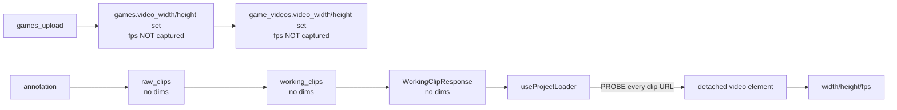
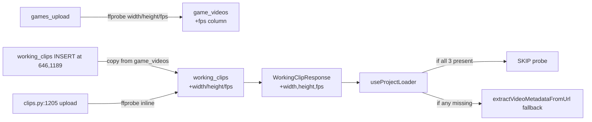

# T1500 Design: Persist clip dimensions, eliminate metadata probe

**Status:** DRAFT — awaiting approval
**Follow-up to:** T1490

## Context

Every project load triggers `extractVideoMetadataFromUrl()` (one detached `<video preload="metadata">` per unique clip URL) purely to learn `width`, `height`, `fps`. These values are intrinsic to the source video and are already accessible server-side during upload — they're just not persisted or returned.

## Decision summary

| Question | Decision |
|---|---|
| Where to store truth? | `game_videos` (source video table) — add `fps` column (width/height already exist) |
| Where to denormalize? | `working_clips` — add `width`, `height`, `fps` per task spec (fast read, no JOIN gymnastics) |
| How to populate new inserts? | At INSERT time in clips.py, copy from parent `game_videos` via the raw_clip's `video_sequence`; upload path probes with ffprobe inline |
| How to capture fps upstream? | `games_upload.py` already runs ffprobe-adjacent logic during ingest; add fps extraction there |
| Backfill strategy? | Modal batch job using byte-range R2 fetch (first 1 MB) + ffprobe-from-stdin; fallback to tail range for moov-at-end |
| Frontend skip condition? | `if (clip.width && clip.height && clip.fps) skip probe` in useProjectLoader |
| Delete probe? | **No.** Keep `extractVideoMetadataFromUrl` as fallback (per task) |

## Current state



**Probe volume:** N unique clip URLs per project load = N `/api/clips/{id}/stream` requests purely for metadata.

## Target state



## Implementation plan

### 1. Schema (src/backend/app/database.py migrations ~line 812)

```python
# T1500: persist clip source dimensions
"ALTER TABLE game_videos ADD COLUMN fps REAL",
"ALTER TABLE games ADD COLUMN video_fps REAL",   # legacy single-video parity
"ALTER TABLE working_clips ADD COLUMN width INTEGER",
"ALTER TABLE working_clips ADD COLUMN height INTEGER",
"ALTER TABLE working_clips ADD COLUMN fps REAL",
```

All nullable — backfill populates retroactively; probe fallback handles remaining NULLs.

### 2. Upstream capture — games_upload.py

In the upload ingest flow (same code path that currently sets `video_width` on single-video games, games.py:438-443), run ffprobe once on the ingested video and capture fps alongside existing dims. Reuse `get_video_metadata_ffprobe()` from `app/ai_upscaler/__init__.py:54` — it already returns `{width, height, fps, duration}`.

Write fps to `game_videos.fps` (per-video) and `games.video_fps` (single-video legacy path).

### 3. working_clips INSERTs — clips.py

**Line 646** (auto-project for 5-star clip) and **line 1189** (library add):
- Both have `raw_clip_id` → JOIN raw_clips → game_videos (via game_id + video_sequence) → fetch width/height/fps
- Extend the INSERT to include `width, height, fps`

**Line 1205** (direct upload, no raw_clip):
- Run `get_video_metadata_ffprobe()` on the uploaded file
- Include result in INSERT

Pseudo code:
```python
# 646 / 1189
dims = cursor.execute("""
    SELECT gv.video_width, gv.video_height, gv.fps
    FROM raw_clips rc
    LEFT JOIN game_videos gv ON gv.game_id = rc.game_id AND gv.sequence = rc.video_sequence
    WHERE rc.id = ?
""", (raw_clip_id,)).fetchone()
cursor.execute("""
    INSERT INTO working_clips (project_id, raw_clip_id, sort_order, version, width, height, fps)
    VALUES (?, ?, ?, ?, ?, ?, ?)
""", (project_id, raw_clip_id, sort_order, 1, dims['video_width'], dims['video_height'], dims['fps']))

# 1205
meta = get_video_metadata_ffprobe(uploaded_path)
cursor.execute("""
    INSERT INTO working_clips (project_id, uploaded_filename, sort_order, version, width, height, fps)
    VALUES (?, ?, ?, ?, ?, ?, ?)
""", (project_id, filename, sort_order, 1, meta['width'], meta['height'], meta['fps']))
```

### 4. API — clips.py:155-179 + SELECT at 1004-1040

`WorkingClipResponse`:
```python
width: Optional[int] = None
height: Optional[int] = None
fps: Optional[float] = None
```

Extend the project-load SELECT to include `wc.width, wc.height, wc.fps`.

### 5. Frontend — useProjectLoader.js:140-172

```javascript
const needsProbe = !(clip.width && clip.height && clip.fps);
if (needsProbe) {
  // existing extractVideoMetadataFromUrl path
} else {
  metadataCache[clip.id] = {
    duration: clip.video_duration,
    width: clip.width,
    height: clip.height,
    framerate: clip.fps,
  };
}
```

### 6. Frontend — useClipManager.js:44-46 / :54-82

`calculateCenteredCrop()` reads from `clipMetadataCache`. No change needed here — the cache gets populated from clip fields instead of probe. (Confirm during implementation.)

### 7. Backfill — scripts/backfill_clip_dimensions.py (Modal batch job)

New standalone Modal function. Per-user DB walk:

```python
@app.function(image=ffmpeg_image, timeout=3600)
def backfill_user(user_id: str):
    # 1. download user DB from R2
    # 2. SELECT wc.id, wc.raw_clip_id, rc.filename, rc.game_id, rc.video_sequence
    #    FROM working_clips wc JOIN raw_clips rc ON wc.raw_clip_id = rc.id
    #    WHERE wc.width IS NULL OR wc.height IS NULL OR wc.fps IS NULL
    # 3. for each row:
    #    - resolve R2 key for the source game_video
    #    - boto3 get_object(Range='bytes=0-1048576') → first 1 MB
    #    - if moov atom not in first MB: tail range fetch (last 512 KB)
    #    - pipe bytes to ffprobe stdin; parse width/height/fps
    #    - UPDATE working_clips SET width/height/fps WHERE id = ?
    #    - Also UPDATE game_videos.fps WHERE game_id/sequence match (source of truth)
    # 4. upload DB back to R2
    # 5. log row counts: updated / failed / skipped
```

Runs idempotently — only touches NULL rows. Failed rows (corrupt R2 object, missing file) stay NULL; frontend probe fallback handles them.

**Cost estimate:** byte-range HEAD + 1 MB fetch per unique game_video ≈ <1 s per clip on Modal. 10K clips → ~3 hours single-threaded, well under an hour with parallel `@app.function(concurrency_limit=16)`.

Invocation: manual trigger per-user from a CLI script (`scripts/trigger_backfill.py`). Not exposed as a user-visible endpoint.

## Testing plan

| Test | Type | Asserts |
|---|---|---|
| Migration idempotent | Backend unit | Running `ensure_database()` twice doesn't error |
| INSERT populates dims from raw_clip's game_video | Backend unit | After adding library clip to project, working_clips row has width/height/fps |
| Upload path runs ffprobe | Backend unit | After upload, working_clips row has dims populated |
| WorkingClipResponse includes fields | Backend unit | Response schema has width/height/fps |
| Frontend skips probe when complete | Frontend unit | useProjectLoader doesn't call extractVideoMetadataFromUrl when all 3 fields present |
| Frontend falls back to probe when any missing | Frontend unit | Probe is called when `clip.fps === null` |
| Backfill updates NULL rows only | Backend unit | Running twice produces same result |

## Risks & open questions

1. **Multi-video games with `video_sequence = NULL`** — legacy raw_clips may not have `video_sequence` set. JOIN will fail silently → dims end up NULL → probe fallback kicks in. Acceptable.
2. **Moov atom at end of file** — some MP4s store moov at the end (progressive download unfriendly). Byte-range fetch of first MB fails for these. Backfill falls back to tail range (last 512 KB). If both fail, row stays NULL.
3. **fps precision** — `r_frame_rate` is "30000/1001" for NTSC. Store as REAL (decimal), consumer rounds as needed. No change from current behavior.
4. **Modal image** — needs `ffprobe` binary. Use existing image from `video_processing.py` or a minimal one with `ffmpeg` package.
5. **Backfill trigger timing** — run after deploy once, or lazy-per-load? Proposing one-shot Modal job post-deploy; NULL rows auto-handle via probe fallback until then.

## Out of scope
- Deleting `extractVideoMetadataFromUrl` (kept as fallback per task)
- Eliminating probe in useAnnotateState / useOverlayState (different data sources; follow-up)
- Duration caching (duration already on games.video_duration; separate concern)
